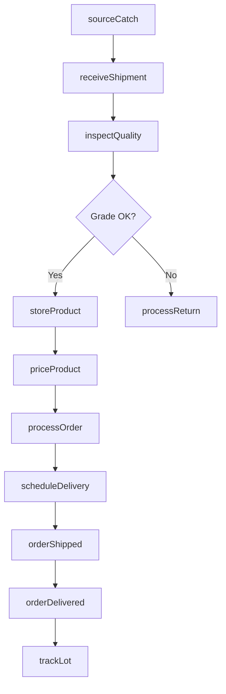
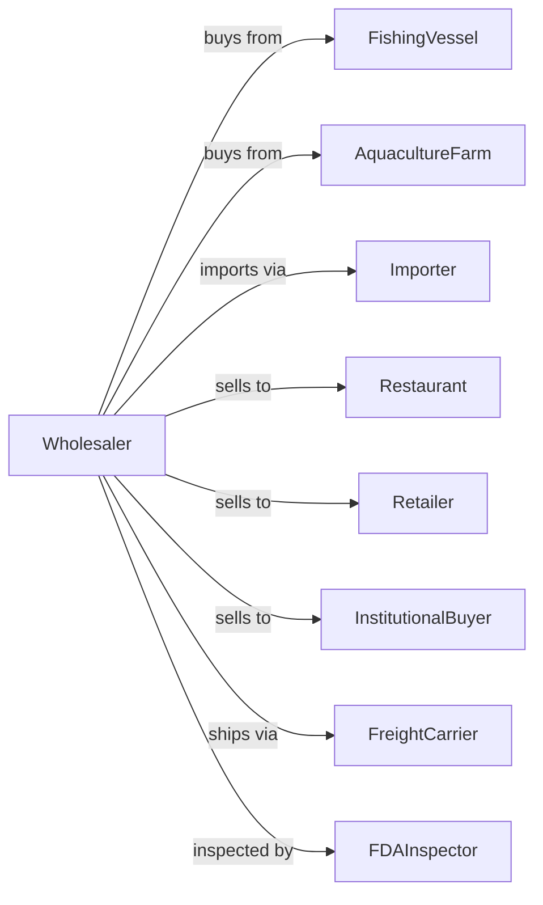

# Fish and Seafood Merchant Wholesalers

> Business-as-Code definition for seafood wholesale distribution operations. Models the complete cold chain from fishing vessels and aquaculture farms through restaurant and retail delivery.

## Overview

Fish and seafood merchant wholesalers distribute fresh, frozen, and processed seafood products to restaurants, grocery retailers, and foodservice operators. This definition exposes actions for seafood procurement, cold chain management, quality grading, and order fulfillment with events for automated inventory rotation and traceability compliance.

## Actors

| Actor | Description |
|-------|-------------|
| FishingVessel | Commercial fishing boat supplying wild-caught seafood |
| AquacultureFarm | Fish farm or shellfish operation providing farmed products |
| Importer | Brings seafood from international suppliers |
| Restaurant | Foodservice buyer purchasing seafood for menu items |
| Retailer | Grocery store or fish market purchasing for resale |
| InstitutionalBuyer | Hospital, school, or corporate cafeteria purchasing in volume |
| FreightCarrier | Refrigerated transport provider |
| FDAInspector | Federal inspector ensuring food safety compliance |

## Roles

| Role | Description |
|------|-------------|
| BuyingManager | Sources seafood and negotiates with suppliers |
| QualityInspector | Grades incoming product and monitors freshness |
| WarehouseManager | Oversees cold storage operations and inventory |
| SalesRepresentative | Manages customer accounts and takes orders |
| DeliveryDriver | Operates refrigerated trucks for local delivery |
| ComplianceOfficer | Maintains food safety records and traceability |

## Entities

| Entity | Description |
|--------|-------------|
| SeafoodLot | Batch of seafood with origin, catch date, and grade |
| Product | Specific species and form (whole, fillet, portion) |
| Inventory | Current stock levels by product and storage location |
| PurchaseOrder | Customer order specifying products and quantities |
| ColdStorage | Refrigerated or frozen warehouse space |
| QualityGrade | Freshness rating (A, B, C) based on inspection |
| SupplierContract | Agreement with fishing vessel or farm |
| ShipmentManifest | Documentation for incoming or outgoing loads |
| TraceabilityRecord | Chain of custody from catch to customer |
| PriceList | Current wholesale prices by product and volume |

## Actions

| Action | Description |
|--------|-------------|
| sourceCatch | Procure seafood from fishing vessels or farms |
| receiveShipment | Accept delivery and verify against manifest |
| inspectQuality | Grade product for freshness and quality |
| storeProduct | Place in appropriate cold storage location |
| processOrder | Pick, pack, and prepare customer order |
| priceProduct | Set wholesale prices based on market conditions |
| scheduleDelivery | Arrange refrigerated transport to customer |
| rotateInventory | Move older stock forward using FIFO |
| trackLot | Maintain traceability from source to delivery |
| processReturn | Handle rejected or returned product |
| generateReport | Produce sales, inventory, or compliance reports |
| negotiateContract | Establish terms with suppliers or buyers |

## Events

| Event | Description |
|-------|-------------|
| catchReceived | Seafood lot arrived from fishing vessel |
| shipmentInspected | Quality grading completed on incoming product |
| productStored | Seafood placed in cold storage |
| orderReceived | Customer purchase order submitted |
| orderPicked | Products selected and staged for delivery |
| orderShipped | Delivery departed for customer |
| orderDelivered | Customer confirmed receipt |
| inventoryLow | Stock fell below reorder threshold |
| lotExpiring | Product approaching freshness deadline |
| priceUpdated | Wholesale pricing changed |
| qualityAlert | Product failed quality inspection |
| returnProcessed | Customer return handled |

## Searches

| Search | Description |
|--------|-------------|
| findProducts | Search catalog by species, form, or origin |
| getInventory | Check stock levels by product and location |
| getOrders | Retrieve orders by customer, status, or date |
| trackShipment | Get delivery status and ETA |
| findSuppliers | Search suppliers by species or region |
| getLotHistory | Trace product from catch to customer |
| getExpiringStock | List products by remaining shelf life |

## Workflow



## Actor Relationships



## Usage

### Calling Actions

```typescript
import { distributeSeafood } from '@headlessly/distribute-seafood'

const wholesaler = distributeSeafood()

// Receive catch from fishing vessel
const lot = await wholesaler.sourceCatch({
  supplierId: 'vessel-north-atlantic',
  species: 'atlantic-salmon',
  weight: 5000,
  catchDate: '2024-02-10',
  harvestMethod: 'wild-caught'
})

// Inspect and grade the lot
const inspection = await wholesaler.inspectQuality({
  lotId: lot.id,
  metrics: ['temperature', 'appearance', 'odor', 'texture'],
  inspector: 'inspector-jones'
})

// Process customer order
await wholesaler.processOrder({
  customerId: 'restaurant-oceanview',
  items: [
    { productId: 'salmon-fillet', quantity: 50, unit: 'lb' },
    { productId: 'shrimp-21-25', quantity: 30, unit: 'lb' }
  ],
  deliveryDate: '2024-02-12',
  deliveryWindow: 'morning'
})
```

### Event-Driven Automation

```typescript
// Auto-alert on expiring inventory
wholesaler.lotExpiring(async ({ lotId, daysRemaining, product }) => {
  if (daysRemaining <= 2) {
    await wholesaler.priceProduct({
      productId: product.id,
      discount: 0.25,
      reason: 'clearance'
    })
  }
})

// Auto-reorder when inventory low
wholesaler.inventoryLow(async ({ productId, currentStock, reorderPoint }) => {
  const suppliers = await wholesaler.findSuppliers({ species: productId })
  await wholesaler.sourceCatch({
    supplierId: suppliers[0].id,
    species: productId,
    weight: reorderPoint * 2
  })
})
```
