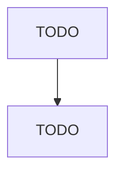

# Other Grocery and Related Products Merchant Wholesalers

> TODO: Business-as-Code definition

## Overview

This industry comprises establishments primarily engaged in the merchant wholesale distribution of groceries and related products (except a general line of groceries; packaged frozen food; dairy products (except dried and canned); poultry products (except canned); confectioneries; fish and seafood (except canned); meat products (except canned); and fresh fruits and vegetables). Included in this industry are establishments primarily engaged in the bottling and merchant wholesale distribution of s

## Actors

| Actor | Description |
|-------|-------------|
| TODO | TODO |

## Entities

| Entity | Description |
|--------|-------------|
| TODO | TODO |

## Actions

| Action | Description |
|--------|-------------|
| TODO | TODO |

## Events

| Event | Description |
|-------|-------------|
| TODO | TODO |

## Searches

| Search | Description |
|--------|-------------|
| TODO | TODO |

## Workflow

## Actor Relationships

