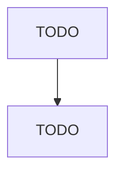

# Grain and Field Bean Merchant Wholesalers

> TODO: Business-as-Code definition

## Overview

This industry comprises establishments primarily engaged in the merchant wholesale distribution of grains, such as corn, wheat, oats, barley, and unpolished rice; dry beans; and soybeans and other inedible beans. Included in this industry are establishments primarily engaged in operating country or terminal grain elevators primarily for the purpose of wholesaling. Cross-References. Establishments primarily engaged in--

## Actors

| Actor | Description |
|-------|-------------|
| TODO | TODO |

## Entities

| Entity | Description |
|--------|-------------|
| TODO | TODO |

## Actions

| Action | Description |
|--------|-------------|
| TODO | TODO |

## Events

| Event | Description |
|-------|-------------|
| TODO | TODO |

## Searches

| Search | Description |
|--------|-------------|
| TODO | TODO |

## Workflow

## Actor Relationships

