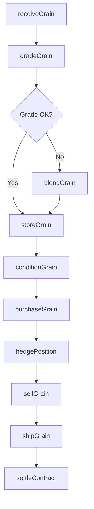
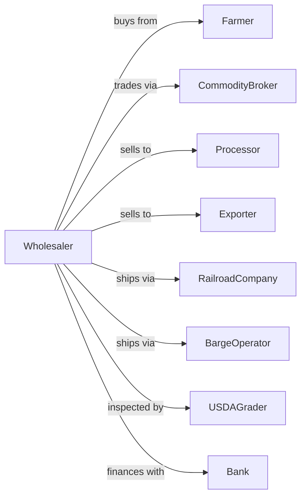

# Grain and Field Bean Merchant Wholesalers

> Business-as-Code definition for grain wholesale distribution operations. Models the complete grain merchandising cycle from farm gate through export terminal or processor delivery.

## Overview

Grain and field bean merchant wholesalers operate country and terminal elevators to receive, store, condition, and sell corn, wheat, soybeans, and other grains. This definition exposes actions for grain procurement, quality grading, storage management, and commodity trading with events for automated hedging and logistics coordination.

## Actors

| Actor | Description |
|-------|-------------|
| Farmer | Producer delivering grain at harvest or from on-farm storage |
| CommodityBroker | Facilitates grain sales and forward contracts |
| Processor | Flour mill, feed mill, or ethanol plant purchasing grain |
| Exporter | Terminal elevator or trading company shipping internationally |
| RailroadCompany | Provides unit train service for bulk grain transport |
| BargeOperator | Moves grain via inland waterways |
| USDAGrader | Federal grain inspector certifying quality |
| Bank | Provides commodity financing and operating capital |

## Roles

| Role | Description |
|------|-------------|
| GrainMerchandiser | Buys grain from farmers and negotiates sales |
| ElevatorManager | Oversees receiving, storage, and shipping operations |
| GrainGrader | Tests incoming grain for moisture, damage, and quality |
| TrafficCoordinator | Schedules rail cars, trucks, and barges |
| RiskManager | Manages futures positions and hedging strategy |
| Accountant | Tracks settlements, storage fees, and inventory value |

## Entities

| Entity | Description |
|--------|-------------|
| GrainLot | Batch of grain with origin, grade, and weight |
| Contract | Purchase or sale agreement with price and delivery terms |
| Bin | Storage structure with capacity and commodity assignment |
| GradeFactors | Quality metrics including moisture, test weight, damage |
| ScaleTicket | Weight receipt for incoming or outgoing grain |
| FuturesPosition | Hedge position on commodity exchange |
| BasisContract | Forward purchase with price tied to futures |
| ShippingOrder | Instructions for outbound grain movement |
| StorageLedger | Record of bushels stored by customer and fee |
| Inventory | Current grain stocks by type, grade, and location |

## Actions

| Action | Description |
|--------|-------------|
| receiveGrain | Accept delivery from farmer at elevator |
| gradeGrain | Test for moisture, damage, foreign material |
| storeGrain | Place in appropriate bin based on grade |
| conditionGrain | Dry or aerate to maintain quality |
| purchaseGrain | Buy grain from farmer or another elevator |
| sellGrain | Execute sale to processor, exporter, or broker |
| hedgePosition | Establish futures position to manage price risk |
| shipGrain | Load trucks, rail cars, or barges for delivery |
| blendGrain | Combine lots to achieve target grade |
| transferOwnership | Move stored grain between customer accounts |
| calculateBasis | Determine local cash price versus futures |
| settleContract | Complete payment for delivered grain |

## Events

| Event | Description |
|-------|-------------|
| grainReceived | Grain arrived and weighed at elevator |
| grainGraded | Quality test results recorded |
| grainStored | Grain placed in storage bin |
| grainSold | Sale contract executed |
| grainShipped | Outbound shipment departed |
| contractSettled | Payment completed for delivery |
| priceAlert | Market moved beyond threshold |
| basisChanged | Local cash price spread changed |
| inventoryLow | Stocks fell below target level |
| storageFull | Bin capacity reached |
| hedgePlaced | Futures position established |
| qualityIssue | Grain condition requires attention |

## Searches

| Search | Description |
|--------|-------------|
| getInventory | Check grain stocks by type, grade, and location |
| getContracts | Retrieve open purchase and sale contracts |
| findFarmers | Search producer accounts and delivery history |
| getMarketPrices | Get current futures and cash prices |
| getBasis | View local basis levels by delivery point |
| getShipments | Track outbound grain movements |
| getStorageAccounts | List customers with grain in storage |

## Workflow



## Actor Relationships



## Usage

### Calling Actions

```typescript
import { wholesaleGrain } from '@headlessly/wholesale-grain'

const elevator = wholesaleGrain()

// Receive grain from farmer
const lot = await elevator.receiveGrain({
  farmerId: 'johnson-farms',
  commodity: 'corn',
  grossWeight: 72000,
  tareWeight: 32000,
  deliveryType: 'spot-sale'
})

// Grade the incoming grain
const grade = await elevator.gradeGrain({
  lotId: lot.id,
  tests: ['moisture', 'testWeight', 'damage', 'foreignMaterial']
})

// Purchase and hedge
await elevator.purchaseGrain({
  lotId: lot.id,
  priceType: 'cash',
  price: 5.85,
  paymentTerms: 'net-30'
})

await elevator.hedgePosition({
  commodity: 'corn',
  bushels: lot.netBushels,
  action: 'sell',
  month: 'CZ24'
})
```

### Event-Driven Automation

```typescript
// Auto-hedge on purchase
elevator.grainReceived(async ({ lotId, commodity, bushels }) => {
  await elevator.hedgePosition({
    commodity,
    bushels,
    action: 'sell',
    month: getNearbyMonth(commodity)
  })
})

// Alert on basis opportunity
elevator.basisChanged(async ({ location, commodity, oldBasis, newBasis }) => {
  if (newBasis > oldBasis + 0.10) {
    // Basis strengthened - good time to sell cash grain
    await notifyMerchandiser({
      message: `Basis improved ${newBasis - oldBasis} at ${location}`
    })
  }
})
```
