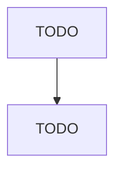

# Livestock Merchant Wholesalers

> TODO: Business-as-Code definition

## Overview

This industry comprises establishments primarily engaged in the merchant wholesale distribution of livestock (except horses and mules). Illustrative Examples: Cattle merchant wholesalers Hogs merchant wholesalers Goats merchant wholesalers Sheep merchant wholesalers Cross-References.

## Actors

| Actor | Description |
|-------|-------------|
| TODO | TODO |

## Entities

| Entity | Description |
|--------|-------------|
| TODO | TODO |

## Actions

| Action | Description |
|--------|-------------|
| TODO | TODO |

## Events

| Event | Description |
|-------|-------------|
| TODO | TODO |

## Searches

| Search | Description |
|--------|-------------|
| TODO | TODO |

## Workflow

## Actor Relationships

