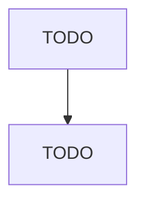

# Other Farm Product Raw Material Merchant Wholesalers

> TODO: Business-as-Code definition

## Overview

This industry comprises establishments primarily engaged in the merchant wholesale distribution of farm products (except grain and field beans, livestock, raw milk, live poultry, and fresh fruits and vegetables). Illustrative Examples: Chicks, live, merchant wholesalers Hemp merchant wholesalers Mules merchant wholesalers Hides merchant wholesalers Raw cotton merchant wholesalers Horses merchant wholesalers Nuts, unprocessed or shelled only, merchant wholesalers Raw pelts merchant wholesalers Le

## Actors

| Actor | Description |
|-------|-------------|
| TODO | TODO |

## Entities

| Entity | Description |
|--------|-------------|
| TODO | TODO |

## Actions

| Action | Description |
|--------|-------------|
| TODO | TODO |

## Events

| Event | Description |
|-------|-------------|
| TODO | TODO |

## Searches

| Search | Description |
|--------|-------------|
| TODO | TODO |

## Workflow

## Actor Relationships

