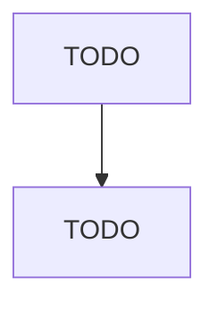

# Other Chemical and Allied Products Merchant Wholesalers

> TODO: Business-as-Code definition

## Overview

This industry comprises establishments primarily engaged in the merchant wholesale distribution of chemicals and allied products (except agricultural and medicinal chemicals, paints and varnishes, fireworks, and plastics materials and basic forms and shapes). Illustrative Examples: Acids merchant wholesalers Industrial chemicals merchant wholesalers Automotive chemicals (except lubricating oils and greases) merchant wholesalers Industrial salts merchant wholesalers Dyestuffs merchant wholesalers

## Actors

| Actor | Description |
|-------|-------------|
| TODO | TODO |

## Entities

| Entity | Description |
|--------|-------------|
| TODO | TODO |

## Actions

| Action | Description |
|--------|-------------|
| TODO | TODO |

## Events

| Event | Description |
|-------|-------------|
| TODO | TODO |

## Searches

| Search | Description |
|--------|-------------|
| TODO | TODO |

## Workflow

## Actor Relationships

