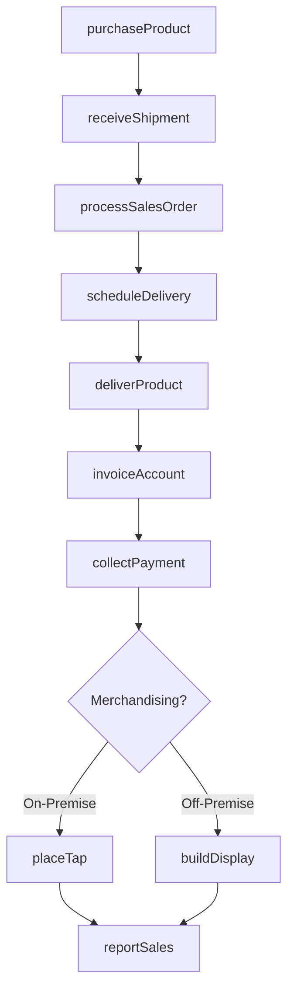
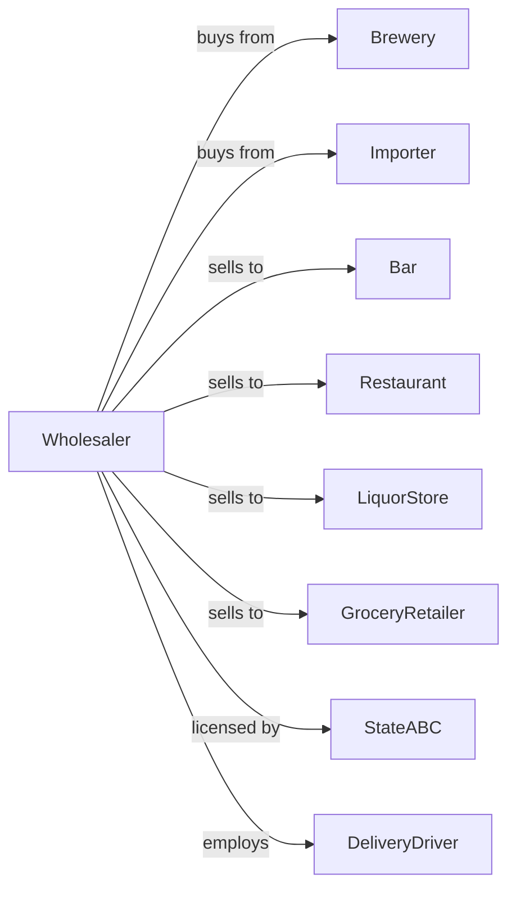

# Beer and Ale Merchant Wholesalers

> Business-as-Code definition for beer wholesale distribution operations. Models the complete three-tier distribution from breweries through licensed retail accounts.

## Overview

Beer and ale merchant wholesalers distribute domestic and imported beers, craft ales, and malt beverages to bars, restaurants, liquor stores, and grocery retailers. This definition exposes actions for product procurement, cold chain management, territory coverage, and regulatory compliance with events for automated inventory management and market execution.

## Actors

| Actor | Description |
|-------|-------------|
| Brewery | Domestic or craft brewery supplying beer products |
| Importer | Brings international beer brands to market |
| Bar | On-premise retailer serving draft and packaged beer |
| Restaurant | Foodservice establishment with beer program |
| LiquorStore | Off-premise package store selling beer |
| GroceryRetailer | Supermarket with beer section |
| StateABC | State alcohol control board regulating sales |
| DeliveryDriver | Licensed driver delivering to retail accounts |

## Roles

| Role | Description |
|------|-------------|
| SalesRepresentative | Manages retail accounts and takes orders |
| TerritoryManager | Oversees sales reps and account coverage |
| WarehouseManager | Manages cold storage and inventory operations |
| DeliveryDriver | Operates delivery trucks to retail accounts |
| MerchandiserRep | Builds displays and ensures shelf compliance |
| ComplianceOfficer | Ensures regulatory and licensing compliance |

## Entities

| Entity | Description |
|--------|-------------|
| Product | Beer SKU with brand, package, and UPC |
| Inventory | Current stock by product and warehouse location |
| RetailAccount | Licensed bar, restaurant, or store |
| SalesOrder | Customer order specifying products and quantities |
| DeliveryRoute | Optimized sequence of delivery stops |
| Invoice | Billing document for delivered product |
| PriceList | Current pricing by product and account type |
| Promotion | Deal or discount program from supplier |
| Tap | Draft beer handle placement at on-premise account |
| Display | Point-of-sale merchandising in retail location |

## Actions

| Action | Description |
|--------|-------------|
| purchaseProduct | Order beer from brewery or importer |
| receiveShipment | Accept delivery into cold storage warehouse |
| processSalesOrder | Pick, stage, and prepare customer order |
| scheduleDelivery | Plan delivery route and assign driver |
| deliverProduct | Transport and deliver to retail account |
| invoiceAccount | Generate billing for delivered product |
| collectPayment | Process payment from retail account |
| placeTap | Install draft handle at on-premise account |
| buildDisplay | Set up merchandising in retail location |
| runPromotion | Execute supplier promotional program |
| auditAccount | Visit retail location to check compliance |
| reportSales | Submit depletions to supplier |

## Events

| Event | Description |
|-------|-------------|
| shipmentReceived | Beer arrived from supplier |
| productStored | Inventory placed in cold storage |
| orderReceived | Retail account submitted order |
| orderDelivered | Products delivered to account |
| invoiceSent | Billing transmitted to customer |
| paymentReceived | Account payment processed |
| inventoryLow | Stock fell below reorder point |
| productExpiring | Beer approaching freshness date |
| promotionStarted | Supplier promotion activated |
| promotionEnded | Promotional program expired |
| tapPlaced | Draft handle installed at account |
| displayBuilt | Retail merchandising completed |

## Searches

| Search | Description |
|--------|-------------|
| findProducts | Search catalog by brand, style, or package |
| getInventory | Check stock levels by product and warehouse |
| getAccounts | Search retail accounts by type or territory |
| getOrders | Retrieve orders by account, status, or date |
| getDeliverySchedule | View planned deliveries by route |
| getPromotions | View active supplier promotions |
| getSalesHistory | Retrieve account sales and depletions |

## Workflow



## Actor Relationships



## Usage

### Calling Actions

```typescript
import { distributeBeer } from '@headlessly/distribute-beer'

const distributor = distributeBeer()

// Purchase from brewery
const order = await distributor.purchaseProduct({
  supplierId: 'craft-brewing-co',
  products: [
    { sku: 'ipa-6pk', quantity: 100, unit: 'case' },
    { sku: 'lager-keg', quantity: 20, unit: 'half-barrel' }
  ],
  deliveryDate: '2024-02-12'
})

// Process retail order
await distributor.processSalesOrder({
  accountId: 'downtown-bar-grill',
  items: [
    { productId: 'ipa-6pk', quantity: 5, unit: 'case' },
    { productId: 'lager-keg', quantity: 2, unit: 'half-barrel' }
  ],
  deliveryDate: '2024-02-14'
})

// Place draft handle
await distributor.placeTap({
  accountId: 'downtown-bar-grill',
  productId: 'lager-keg',
  tapPosition: 3,
  glasswareKit: true
})
```

### Event-Driven Automation

```typescript
// Auto-alert on expiring product
distributor.productExpiring(async ({ productId, lotId, daysRemaining }) => {
  if (daysRemaining <= 30) {
    await distributor.runPromotion({
      productId,
      discount: 0.20,
      reason: 'freshness-clearance'
    })
  }
})

// Auto-reorder on low inventory
distributor.inventoryLow(async ({ productId, currentStock, reorderPoint }) => {
  const supplier = await getPreferredSupplier(productId)
  await distributor.purchaseProduct({
    supplierId: supplier.id,
    products: [{ sku: productId, quantity: reorderPoint * 2 }]
  })
})
```
