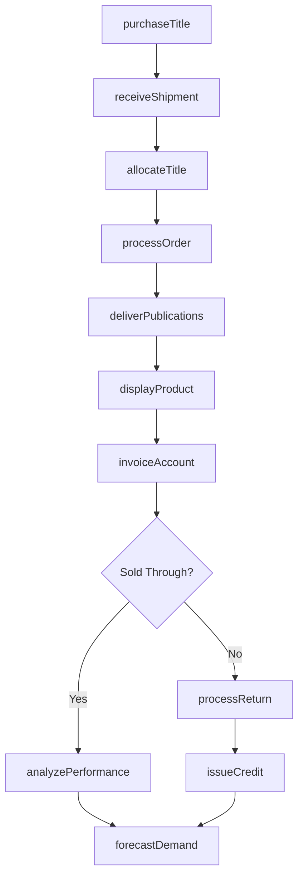
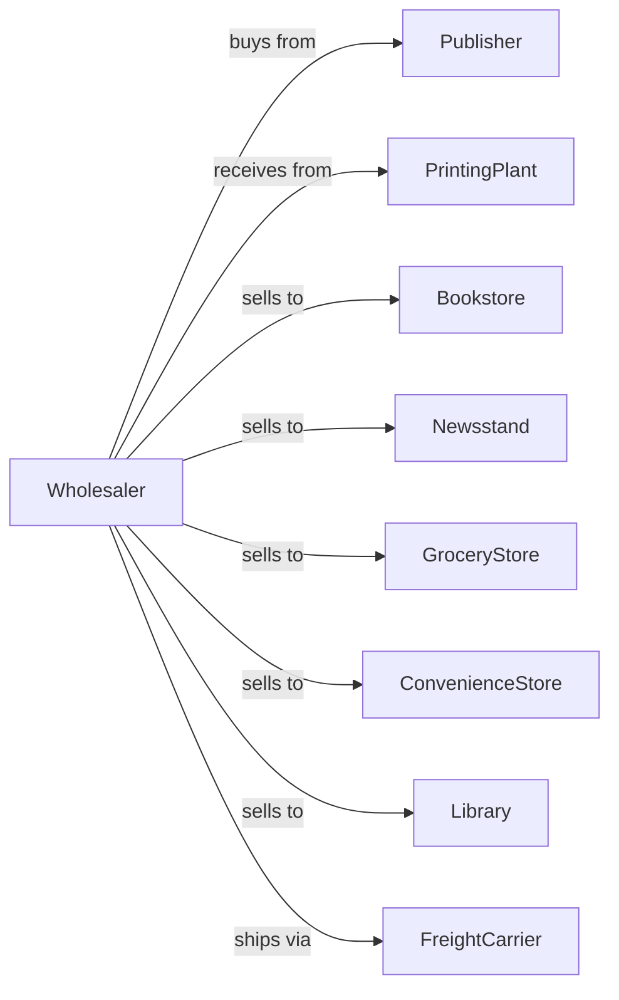

# Book, Periodical, and Newspaper Merchant Wholesalers

> Business-as-Code definition for publication wholesale distribution operations. Models the complete supply chain for books, magazines, and newspapers to retail outlets.

## Overview

Book, periodical, and newspaper merchant wholesalers distribute publications from publishers to bookstores, newsstands, grocery stores, and convenience retailers. This definition exposes actions for title procurement, inventory management, retail distribution, and returns processing with events for automated replenishment and sell-through optimization.

## Actors

| Actor | Description |
|-------|-------------|
| Publisher | Book or magazine publisher supplying titles |
| PrintingPlant | Produces newspapers and periodicals |
| Bookstore | Retail book seller receiving inventory |
| Newsstand | Kiosk or stand selling newspapers and magazines |
| GroceryStore | Supermarket with magazine racks |
| ConvenienceStore | C-store with publication section |
| Library | Institutional buyer of books and periodicals |
| FreightCarrier | Delivers publications from distributors |

## Roles

| Role | Description |
|------|-------------|
| BuyingManager | Selects titles and manages publisher relationships |
| SalesRepresentative | Manages retail accounts and programs |
| WarehouseManager | Oversees inventory and distribution operations |
| RouteDriver | Delivers publications on regular schedules |
| ReturnsProcessor | Handles unsold publication returns |
| InventoryAnalyst | Tracks sell-through and optimizes allocations |

## Entities

| Entity | Description |
|--------|-------------|
| Title | Book, magazine, or newspaper with ISBN or ISSN |
| Issue | Specific edition or date of periodical |
| Inventory | Current stock by title and warehouse location |
| RetailAccount | Bookstore, newsstand, or retailer |
| AllocationPlan | Distribution quantities by account and title |
| DeliveryRoute | Regular delivery schedule for accounts |
| Invoice | Billing document for delivered publications |
| ReturnCredit | Credit memo for unsold returns |
| SellThrough | Percentage of allocated units sold |
| OnSaleDate | Release date for new titles or issues |

## Actions

| Action | Description |
|--------|-------------|
| purchaseTitle | Order publications from publisher |
| receiveShipment | Accept delivery into warehouse |
| allocateTitle | Distribute quantities to retail accounts |
| processOrder | Pick and prepare account deliveries |
| deliverPublications | Transport to retail accounts |
| displayProduct | Set up publication racks at retail |
| invoiceAccount | Generate billing for deliveries |
| processReturn | Accept unsold publications for credit |
| issueCredit | Create credit memo for returns |
| analyzePerformance | Calculate sell-through by title and account |
| forecastDemand | Predict quantities for upcoming issues |
| coordinateOnSale | Manage new release timing and distribution |

## Events

| Event | Description |
|-------|-------------|
| shipmentReceived | Publications arrived from publisher |
| titleAllocated | Distribution quantities assigned |
| deliveryCompleted | Publications delivered to account |
| invoiceSent | Billing transmitted to customer |
| returnReceived | Unsold publications returned |
| creditIssued | Return credit processed |
| sellThroughCalculated | Performance metrics updated |
| onSaleDateReached | New issue or title release date |
| inventoryLow | Stock fell below allocation needs |
| issueExpired | Periodical past sale period |
| newTitleAnnounced | Publisher announced upcoming release |
| rackServiced | Display restocked and organized |

## Searches

| Search | Description |
|--------|-------------|
| findTitles | Search catalog by title, author, or category |
| getInventory | Check stock levels by title and location |
| getAccounts | Search retail accounts by type or route |
| getAllocations | View distribution plan by title |
| getReturns | Retrieve returns by account or period |
| getSellThrough | View performance metrics by title |
| getUpcoming | List titles approaching on-sale date |

## Workflow



## Actor Relationships



## Usage

### Calling Actions

```typescript
import { wholesalePublications } from '@headlessly/wholesale-publications'

const distributor = wholesalePublications()

// Purchase from publisher
const order = await distributor.purchaseTitle({
  publisherId: 'major-publishing-house',
  titles: [
    { isbn: '978-0-123456-78-9', quantity: 500 },
    { isbn: '978-0-987654-32-1', quantity: 250 }
  ],
  shipDate: '2024-02-10'
})

// Allocate to retail accounts
await distributor.allocateTitle({
  titleId: '978-0-123456-78-9',
  allocations: [
    { accountId: 'downtown-bookstore', quantity: 25 },
    { accountId: 'airport-newsstand', quantity: 15 },
    { accountId: 'grocery-chain', quantity: 100 }
  ]
})

// Process returns
await distributor.processReturn({
  accountId: 'downtown-bookstore',
  items: [
    { titleId: '978-0-111222-33-4', quantity: 8, condition: 'resalable' },
    { titleId: '978-0-444555-66-7', quantity: 3, condition: 'damaged' }
  ]
})
```

### Event-Driven Automation

```typescript
// Auto-allocate on new issue arrival
distributor.shipmentReceived(async ({ titleId, quantity }) => {
  const accounts = await distributor.getAccounts({ category: 'newsstand' })
  const historicalData = await distributor.getSellThrough({ titleId })

  const allocations = accounts.map(account => ({
    accountId: account.id,
    quantity: calculateAllocation(account, historicalData)
  }))

  await distributor.allocateTitle({ titleId, allocations })
})

// Auto-process expired issues
distributor.issueExpired(async ({ titleId, issueDate }) => {
  const unsold = await distributor.getInventory({ titleId })
  if (unsold.quantity > 0) {
    await distributor.processReturn({
      type: 'affidavit-strip',
      titleId,
      quantity: unsold.quantity
    })
  }
})
```
