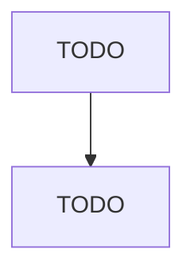

# Other Miscellaneous Nondurable Goods Merchant Wholesalers

> TODO: Business-as-Code definition

## Overview

This industry comprises establishments primarily engaged in the merchant wholesale distribution of nondurable goods (except printing and writing paper; stationery and office supplies; industrial and personal service paper; drugs and druggists' sundries; apparel, piece goods, and notions; grocery and related products; farm product raw materials; chemical and allied products; petroleum and petroleum products; beer, wine, and distilled alcoholic beverages; farm supplies; books, periodicals, and new

## Actors

| Actor | Description |
|-------|-------------|
| TODO | TODO |

## Entities

| Entity | Description |
|--------|-------------|
| TODO | TODO |

## Actions

| Action | Description |
|--------|-------------|
| TODO | TODO |

## Events

| Event | Description |
|-------|-------------|
| TODO | TODO |

## Searches

| Search | Description |
|--------|-------------|
| TODO | TODO |

## Workflow

## Actor Relationships

