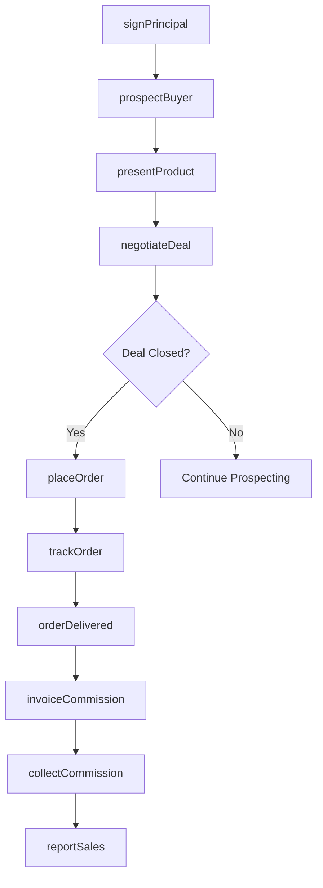
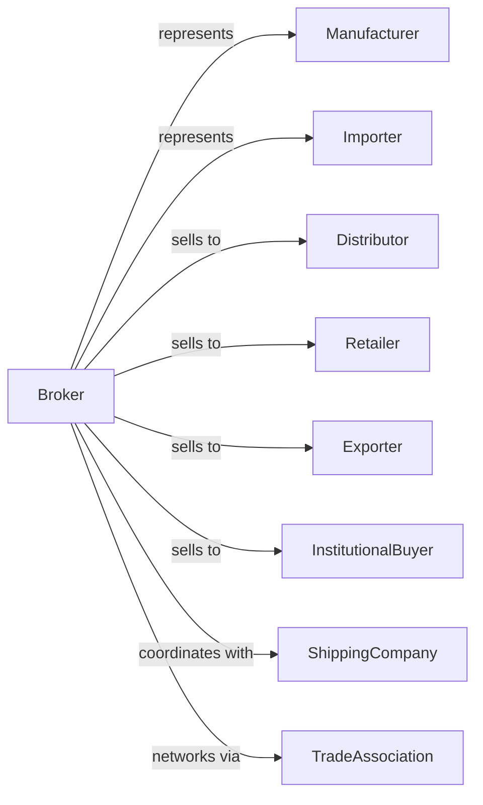

# Wholesale Trade Agents and Brokers

> Business-as-Code definition for wholesale brokerage and sales agent operations. Models the complete transaction cycle for connecting buyers and sellers without taking title to goods.

## Overview

Wholesale trade agents and brokers facilitate transactions between buyers and sellers of durable and nondurable goods, earning commissions or fees without taking ownership of merchandise. This definition exposes actions for principal representation, buyer-seller matching, deal negotiation, and commission management with events for automated lead qualification and transaction tracking.

## Actors

| Actor | Description |
|-------|-------------|
| Manufacturer | Principal seeking representation for product sales |
| Importer | Principal requiring sales channels for imported goods |
| Distributor | Buyer purchasing goods through broker network |
| Retailer | Buyer sourcing products via brokers |
| Exporter | Buyer seeking goods for international markets |
| InstitutionalBuyer | Large-scale purchaser using broker services |
| ShippingCompany | Arranges logistics for brokered transactions |
| TradeAssociation | Industry group providing market intelligence |

## Roles

| Role | Description |
|------|-------------|
| SalesAgent | Represents principals and solicits orders |
| BrokerPrincipal | Owns brokerage firm and manages relationships |
| AccountManager | Maintains relationships with key principals |
| MarketAnalyst | Researches trends and identifies opportunities |
| TransactionCoordinator | Manages order processing and documentation |
| CommissionsManager | Tracks and reconciles commission payments |

## Entities

| Entity | Description |
|--------|-------------|
| Principal | Manufacturer or supplier represented by broker |
| Buyer | Customer purchasing through broker services |
| Product | Item or product line represented for sale |
| Territory | Geographic or market area of representation |
| Commission | Fee structure for transactions and services |
| SalesAgreement | Contract between broker and principal |
| Order | Purchase transaction facilitated by broker |
| Quote | Price proposal for buyer inquiry |
| Lead | Prospective buyer or sales opportunity |
| Invoice | Billing for commissions earned |

## Actions

| Action | Description |
|--------|-------------|
| signPrincipal | Establish representation agreement with supplier |
| prospectBuyer | Identify and qualify potential customers |
| presentProduct | Introduce principal's products to buyers |
| negotiateDeal | Facilitate terms between buyer and seller |
| placeOrder | Submit purchase order to principal |
| trackOrder | Monitor order fulfillment and delivery |
| invoiceCommission | Bill principal for earned commissions |
| collectCommission | Receive payment for services |
| analyzeMarket | Research trends and competitive landscape |
| reportSales | Provide sales data and forecasts to principal |
| resolveDispute | Mediate issues between buyer and seller |
| renewAgreement | Extend or modify principal relationship |

## Events

| Event | Description |
|-------|-------------|
| principalSigned | New representation agreement executed |
| leadQualified | Prospective buyer confirmed as viable |
| productPresented | Sales presentation completed |
| dealNegotiated | Terms agreed between parties |
| orderPlaced | Purchase transaction submitted |
| orderShipped | Principal dispatched goods to buyer |
| orderDelivered | Buyer received merchandise |
| commissionEarned | Transaction qualified for payment |
| commissionPaid | Payment received from principal |
| agreementExpiring | Representation contract nearing end |
| territoryChanged | Geographic coverage modified |
| disputeRaised | Issue reported by buyer or principal |

## Searches

| Search | Description |
|--------|-------------|
| findPrincipals | Search represented manufacturers and suppliers |
| findBuyers | Search customer accounts and prospects |
| getOrders | Retrieve transactions by principal or buyer |
| getCommissions | View earned and pending commission payments |
| getLeads | List qualified prospects and opportunities |
| getTerritories | View geographic coverage by principal |
| getSalesHistory | Retrieve historical sales by product or account |

## Workflow



## Actor Relationships



## Usage

### Calling Actions

```typescript
import { brokerGoods } from '@headlessly/broker-goods'

const agency = brokerGoods()

// Sign new principal
const agreement = await agency.signPrincipal({
  principalId: 'acme-manufacturing',
  products: ['widget-a', 'widget-b', 'widget-pro'],
  territory: ['northeast', 'mid-atlantic'],
  commissionRate: 0.08,
  term: '2-years',
  exclusivity: 'exclusive'
})

// Present products to prospective buyer
await agency.presentProduct({
  buyerId: 'regional-distributor',
  products: ['widget-a', 'widget-pro'],
  presentation: 'virtual-demo',
  attendees: ['buyer', 'category-manager']
})

// Place order after negotiation
const order = await agency.placeOrder({
  principalId: 'acme-manufacturing',
  buyerId: 'regional-distributor',
  items: [
    { productId: 'widget-a', quantity: 500, price: 45.00 },
    { productId: 'widget-pro', quantity: 100, price: 125.00 }
  ],
  terms: 'net-30',
  shipTo: 'buyer-warehouse-main'
})

// Invoice for commission
await agency.invoiceCommission({
  orderId: order.id,
  commissionRate: 0.08,
  invoiceAmount: order.total * 0.08
})
```

### Event-Driven Automation

```typescript
// Auto-invoice on order delivery
agency.orderDelivered(async ({ orderId, principalId, orderTotal }) => {
  const agreement = await agency.findPrincipals({ id: principalId })
  const commission = orderTotal * agreement.commissionRate

  await agency.invoiceCommission({
    orderId,
    principalId,
    commissionAmount: commission
  })
})

// Auto-alert on expiring agreements
agency.agreementExpiring(async ({ principalId, expirationDate, daysRemaining }) => {
  if (daysRemaining <= 60) {
    await notifyAccountManager({
      principalId,
      message: `Agreement expires in ${daysRemaining} days - schedule renewal discussion`
    })
  }
})
```
