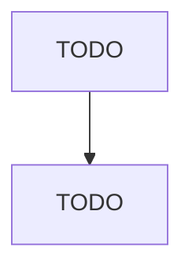

# Wholesale Trade Agents and Brokers

> TODO: Business-as-Code definition

## Overview

This industry comprises wholesale trade agents and brokers acting on behalf of buyers or sellers in the wholesale distribution of goods, including those that use the Internet or other electronic means to bring together buyers and sellers. Agents and brokers do not take title to the goods being sold but rather receive a commission or fee for their service. Agents and brokers for all durable and nondurable goods are included in this industry. Illustrative Examples: Independent sales representative

## Actors

| Actor | Description |
|-------|-------------|
| TODO | TODO |

## Entities

| Entity | Description |
|--------|-------------|
| TODO | TODO |

## Actions

| Action | Description |
|--------|-------------|
| TODO | TODO |

## Events

| Event | Description |
|-------|-------------|
| TODO | TODO |

## Searches

| Search | Description |
|--------|-------------|
| TODO | TODO |

## Workflow

## Actor Relationships

