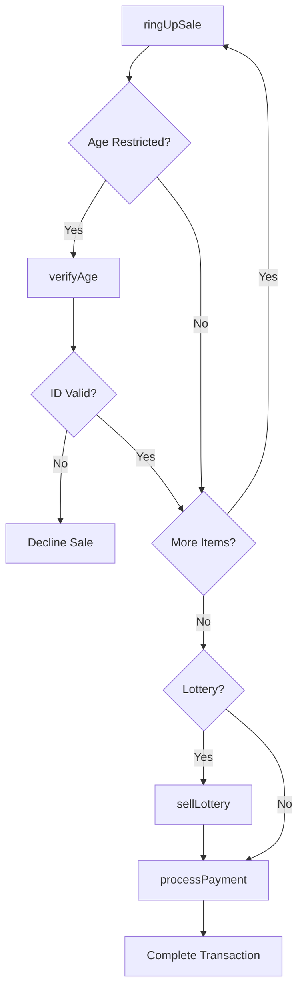
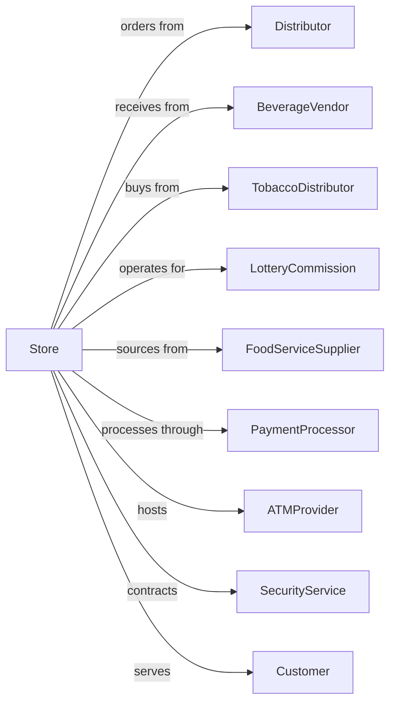

# Convenience Retailers

> Business-as-Code definition for convenience store retail operations. Models quick-trip shopping for snacks, beverages, tobacco, lottery, and prepared foods with fast checkout and extended hours.

## Overview

Convenience retailers provide limited grocery items including beverages, snacks, tobacco, and prepared foods in a quick-service format. This definition exposes actions for fast transactions, age-verified sales, lottery operations, foodservice, and inventory management optimized for high-velocity convenience items.

## Actors

| Actor | Description |
|-------|-------------|
| Distributor | Provides grocery and packaged goods |
| BeverageVendor | Delivers soft drinks, energy drinks, and water |
| TobaccoDistributor | Supplies cigarettes and tobacco products |
| LotteryCommission | Manages lottery terminal and tickets |
| FoodServiceSupplier | Provides prepared food ingredients |
| PaymentProcessor | Handles cards, cash, and mobile payments |
| ATMProvider | Operates in-store ATM machine |
| SecurityService | Monitors for theft and safety |
| Customer | Quick-trip shopper |

## Roles

| Role | Description |
|------|-------------|
| StoreManager | Oversees store operations |
| AssistantManager | Supports manager and handles shifts |
| Cashier | Processes transactions and checks ID |
| StockClerk | Replenishes coolers and shelves |
| FoodServiceWorker | Prepares hot food and beverages |
| NightShiftAttendant | Operates store during overnight hours |

## Entities

| Entity | Description |
|--------|-------------|
| Product | SKU with price and age restriction flag |
| Transaction | Customer purchase record |
| LotteryTicket | Instant or drawing game ticket |
| AgeRestriction | Products requiring ID verification |
| PreparedFood | Hot dogs, pizza, and roller grill items |
| Fountain | Self-serve beverage dispensers |
| Cooler | Refrigerated display for beverages |
| MoneyOrder | Financial services product |
| Shift | Employee work period |

## Actions

| Action | Description |
|--------|-------------|
| ringUpSale | Process item at register |
| verifyAge | Check ID for restricted products |
| sellLottery | Process lottery ticket purchase |
| cashLottery | Pay out winning tickets |
| prepareFood | Make hot food items |
| brewCoffee | Maintain fresh coffee supply |
| stockCooler | Replenish cold beverages |
| processPayment | Complete transaction |
| sellMoneyOrder | Issue money order |
| countDrawer | Balance cash at shift end |
| receiveDSD | Accept direct store delivery |
| monitorSecurity | Watch for theft and safety issues |

## Events

| Event | Description |
|-------|-------------|
| saleRungUp | Item added to transaction |
| ageVerified | ID checked and approved |
| lotterySold | Ticket purchased |
| lotteryCashed | Winning ticket paid |
| foodPrepared | Hot food ready |
| coffeeBrewed | Fresh coffee available |
| coolerStocked | Beverages replenished |
| paymentProcessed | Transaction completed |
| moneyOrderSold | Money order issued |
| drawerCounted | Shift cash balanced |
| dsdReceived | Vendor delivery accepted |
| securityAlert | Potential incident detected |

## Searches

| Search | Description |
|--------|-------------|
| findProducts | Search by name or category |
| checkStock | Query inventory levels |
| getLotteryStatus | Check terminal and ticket status |
| getShiftSales | View sales by shift |
| getPreparedFoodStatus | Check food holding times |
| getDeliverySchedule | View expected vendor deliveries |
| getSecurityLogs | Retrieve incident reports |
| getTopSellers | View highest velocity items |

## Workflow



## Actor Relationships



## Usage

### Calling Actions

```typescript
import { retailConvenience } from '@headlessly/retail-convenience'

const store = retailConvenience()

// Ring up customer purchase
const transaction = await store.ringUpSale({
  items: [
    { sku: 'REDBULL-12OZ', quantity: 2 },
    { sku: 'DORITOS-REG', quantity: 1 },
    { sku: 'MARLBORO-RED', quantity: 1, ageRestricted: true }
  ]
})

// Verify age for tobacco
const ageCheck = await store.verifyAge({
  transactionId: transaction.id,
  idType: 'drivers-license',
  dateOfBirth: '1990-05-15',
  idNumber: 'D12345678'
})

// Process lottery purchase
await store.sellLottery({
  transactionId: transaction.id,
  games: [
    { type: 'powerball', quantity: 1, quickPick: true },
    { type: 'scratch', sku: 'LUCKY-7S', quantity: 3 }
  ]
})

// Complete payment
await store.processPayment({
  transactionId: transaction.id,
  method: 'cash',
  tendered: 50.00
})
```

### Event-Driven Automation

```typescript
// Alert on food holding time
store.foodPrepared(async ({ itemId, preparedAt, holdTime }) => {
  await scheduleTask({
    at: addMinutes(preparedAt, holdTime - 15),
    action: async () => {
      await alertStaff({
        message: `${itemId} expires in 15 minutes`,
        priority: 'medium'
      })
    }
  })
})

// Reorder high-velocity items
store.coolerStocked(async ({ products }) => {
  for (const product of products) {
    if (product.daysOfSupply < 1) {
      await createPurchaseOrder({
        sku: product.sku,
        quantity: product.parLevel - product.onHand,
        priority: 'urgent'
      })
    }
  }
})
```
