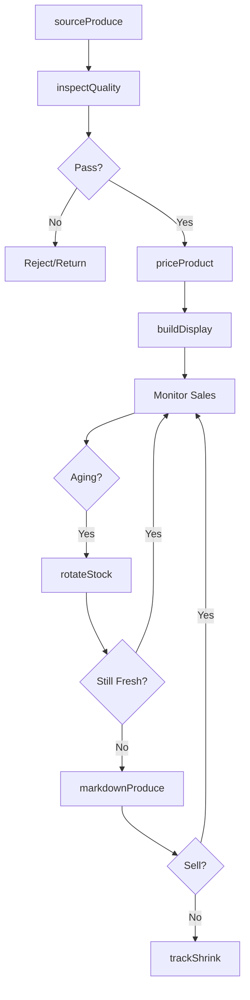
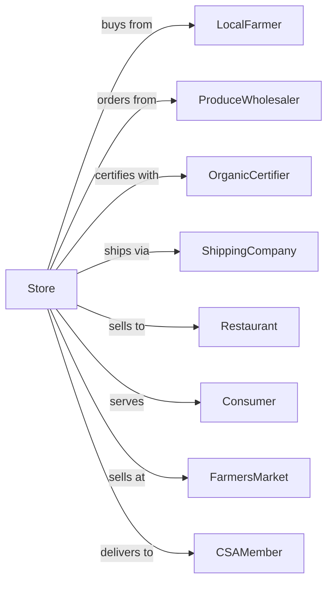

# Fruit and Vegetable Retailers

> Business-as-Code definition for fresh produce retail operations. Models sourcing from farms and markets, quality grading, display merchandising, and perishable inventory management for fruits and vegetables.

## Overview

Fruit and vegetable retailers specialize in fresh produce sourced from farms, wholesale markets, and distributors. This definition exposes actions for quality assessment, seasonal sourcing, display merchandising, ripeness management, and customer service for farmers markets, produce stands, and specialty greengrocers.

## Actors

| Actor | Description |
|-------|-------------|
| LocalFarmer | Provides locally grown produce |
| ProduceWholesaler | Distributes fruits and vegetables |
| OrganicCertifier | Verifies organic growing practices |
| ShippingCompany | Transports produce from source |
| PackagingSupplier | Provides bags, crates, and containers |
| Restaurant | Commercial buyer for foodservice |
| Consumer | Individual purchasing produce |
| FarmersMarket | Venue for direct-to-consumer sales |
| CSAMember | Subscriber to produce box program |

## Roles

| Role | Description |
|------|-------------|
| StoreOwner | Owns and operates produce business |
| Buyer | Sources and purchases produce |
| ProduceManager | Manages quality and displays |
| SalesClerk | Assists customers and processes sales |
| StockHandler | Receives, grades, and stocks produce |
| DeliveryDriver | Delivers to customers and restaurants |
| MarketStandOperator | Sells at farmers markets |

## Entities

| Entity | Description |
|--------|-------------|
| Product | Fruit or vegetable item |
| Grade | Quality classification for produce |
| Lot | Batch of produce from single source |
| Display | Merchandised arrangement of products |
| Season | Time period for product availability |
| Source | Farm or supplier origin |
| CSABox | Weekly produce subscription package |
| Ripeness | Maturity stage of produce |
| Shrink | Product loss from spoilage |

## Actions

| Action | Description |
|--------|-------------|
| sourceProduce | Purchase from farms and wholesalers |
| inspectQuality | Grade incoming produce |
| buildDisplay | Merchandise products attractively |
| rotateStock | Move older produce forward |
| adjustRipeness | Manage ripening conditions |
| priceProduct | Set prices based on quality and market |
| assembleCsaBox | Build weekly subscription box |
| processOrder | Complete customer purchase |
| deliverOrder | Transport to customer location |
| markdownProduce | Reduce price on aging items |
| trackShrink | Monitor and record product loss |
| adviseSeason | Inform customer on peak seasons |

## Events

| Event | Description |
|-------|-------------|
| produceSourced | Purchase order placed |
| qualityInspected | Incoming produce graded |
| displayBuilt | Products merchandised |
| stockRotated | Inventory refreshed |
| ripenessAdjusted | Storage conditions modified |
| productPriced | Prices set |
| csaBoxAssembled | Subscription box ready |
| orderProcessed | Sale completed |
| orderDelivered | Customer received delivery |
| produceMarkedDown | Price reduced |
| shrinkTracked | Loss recorded |
| seasonAdvised | Customer informed |

## Searches

| Search | Description |
|--------|-------------|
| findProducts | Search by type, origin, or organic |
| checkAvailability | Query current inventory |
| getSeasonalProducts | View in-season items |
| findSources | List available suppliers |
| getCsaMembers | View subscription customers |
| getShrinkReport | Review product loss data |
| getPriceHistory | Track price trends |
| getLocalFarms | Find nearby producers |

## Workflow



## Actor Relationships



## Usage

### Calling Actions

```typescript
import { sellProduce } from '@headlessly/sell-produce'

const store = sellProduce()

// Source seasonal produce
const order = await store.sourceProduce({
  supplier: 'valley-farms',
  items: [
    { product: 'tomatoes', variety: 'heirloom', quantity: 50, unit: 'lbs' },
    { product: 'peaches', variety: 'freestone', quantity: 3, unit: 'cases' },
    { product: 'corn', variety: 'bi-color', quantity: 10, unit: 'dozen' }
  ],
  delivery: 'tomorrow-early'
})

// Inspect and grade quality
const inspection = await store.inspectQuality({
  lotId: order.lotId,
  criteria: {
    appearance: 'good',
    firmness: 'appropriate',
    defects: 'minimal',
    temperature: 'cold-chain-maintained'
  }
})

// Assemble CSA box
await store.assembleCsaBox({
  week: '2024-W15',
  boxType: 'standard',
  contents: [
    { product: 'spinach', quantity: 1, unit: 'bunch' },
    { product: 'tomatoes', quantity: 2, unit: 'lbs' },
    { product: 'apples', quantity: 4, unit: 'each' },
    { product: 'carrots', quantity: 1, unit: 'bunch' }
  ]
})
```

### Event-Driven Automation

```typescript
// Auto-markdown aging produce
store.stockRotated(async ({ products }) => {
  for (const product of products) {
    if (product.daysInInventory > product.peakDays) {
      await store.markdownProduce({
        productId: product.id,
        discount: 0.30,
        reason: 'peak-freshness-passed'
      })
    }
  }
})

// Notify CSA members of weekly box
store.csaBoxAssembled(async ({ week, members }) => {
  for (const member of members) {
    await notifyMember({
      memberId: member.id,
      message: `Your ${week} produce box is ready!`,
      contents: member.boxContents,
      pickupWindow: member.pickupWindow
    })
  }
})
```
