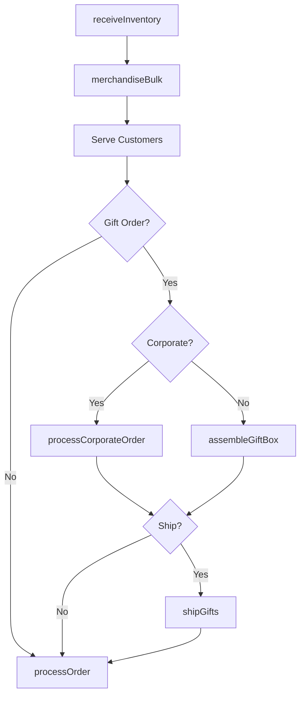
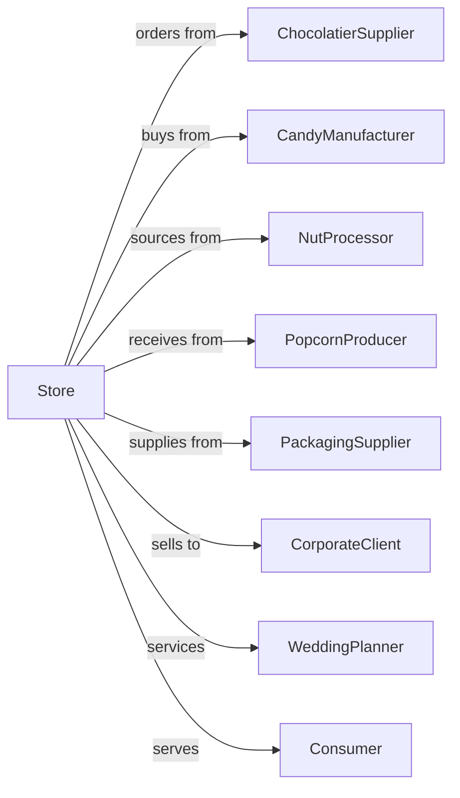

# Confectionery and Nut Retailers

> Business-as-Code definition for candy and nut retail operations. Models chocolate sourcing, gift box assembly, seasonal merchandising, and specialty confection sales for retail customers and corporate gifting.

## Overview

Confectionery and nut retailers specialize in candy, chocolates, nuts, and popcorn products. This definition exposes actions for gift box assembly, seasonal inventory management, bulk candy merchandising, corporate gifting programs, and custom assortment creation for retail and wholesale customers.

## Actors

| Actor | Description |
|-------|-------------|
| ChocolatierSupplier | Provides premium chocolates |
| CandyManufacturer | Supplies bulk and packaged candy |
| NutProcessor | Sources roasted and flavored nuts |
| PopcornProducer | Provides gourmet popcorn products |
| PackagingSupplier | Supplies gift boxes and ribbons |
| CorporateClient | Business purchasing gifts |
| WeddingPlanner | Orders favors and candy bars |
| Consumer | Individual purchasing confections |
| HolidayDistributor | Supplies seasonal items |

## Roles

| Role | Description |
|------|-------------|
| StoreOwner | Owns and operates candy shop |
| StoreManager | Oversees daily operations |
| SalesAssociate | Serves customers and creates gifts |
| GiftAssembler | Builds custom gift boxes |
| BulkMerchandiser | Maintains candy displays |
| CorporateCoordinator | Handles business accounts |
| EventSpecialist | Plans candy bars and event services |

## Entities

| Entity | Description |
|--------|-------------|
| Chocolate | Premium and everyday chocolates |
| Candy | Hard, soft, and novelty confections |
| Nut | Roasted, flavored, and mixed nuts |
| GiftBox | Assembled assortment in decorative box |
| BulkCandy | Self-serve candy by weight |
| SeasonalItem | Holiday-themed confections |
| CorporateOrder | Business gift program order |
| CandyBar | Event display with assorted sweets |
| Favor | Individual wrapped portion for events |

## Actions

| Action | Description |
|--------|-------------|
| receiveInventory | Accept confection shipments |
| merchandiseBulk | Stock self-serve candy displays |
| assembleGiftBox | Create custom assortment |
| takeCustomOrder | Accept special gift request |
| processCorporateOrder | Handle business gift program |
| createCandyBar | Design event candy display |
| packageFavors | Prepare individual event portions |
| manageSeasonal | Stock holiday merchandise |
| processOrder | Complete customer sale |
| offerSampling | Provide product tasting |
| shipGifts | Mail gift orders to recipients |
| trackInventory | Monitor stock levels |

## Events

| Event | Description |
|-------|-------------|
| inventoryReceived | Shipment accepted |
| bulkMerchandised | Candy displays stocked |
| giftBoxAssembled | Custom assortment ready |
| customOrderTaken | Special request recorded |
| corporateOrderProcessed | Business order completed |
| candyBarCreated | Event display designed |
| favorsPackaged | Event portions ready |
| seasonalManaged | Holiday items stocked |
| orderProcessed | Sale completed |
| samplingOffered | Tasting provided |
| giftsShipped | Mail orders sent |
| inventoryTracked | Stock levels updated |

## Searches

| Search | Description |
|--------|-------------|
| findProducts | Search by type, flavor, or brand |
| checkInventory | Query current stock |
| findGiftOptions | Browse gift box selections |
| getCorporateAccounts | List business customers |
| getSeasonalItems | View holiday products |
| findEventPackages | Browse candy bar options |
| getTopSellers | View popular items |
| findDietaryOptions | Search sugar-free, vegan items |

## Workflow



## Actor Relationships



## Usage

### Calling Actions

```typescript
import { sellConfectionery } from '@headlessly/sell-confectionery'

const store = sellConfectionery()

// Assemble custom gift box
const giftBox = await store.assembleGiftBox({
  customerId: 'cust-123',
  size: 'large',
  contents: [
    { product: 'truffles-assorted', quantity: 12 },
    { product: 'caramels-sea-salt', quantity: 8 },
    { product: 'almonds-dark-chocolate', quantity: 0.5, unit: 'lbs' },
    { product: 'toffee-english', quantity: 6 }
  ],
  packaging: {
    box: 'gold-ribbon',
    card: 'Happy Birthday!',
    bow: 'burgundy'
  }
})

// Process corporate gift order
const corporateOrder = await store.processCorporateOrder({
  accountId: 'corp-456',
  orderType: 'holiday-gifts',
  items: {
    giftBox: 'executive-collection',
    quantity: 50,
    customization: {
      ribbon: 'company-blue',
      card: 'Thank you for your partnership'
    }
  },
  recipients: 'provided-list',
  shipDate: '2024-12-15'
})

// Create wedding candy bar
await store.createCandyBar({
  eventId: 'wedding-789',
  date: '2024-06-22',
  guestCount: 150,
  selections: [
    { product: 'jordan-almonds', quantity: 10, unit: 'lbs' },
    { product: 'jelly-beans-gourmet', quantity: 8, unit: 'lbs' },
    { product: 'chocolate-coins', quantity: 200, unit: 'each' }
  ],
  displayRental: true,
  delivery: true
})
```

### Event-Driven Automation

```typescript
// Remind corporate accounts before holidays
store.inventoryTracked(async ({ season }) => {
  if (season === 'pre-holiday') {
    const accounts = await store.getCorporateAccounts()
    for (const account of accounts) {
      await sendReminder({
        accountId: account.id,
        message: 'Order holiday gifts early for best selection',
        deadline: 'december-1'
      })
    }
  }
})

// Notify when gift ships
store.giftsShipped(async ({ orderId, recipients, tracking }) => {
  for (const recipient of recipients) {
    await notifyRecipient({
      email: recipient.email,
      message: 'A gift is on its way!',
      tracking: tracking[recipient.id],
      sender: recipient.giftFrom
    })
  }
})
```
