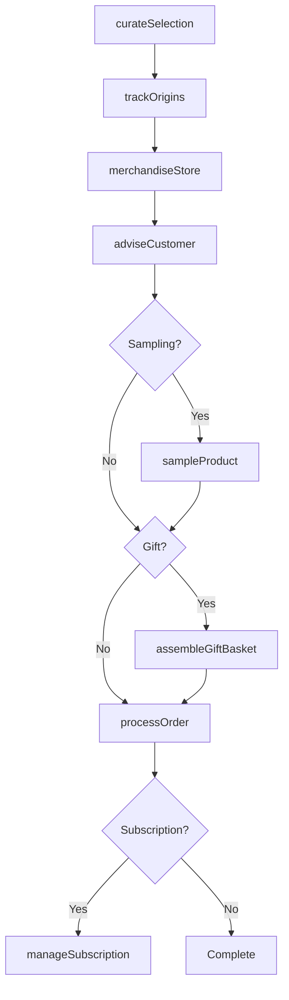
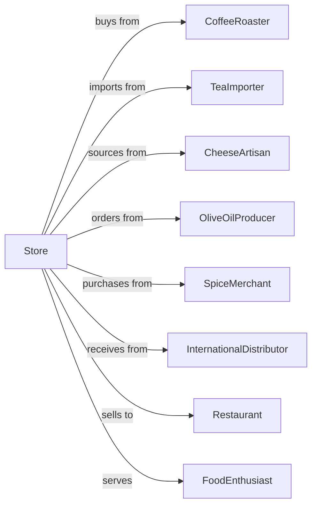

# All Other Specialty Food Retailers

> Business-as-Code definition for specialty food retail operations. Models gourmet products, coffee, tea, spices, dairy specialties, and other niche food items with expertise-driven customer service.

## Overview

Specialty food retailers focus on gourmet foods, artisan products, and niche categories including coffee, tea, spices, cheese, olive oil, and international ingredients. This definition exposes actions for product curation, tasting events, subscription programs, and expert consultation for discerning food enthusiasts.

## Actors

| Actor | Description |
|-------|-------------|
| CoffeeRoaster | Provides specialty coffee beans |
| TeaImporter | Sources fine teas worldwide |
| CheeseArtisan | Supplies artisan cheeses |
| OliveOilProducer | Provides premium oils and vinegars |
| SpiceMerchant | Sources spices and seasonings |
| InternationalDistributor | Imports ethnic and gourmet foods |
| Restaurant | Commercial buyer for ingredients |
| FoodEnthusiast | Consumer seeking specialty items |
| GiftBuyser | Customer purchasing food gifts |

## Roles

| Role | Description |
|------|-------------|
| ShopOwner | Owns and operates specialty store |
| FoodBuyer | Curates product selection |
| ProductExpert | Provides expert recommendations |
| SalesAssociate | Serves customers and processes sales |
| TastingCoordinator | Organizes sampling events |
| SubscriptionManager | Handles monthly box programs |
| CheeseMonger | Specializes in cheese selection |

## Entities

| Entity | Description |
|--------|-------------|
| Coffee | Specialty beans and ground coffee |
| Tea | Fine loose leaf and packaged teas |
| Cheese | Artisan and imported cheeses |
| OliveOil | Premium oils and vinegars |
| Spice | Herbs, spices, and seasonings |
| GourmetItem | Specialty and artisan foods |
| Subscription | Monthly curated box program |
| TastingEvent | Product sampling occasion |
| GiftBasket | Curated food gift collection |

## Actions

| Action | Description |
|--------|-------------|
| curateSelection | Choose products for inventory |
| adviseCuastomer | Provide expert recommendations |
| conductTasting | Host product sampling event |
| processOrder | Complete customer sale |
| manageSubscription | Handle monthly box program |
| assembleGiftBasket | Create curated gift collection |
| sourcProduct | Find new specialty items |
| sampleProduct | Provide taste for customer |
| trackOrigins | Document product provenance |
| educateCustomer | Share product knowledge |
| fulfillWholesale | Supply restaurant accounts |
| rotateInventory | Manage perishable stock |

## Events

| Event | Description |
|-------|-------------|
| selectionCurated | New products added |
| customerAdvised | Recommendation provided |
| tastingConducted | Sampling event completed |
| orderProcessed | Sale completed |
| subscriptionManaged | Monthly box shipped |
| giftBasketAssembled | Gift collection ready |
| productSourced | New item found |
| productSampled | Taste provided |
| originsTracked | Provenance documented |
| customerEducated | Knowledge shared |
| wholesaleFulfilled | Restaurant order shipped |
| inventoryRotated | Stock refreshed |

## Searches

| Search | Description |
|--------|-------------|
| findProducts | Search by type, origin, or flavor |
| checkInventory | Query current stock |
| findByOrigin | Search products by country |
| getSubscriptionOptions | View box program choices |
| findGiftOptions | Browse gift basket selections |
| getTastingSchedule | View upcoming events |
| findDietaryOptions | Search organic, vegan items |
| getWholesaleAccounts | List restaurant customers |

## Workflow



## Actor Relationships



## Usage

### Calling Actions

```typescript
import { sellSpecialtyFood } from '@headlessly/sell-specialty-food'

const store = sellSpecialtyFood()

// Advise customer on coffee selection
const recommendation = await store.adviseCustomer({
  customerId: 'cust-123',
  category: 'coffee',
  preferences: {
    roastLevel: 'medium',
    flavorNotes: ['chocolate', 'nutty'],
    origin: 'single-origin',
    brewMethod: 'pour-over'
  }
})

// Assemble gift basket
const basket = await store.assembleGiftBasket({
  theme: 'italian-gourmet',
  budget: 75,
  contents: [
    { product: 'olive-oil-tuscan', size: '500ml' },
    { product: 'balsamic-aged-12yr', size: '250ml' },
    { product: 'pasta-artisan', variety: 'pappardelle' },
    { product: 'pesto-basil-genovese' },
    { product: 'taralli-fennel' }
  ],
  packaging: 'wicker-basket',
  card: 'Buon Appetito!'
})

// Set up subscription
await store.manageSubscription({
  customerId: 'cust-456',
  type: 'coffee-explorer',
  frequency: 'monthly',
  preferences: {
    roastLevels: ['light', 'medium'],
    quantity: '12oz',
    grind: 'whole-bean'
  },
  startDate: '2024-05-01'
})
```

### Event-Driven Automation

```typescript
// Ship subscription boxes
store.subscriptionManaged(async ({ subscriptionId, customerId, shipDate }) => {
  const box = await curateMonthlyBox(subscriptionId)

  await shipBox({
    customerId,
    contents: box.items,
    shippingDate: shipDate,
    includeNotes: true
  })
})

// Invite loyal customers to tastings
store.orderProcessed(async ({ customerId, total, category }) => {
  const customer = await getCustomer(customerId)

  if (customer.lifetimeSpend > 500) {
    const upcomingTasting = await store.getTastingSchedule({ category })
    if (upcomingTasting) {
      await inviteToTasting({
        customerId,
        event: upcomingTasting,
        vipAccess: true
      })
    }
  }
})
```
