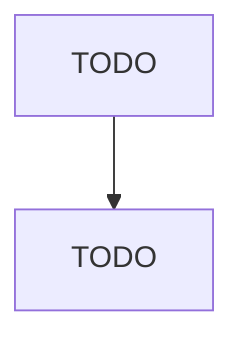

# Floor Covering Retailers

> TODO: Business-as-Code definition

## Overview

This U.S. industry comprises establishments primarily engaged in retailing new floor coverings, such as rugs and carpets, laminate and vinyl floor coverings, linoleum flooring, and floor tile (except ceramic tile or hardwood floor coverings only); or retailing new floor coverings in combination with installation and repair services. Cross-References. Establishments primarily engaged in--

## Actors

| Actor | Description |
|-------|-------------|
| TODO | TODO |

## Roles

| Role | Description |
|------|-------------|
| TODO | TODO |

## Entities

| Entity | Description |
|--------|-------------|
| TODO | TODO |

## Actions

| Action | Description |
|--------|-------------|
| TODO | TODO |

## Events

| Event | Description |
|-------|-------------|
| TODO | TODO |

## Searches

| Search | Description |
|--------|-------------|
| TODO | TODO |

## Workflow

## Actor Relationships

