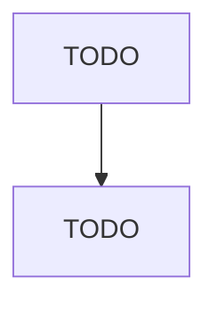

# All Other Home Furnishings Retailers

> TODO: Business-as-Code definition

## Overview

This U.S. industry comprises establishments primarily engaged in retailing new home furnishings (except furniture, floor coverings, and window treatments). Illustrative Examples: Bath shops Kitchenware retailers Chinaware retailers Linen retailers Electric lamp retailers Picture frame retailers, custom Glassware retailers Wood-burning stove retailers Housewares retailers Cross-References. Establishments primarily engaged in--

## Actors

| Actor | Description |
|-------|-------------|
| TODO | TODO |

## Roles

| Role | Description |
|------|-------------|
| TODO | TODO |

## Entities

| Entity | Description |
|--------|-------------|
| TODO | TODO |

## Actions

| Action | Description |
|--------|-------------|
| TODO | TODO |

## Events

| Event | Description |
|-------|-------------|
| TODO | TODO |

## Searches

| Search | Description |
|--------|-------------|
| TODO | TODO |

## Workflow

## Actor Relationships

