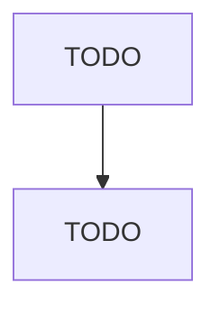

# Electronics and Appliance Retailers

> TODO: Business-as-Code definition

## Overview

This industry comprises establishments primarily engaged in one of the following: (1) retailing an array of new household-type appliances and consumer-type electronic products, such as televisions, computers, electronic tablets, and cameras; (2) specializing in retailing a single line of new consumer-type electronic products; (3) retailing these new products in combination with repair and support services; (4) retailing new prepackaged or downloadable computer software (without publishing); and/

## Actors

| Actor | Description |
|-------|-------------|
| TODO | TODO |

## Roles

| Role | Description |
|------|-------------|
| TODO | TODO |

## Entities

| Entity | Description |
|--------|-------------|
| TODO | TODO |

## Actions

| Action | Description |
|--------|-------------|
| TODO | TODO |

## Events

| Event | Description |
|-------|-------------|
| TODO | TODO |

## Searches

| Search | Description |
|--------|-------------|
| TODO | TODO |

## Workflow

## Actor Relationships

