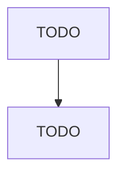

# All Other General Merchandise Retailers

> TODO: Business-as-Code definition

## Overview

This U.S. industry comprises establishments primarily engaged in retailing new and used general merchandise (except department stores, warehouse clubs, superstores, and supercenters). These establishments retail a general line of new and used merchandise, such as apparel, automotive parts, dry goods, groceries, hardware, housewares or home furnishings, and other lines in limited amounts, with none of the lines predominating. This industry also includes establishments primarily engaged in retaili

## Actors

| Actor | Description |
|-------|-------------|
| TODO | TODO |

## Roles

| Role | Description |
|------|-------------|
| TODO | TODO |

## Entities

| Entity | Description |
|--------|-------------|
| TODO | TODO |

## Actions

| Action | Description |
|--------|-------------|
| TODO | TODO |

## Events

| Event | Description |
|-------|-------------|
| TODO | TODO |

## Searches

| Search | Description |
|--------|-------------|
| TODO | TODO |

## Workflow

## Actor Relationships

