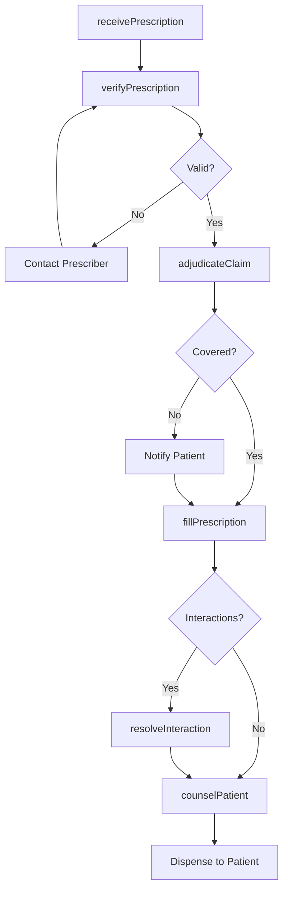
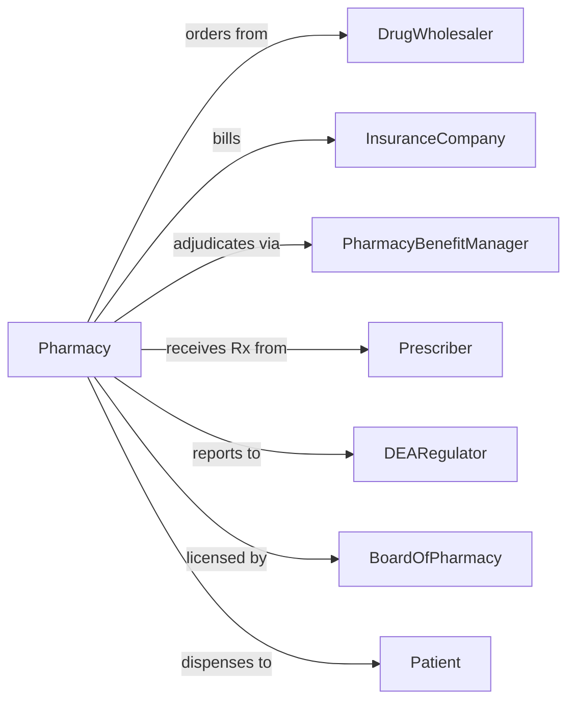

# Pharmacies and Drug Retailers

> Business-as-Code definition for pharmacy and drug retail operations. Models the prescription dispensing lifecycle from order receipt through insurance adjudication, patient consultation, and medication management services.

## Overview

Pharmacies and drug retailers dispense prescription medications, sell over-the-counter drugs, and provide clinical services including immunizations and medication therapy management. This definition exposes actions for prescription processing, insurance claims, patient counseling, and clinical services that drive modern pharmacy operations.

## Actors

| Actor | Description |
|-------|-------------|
| DrugWholesaler | Supplies prescription and OTC medications |
| InsuranceCompany | Provides prescription drug coverage |
| PharmacyBenefitManager | Manages drug formularies and claims processing |
| Prescriber | Physicians and practitioners issuing prescriptions |
| DEARegulator | Enforces controlled substance regulations |
| BoardOfPharmacy | Licenses pharmacists and regulates practice |
| Patient | Individual receiving prescription medications |
| Manufacturer | Produces medications and provides rebates |

## Roles

| Role | Description |
|------|-------------|
| PharmacyManager | Oversees pharmacy operations and compliance |
| Pharmacist | Dispenses medications and counsels patients |
| PharmacyTechnician | Assists with prescription preparation and intake |
| PharmacyClerk | Handles customer service and front-end checkout |
| ImmunizationSpecialist | Administers vaccines and immunizations |
| MTMPharmacist | Provides medication therapy management services |

## Entities

| Entity | Description |
|--------|-------------|
| Prescription | Medication order from prescriber with instructions |
| Medication | Drug product with NDC, strength, and form |
| Patient | Individual with demographic and insurance information |
| InsuranceClaim | Request for payment from payer |
| Copay | Patient cost share for prescription |
| Refill | Subsequent fill of existing prescription |
| ControlledSubstance | DEA-scheduled medication with tracking |
| Immunization | Vaccine administration record |
| DrugInteraction | Alert for potential medication conflict |
| Inventory | Drug stock levels and expiration dates |
| Consultation | Pharmacist counseling session |
| Formulary | Insurance-approved drug list with tiers |

## Actions

| Action | Description |
|--------|-------------|
| receivePrescription | Accept new prescription from prescriber |
| verifyPrescription | Check for completeness and validity |
| adjudicateClaim | Submit to insurance and receive payment |
| fillPrescription | Dispense medication per prescription |
| counselPatient | Provide medication information and guidance |
| processRefill | Fill subsequent dose of existing prescription |
| transferPrescription | Send or receive prescription from another pharmacy |
| administerVaccine | Give immunization and document |
| conductMTM | Perform medication therapy management review |
| orderInventory | Submit drug orders to wholesaler |
| reportControlled | Log controlled substance transactions |
| resolveInteraction | Address drug interaction alerts |

## Events

| Event | Description |
|-------|-------------|
| prescriptionReceived | New order received from prescriber |
| prescriptionVerified | Validity and completeness confirmed |
| claimAdjudicated | Insurance response received |
| prescriptionFilled | Medication dispensed and ready |
| patientCounseled | Consultation completed |
| refillProcessed | Subsequent fill completed |
| prescriptionTransferred | Prescription sent to another pharmacy |
| vaccineAdministered | Immunization given and recorded |
| mtmCompleted | Medication review finished |
| inventoryOrdered | Drug order submitted to wholesaler |
| controlledReported | Schedule II-V transaction logged |
| interactionResolved | Drug conflict addressed with prescriber |

## Searches

| Search | Description |
|--------|-------------|
| findPrescription | Search by patient, Rx number, or prescriber |
| checkDrugCoverage | Verify formulary status and copay |
| getPatientProfile | Retrieve patient medications and history |
| findInteractions | Check for drug-drug interactions |
| getRefillStatus | Check refill eligibility and count |
| getInventory | Query drug stock levels |
| findVaccineRecords | Retrieve patient immunization history |
| getControlledLog | Access controlled substance transaction history |

## Workflow



## Actor Relationships



## Usage

### Calling Actions

```typescript
import { retailPharmaceuticals } from '@headlessly/retail-pharmaceuticals'

const pharmacy = retailPharmaceuticals()

// Receive and process new prescription
const rx = await pharmacy.receivePrescription({
  source: 'eRx',
  prescriber: { npi: '1234567890', name: 'Dr. Smith' },
  patient: { id: 'pat-123', dob: '1980-05-15' },
  medication: { ndc: '00069015401', quantity: 30, directions: 'Take 1 tablet daily' }
})

// Adjudicate insurance claim
const claim = await pharmacy.adjudicateClaim({
  prescriptionId: rx.id,
  insurance: { bin: '004336', pcn: 'ADV', memberId: 'ABC123456' },
  daysSupply: 30
})

// Counsel patient on new medication
await pharmacy.counselPatient({
  prescriptionId: rx.id,
  topics: ['sideEffects', 'foodInteractions', 'storage'],
  patientQuestions: true
})
```

### Event-Driven Automation

```typescript
// Alert pharmacist on critical interactions
pharmacy.prescriptionReceived(async ({ prescriptionId, patientId }) => {
  const interactions = await pharmacy.findInteractions({
    patientId,
    newMedication: prescriptionId
  })
  if (interactions.some(i => i.severity === 'major')) {
    await alertPharmacist({
      prescriptionId,
      interactions: interactions.filter(i => i.severity === 'major')
    })
  }
})

// Send refill reminder
pharmacy.prescriptionFilled(async ({ patientId, prescriptionId, daysSupply }) => {
  const reminderDate = addDays(new Date(), daysSupply - 5)
  await scheduleRefillReminder({
    patientId,
    prescriptionId,
    sendDate: reminderDate
  })
})
```
