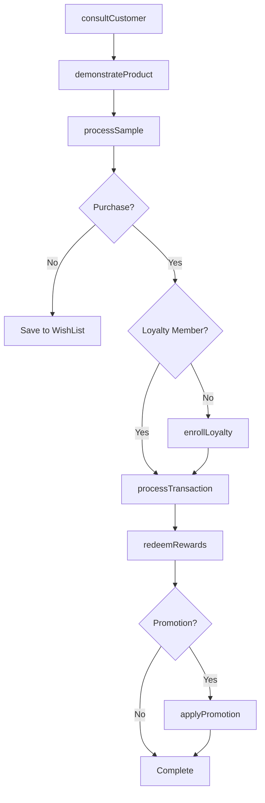
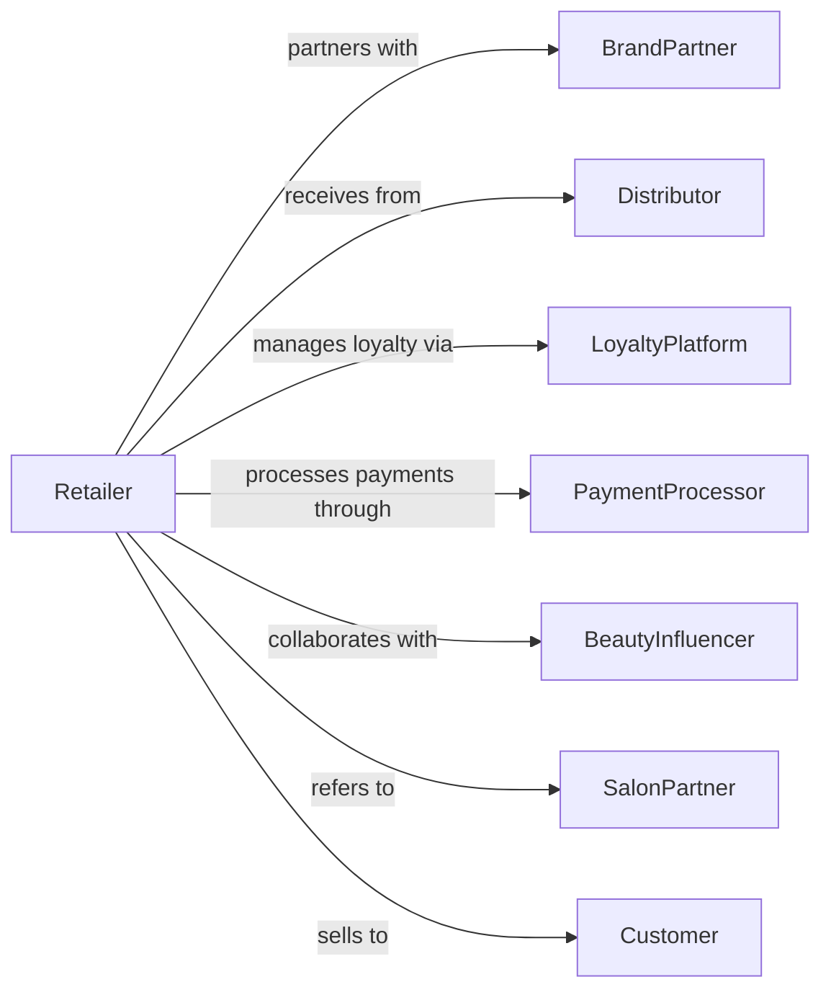

# Cosmetics, Beauty Supplies, and Perfume Retailers

> Business-as-Code definition for cosmetics and beauty retail operations. Models the beauty product sales lifecycle from brand partnerships through customer consultation, loyalty programs, and personalized beauty services.

## Overview

Cosmetics, beauty supplies, and perfume retailers sell makeup, skincare, haircare, fragrances, and personal grooming products through specialized retail environments. This definition exposes actions for beauty consultation, product sampling, loyalty management, and personalized services that drive customer engagement and repeat purchases.

## Actors

| Actor | Description |
|-------|-------------|
| BrandPartner | Supplies branded cosmetics and provides marketing support |
| Distributor | Warehouses and delivers beauty products |
| LoyaltyPlatform | Manages rewards program and customer data |
| PaymentProcessor | Handles card and electronic payment transactions |
| Landlord | Leases retail space in malls and shopping centers |
| Customer | Individual purchasing beauty products |
| BeautyInfluencer | Promotes products through social media partnerships |
| SalonPartner | Provides complementary beauty services |

## Roles

| Role | Description |
|------|-------------|
| StoreManager | Oversees store operations and team performance |
| BeautyAdvisor | Consults with customers on product selection |
| MakeupArtist | Provides application services and tutorials |
| SkinCareSpecialist | Advises on skincare routines and treatments |
| FragranceExpert | Guides customers through scent selection |
| CastMember | Assists customers and processes transactions |
| EducationManager | Trains staff on new products and techniques |

## Entities

| Entity | Description |
|--------|-------------|
| Product | Beauty SKU with brand, category, and attributes |
| Brand | Cosmetics brand with products and marketing assets |
| Sample | Product tester or mini size for trial |
| LoyaltyAccount | Customer rewards membership with points balance |
| Transaction | Customer purchase with items and payment |
| BeautyProfile | Customer preferences, skin type, and history |
| Makeover | Complimentary or paid makeup application service |
| GiftSet | Curated product bundle for gifting |
| Return | Product returned within policy window |
| Subscription | Recurring product delivery program |
| WishList | Customer saved products for future purchase |
| Promotion | Sale, GWP, or bonus points offer |

## Actions

| Action | Description |
|--------|-------------|
| consultCustomer | Discuss needs and recommend products |
| demonstrateProduct | Apply and showcase product on customer |
| processSample | Provide product samples for trial |
| createBeautyProfile | Build customer preference and skin profile |
| processTransaction | Complete purchase with payment and rewards |
| enrollLoyalty | Sign up customer for rewards program |
| bookMakeover | Schedule makeup application appointment |
| processReturn | Handle product returns and exchanges |
| applyPromotion | Activate sale or gift-with-purchase |
| redeemRewards | Apply loyalty points to purchase |
| createGiftSet | Bundle products for gifting |
| manageSubscription | Update recurring delivery preferences |

## Events

| Event | Description |
|-------|-------------|
| customerConsulted | Beauty advice provided |
| productDemonstrated | Product applied and showcased |
| sampleProvided | Tester given to customer |
| beautyProfileCreated | Customer preferences saved |
| transactionCompleted | Purchase finalized with payment |
| loyaltyEnrolled | Customer joined rewards program |
| makeoverBooked | Application appointment scheduled |
| returnProcessed | Refund or exchange completed |
| promotionApplied | Offer activated on purchase |
| rewardsRedeemed | Points applied to transaction |
| giftSetCreated | Bundle assembled for customer |
| subscriptionUpdated | Recurring order modified |

## Searches

| Search | Description |
|--------|-------------|
| findProducts | Search by brand, category, or ingredient |
| getCustomerProfile | Retrieve beauty preferences and history |
| checkInventory | Query stock levels and availability |
| findPromotions | List active sales and offers |
| getLoyaltyBalance | Check customer points and tier |
| getTransactions | Retrieve purchase history |
| findMakeovers | View scheduled appointments |
| getTopSellers | Best-selling products by category |

## Workflow



## Actor Relationships



## Usage

### Calling Actions

```typescript
import { retailCosmetics } from '@headlessly/retail-cosmetics'

const store = retailCosmetics()

// Create beauty profile for customer
const profile = await store.createBeautyProfile({
  customerId: 'cust-456',
  skinType: 'combination',
  skinConcerns: ['aging', 'dullness'],
  preferredBrands: ['brand-A', 'brand-B'],
  allergies: ['fragrance']
})

// Process transaction with rewards
const transaction = await store.processTransaction({
  customerId: 'cust-456',
  items: [
    { sku: 'SERUM-VITAMIN-C', quantity: 1, price: 68.00 },
    { sku: 'MOISTURIZER-HYDRA', quantity: 1, price: 52.00 }
  ],
  loyaltyPointsToRedeem: 500,
  payment: { method: 'credit', amount: 115.00 }
})

// Book makeover appointment
await store.bookMakeover({
  customerId: 'cust-456',
  date: '2024-03-20',
  time: '14:00',
  type: 'special-occasion',
  notes: 'Wedding guest makeup'
})
```

### Event-Driven Automation

```typescript
// Send personalized recommendations
store.beautyProfileCreated(async ({ customerId, skinConcerns }) => {
  const recommendations = await getProductRecommendations({
    concerns: skinConcerns
  })
  await sendPersonalizedEmail({
    customerId,
    subject: 'Products picked just for you',
    products: recommendations
  })
})

// Celebrate loyalty milestones
store.transactionCompleted(async ({ customerId, loyaltyPoints }) => {
  const account = await store.getLoyaltyBalance({ customerId })
  if (account.totalPoints >= 1000 && account.tier === 'insider') {
    await upgradeLoyaltyTier({ customerId, newTier: 'vib' })
    await sendTierUpgradeCelebration({ customerId })
  }
})
```
