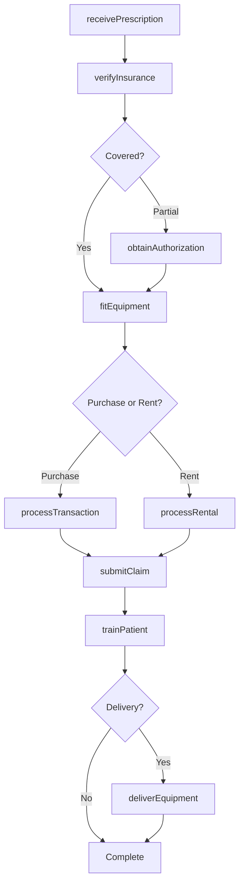
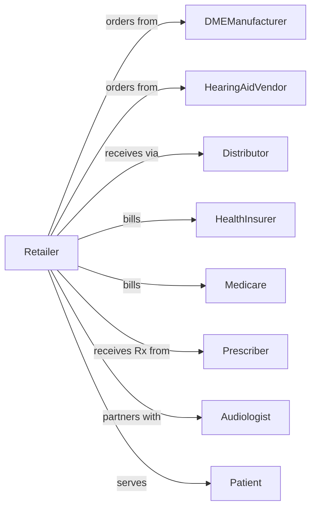

# All Other Health and Personal Care Retailers

> Business-as-Code definition for medical supply retail operations. Models the durable medical equipment and health supply sales lifecycle from prescription processing through insurance billing, fitting, and patient education.

## Overview

Health and personal care retailers in this category sell hearing aids, wheelchairs, mobility equipment, convalescent supplies, and other specialized medical products. This definition exposes actions for prescription verification, insurance authorization, product fitting, patient training, and ongoing service that define medical supply retail.

## Actors

| Actor | Description |
|-------|-------------|
| DMEManufacturer | Produces durable medical equipment and supplies |
| HearingAidVendor | Supplies hearing devices and accessories |
| Distributor | Warehouses and delivers medical supplies |
| HealthInsurer | Provides coverage for medical equipment |
| Medicare | Federal coverage for eligible DME items |
| Prescriber | Physician ordering medical equipment |
| Patient | Individual requiring medical supplies |
| Audiologist | Provides hearing tests and recommendations |

## Roles

| Role | Description |
|------|-------------|
| StoreManager | Oversees medical supply operations |
| DMESpecialist | Fits and adjusts durable medical equipment |
| HearingInstrumentSpecialist | Fits and programs hearing aids |
| BillingSpecialist | Processes insurance claims and authorizations |
| PatientEducator | Trains patients on equipment use |
| DeliveryTechnician | Delivers and sets up equipment at homes |

## Entities

| Entity | Description |
|--------|-------------|
| Equipment | Durable medical equipment item |
| HearingAid | Hearing amplification device |
| Prescription | Physician order for medical equipment |
| Authorization | Insurance pre-approval for equipment |
| Claim | Insurance billing submission |
| Fitting | Equipment adjustment and customization session |
| PatientRecord | Customer medical and equipment history |
| Warranty | Coverage for equipment repairs |
| Rental | Equipment lease arrangement |
| Accessory | Replacement parts and consumables |
| Delivery | Equipment delivery and setup service |
| ServiceTicket | Repair or adjustment request |

## Actions

| Action | Description |
|--------|-------------|
| receivePrescription | Accept physician order for equipment |
| verifyInsurance | Check coverage and benefits |
| obtainAuthorization | Secure prior approval from payer |
| fitEquipment | Adjust equipment for patient comfort |
| processTransaction | Complete sale with payment |
| submitClaim | Bill insurance for covered items |
| trainPatient | Educate on equipment use and care |
| deliverEquipment | Transport and set up at patient location |
| processRental | Set up equipment lease arrangement |
| serviceEquipment | Repair or adjust existing equipment |
| orderAccessories | Fulfill replacement parts and supplies |
| followUpPatient | Check on patient satisfaction and needs |

## Events

| Event | Description |
|-------|-------------|
| prescriptionReceived | Physician order accepted |
| insuranceVerified | Coverage confirmed |
| authorizationObtained | Prior approval secured |
| equipmentFitted | Device adjusted for patient |
| transactionCompleted | Sale finalized |
| claimSubmitted | Insurance bill sent |
| patientTrained | Education completed |
| equipmentDelivered | Setup completed at patient location |
| rentalProcessed | Lease arrangement created |
| equipmentServiced | Repair or adjustment completed |
| accessoriesOrdered | Replacement parts fulfilled |
| followUpCompleted | Patient check-in finished |

## Searches

| Search | Description |
|--------|-------------|
| findEquipment | Search products by type or category |
| getPatientRecord | Retrieve patient history and equipment |
| checkCoverage | Query insurance benefits |
| getAuthorizations | View pending and approved pre-auths |
| getClaims | Track billing submissions |
| findRentals | List active equipment leases |
| getServiceTickets | View repair requests |
| getDeliverySchedule | Upcoming delivery appointments |

## Workflow



## Actor Relationships



## Usage

### Calling Actions

```typescript
import { retailMedicalSupplies } from '@headlessly/retail-medical-supplies'

const store = retailMedicalSupplies()

// Process prescription and verify coverage
const rx = await store.receivePrescription({
  patientId: 'pat-123',
  prescriber: { npi: '1234567890', name: 'Dr. Johnson' },
  equipment: { hcpcs: 'K0823', description: 'Power wheelchair' },
  diagnosis: ['M62.81', 'R26.2']
})

// Obtain prior authorization
const auth = await store.obtainAuthorization({
  prescriptionId: rx.id,
  insurerId: 'medicare',
  documentation: ['mobility-assessment', 'face-to-face-notes']
})

// Fit and deliver equipment
await store.fitEquipment({
  patientId: 'pat-123',
  equipmentId: 'PWC-PRIDE-J6',
  adjustments: ['seat-height', 'armrest-width', 'joystick-position']
})

await store.deliverEquipment({
  patientId: 'pat-123',
  address: '456 Care Lane, Phoenix, AZ 85001',
  setupRequired: true,
  trainingIncluded: true
})
```

### Event-Driven Automation

```typescript
// Submit claim after delivery
store.equipmentDelivered(async ({ patientId, prescriptionId }) => {
  await store.submitClaim({
    patientId,
    prescriptionId,
    serviceDate: new Date()
  })
})

// Schedule follow-up after training
store.patientTrained(async ({ patientId, equipmentType }) => {
  await store.followUpPatient({
    patientId,
    scheduledDate: addDays(new Date(), 14),
    purpose: 'satisfaction-check'
  })
  await sendUsageGuide({ patientId, equipmentType })
})
```
