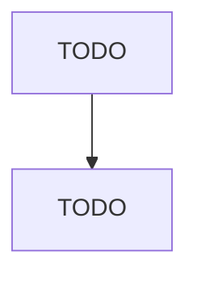

# All Other Health and Personal Care Retailers

> TODO: Business-as-Code definition

## Overview

This U.S. industry comprises establishments primarily engaged in retailing specialized lines of health and personal care merchandise (except drugs, medicines, cosmetics, beauty supplies, perfumes, optical goods, and food supplement products). Illustrative Examples: Convalescent supply retailers Sick room supply retailers Hearing aid retailers Wheelchair retailers Cross-References. Establishments primarily engaged in--

## Actors

| Actor | Description |
|-------|-------------|
| TODO | TODO |

## Roles

| Role | Description |
|------|-------------|
| TODO | TODO |

## Entities

| Entity | Description |
|--------|-------------|
| TODO | TODO |

## Actions

| Action | Description |
|--------|-------------|
| TODO | TODO |

## Events

| Event | Description |
|-------|-------------|
| TODO | TODO |

## Searches

| Search | Description |
|--------|-------------|
| TODO | TODO |

## Workflow

## Actor Relationships

