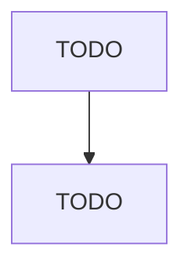

# Gasoline Stations with Convenience Stores

> TODO: Business-as-Code definition

## Overview

This industry comprises establishments primarily engaged in retailing automotive fuels (e.g., gasoline, diesel fuel, gasohol, alternative fuels) in combination with a limited line of groceries. These establishments can either be in a convenience store (i.e., food mart) setting or a gasoline station setting. These establishments may also provide automotive repair services. Cross-References. Establishments primarily engaged in--

## Actors

| Actor | Description |
|-------|-------------|
| TODO | TODO |

## Roles

| Role | Description |
|------|-------------|
| TODO | TODO |

## Entities

| Entity | Description |
|--------|-------------|
| TODO | TODO |

## Actions

| Action | Description |
|--------|-------------|
| TODO | TODO |

## Events

| Event | Description |
|-------|-------------|
| TODO | TODO |

## Searches

| Search | Description |
|--------|-------------|
| TODO | TODO |

## Workflow

## Actor Relationships

