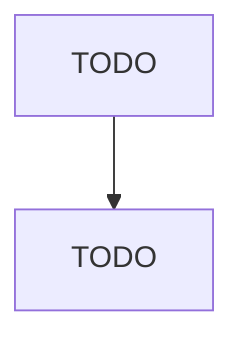

# Other Gasoline Stations

> TODO: Business-as-Code definition

## Overview

This industry comprises establishments generally known as gasoline stations (except those with convenience stores) or truck stops primarily engaged in (1) retailing automotive fuels (e.g., gasoline, diesel fuel, gasohol, alternative fuels) or (2) retailing these fuels in combination with activities, such as providing repair services; selling automotive oils, replacement parts, and accessories; and/or providing food services. Illustrative Examples: Gasoline stations without convenience stores Tru

## Actors

| Actor | Description |
|-------|-------------|
| TODO | TODO |

## Roles

| Role | Description |
|------|-------------|
| TODO | TODO |

## Entities

| Entity | Description |
|--------|-------------|
| TODO | TODO |

## Actions

| Action | Description |
|--------|-------------|
| TODO | TODO |

## Events

| Event | Description |
|-------|-------------|
| TODO | TODO |

## Searches

| Search | Description |
|--------|-------------|
| TODO | TODO |

## Workflow

## Actor Relationships

