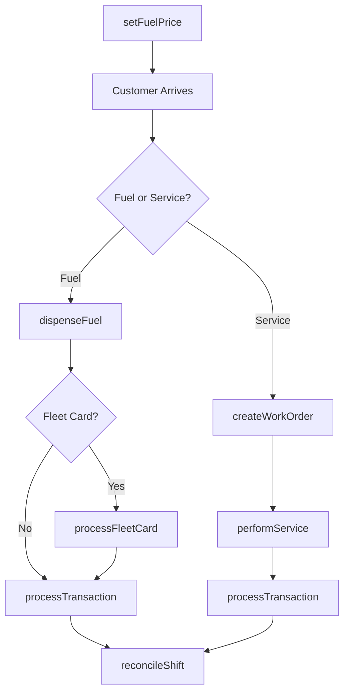
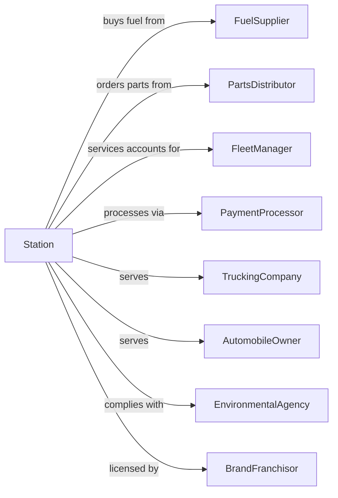

# Other Gasoline Stations

> Business-as-Code definition for gasoline station and truck stop operations. Models the fuel retail lifecycle from procurement through pump operations, automotive services, and fleet accounts.

## Overview

Other gasoline stations include standalone fuel stations without convenience stores, truck stops, and full-service stations offering automotive repairs and services. This definition exposes actions for fuel operations, automotive service management, fleet account handling, and trucker amenities that serve both consumer and commercial customers.

## Actors

| Actor | Description |
|-------|-------------|
| FuelSupplier | Delivers gasoline, diesel, and DEF products |
| PartsDistributor | Supplies automotive parts and accessories |
| FleetManager | Manages commercial vehicle fuel accounts |
| PaymentProcessor | Handles card transactions at pump and office |
| TruckingCompany | Commercial fleet requiring fuel and services |
| AutomobileOwner | Individual customer purchasing fuel and services |
| EnvironmentalAgency | Regulates fuel storage and emissions |
| BrandFranchisor | Licenses fuel brand and quality standards |

## Roles

| Role | Description |
|------|-------------|
| StationManager | Oversees all station operations |
| ServiceManager | Runs automotive repair operations |
| Mechanic | Performs vehicle repairs and maintenance |
| PumpAttendant | Assists customers with fueling |
| FuelDeliveryCoordinator | Manages fuel inventory and deliveries |
| FleetAccountRep | Services commercial account relationships |

## Entities

| Entity | Description |
|--------|-------------|
| FuelProduct | Gasoline, diesel, DEF, or alternative fuel |
| FuelTank | Underground or aboveground storage tank |
| Dispenser | Fuel pump with multiple product nozzles |
| ServiceBay | Automotive repair and maintenance area |
| WorkOrder | Vehicle repair job with parts and labor |
| FleetAccount | Commercial customer with negotiated pricing |
| FuelCard | Fleet payment card with controls |
| Transaction | Customer purchase at pump or service counter |
| PartsSale | Automotive accessory or parts purchase |
| TruckAmenity | Shower, parking, or lounge for truckers |
| DEFDispenser | Diesel exhaust fluid dispensing system |
| TankMonitor | Automated fuel level and leak detection |

## Actions

| Action | Description |
|--------|-------------|
| setFuelPrice | Update pricing on pumps and signs |
| dispenseFuel | Pump fuel to customer vehicle |
| processTransaction | Complete fuel or service purchase |
| receiveFuelDelivery | Accept and verify fuel delivery |
| createWorkOrder | Open automotive repair job |
| performService | Execute vehicle repair or maintenance |
| manageFleetAccount | Set up and maintain commercial accounts |
| processFleetCard | Authorize and track fleet fuel purchases |
| sellParts | Sell automotive accessories and parts |
| monitorTanks | Check fuel levels and environmental compliance |
| provideTruckAmenities | Offer showers, parking, and rest facilities |
| reconcileShift | Balance sales at shift end |

## Events

| Event | Description |
|-------|-------------|
| fuelPriceSet | Pump and sign pricing updated |
| fuelDispensed | Customer received fuel |
| transactionCompleted | Purchase finalized |
| fuelDelivered | Delivery received and verified |
| workOrderCreated | Repair job opened |
| serviceCompleted | Vehicle repair finished |
| fleetAccountCreated | New commercial account set up |
| fleetCardProcessed | Fleet purchase authorized |
| partsSold | Accessory or parts transaction completed |
| tankAlerted | Fuel level low or environmental alert |
| amenityUsed | Trucker accessed shower or parking |
| shiftReconciled | Sales balanced for shift |

## Searches

| Search | Description |
|--------|-------------|
| getFuelPrices | Current pricing by grade |
| getTankLevels | Fuel inventory by tank |
| getWorkOrders | Active and completed repair jobs |
| getFleetAccounts | Commercial accounts by status |
| getTransactions | Sales by date, pump, or account |
| checkPartsInventory | Automotive parts stock levels |
| getAmenityUsage | Trucker facility utilization |
| getEnvironmentalLogs | Tank monitoring and compliance records |

## Workflow



## Actor Relationships



## Usage

### Calling Actions

```typescript
import { retailAutomotiveFuel } from '@headlessly/retail-automotive-fuel'

const station = retailAutomotiveFuel()

// Process fleet fuel transaction
const transaction = await station.processFleetCard({
  cardNumber: 'FLEET-789456',
  pumpId: 8,
  grade: 'diesel',
  gallons: 150,
  pricePerGallon: 3.499,
  odometerReading: 456789,
  driverPin: '1234'
})

// Create service work order
const workOrder = await station.createWorkOrder({
  vehicleInfo: {
    vin: '1GCGG25K081234567',
    make: 'Chevrolet',
    model: 'Silverado',
    year: 2022
  },
  requestedServices: ['oil-change', 'tire-rotation', 'brake-inspection'],
  customerContact: '555-123-4567',
  dropOffTime: '2024-03-15T08:00:00Z'
})

// Complete repair and charge
await station.performService({
  workOrderId: workOrder.id,
  labor: [{ service: 'oil-change', hours: 0.5, rate: 75.00 }],
  parts: [{ sku: 'OIL-5W30-5QT', quantity: 1, price: 32.99 }]
})
```

### Event-Driven Automation

```typescript
// Auto-order fuel when tank low
station.tankAlerted(async ({ tankId, productType, currentGallons, alertType }) => {
  if (alertType === 'low-level') {
    await station.receiveFuelDelivery({
      requestType: 'schedule',
      product: productType,
      requestedGallons: 8000,
      urgency: currentGallons < 500 ? 'emergency' : 'standard'
    })
  } else if (alertType === 'leak-detected') {
    await alertEnvironmentalTeam({ tankId, alertType })
  }
})

// Notify fleet manager of large purchase
station.fleetCardProcessed(async ({ accountId, gallons, totalAmount }) => {
  if (gallons > 200 || totalAmount > 1000) {
    await notifyFleetManager({
      accountId,
      message: `Large fuel purchase: ${gallons} gallons for $${totalAmount}`
    })
  }
})
```
