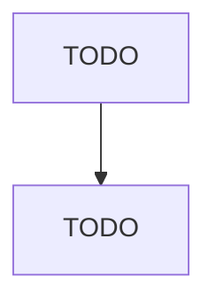

# Clothing and Clothing Accessories Retailers

> TODO: Business-as-Code definition

## Overview

This industry comprises establishments primarily engaged in retailing general or specialized lines of new clothing and clothing accessories, such as hats and caps, costume jewelry, gloves, handbags, ties, wigs, toupees, and belts. These establishments may provide basic alterations, such as hemming, taking in or letting out seams, or lengthening or shortening sleeves. Cross-References. Establishments primarily engaged in--

## Actors

| Actor | Description |
|-------|-------------|
| TODO | TODO |

## Roles

| Role | Description |
|------|-------------|
| TODO | TODO |

## Entities

| Entity | Description |
|--------|-------------|
| TODO | TODO |

## Actions

| Action | Description |
|--------|-------------|
| TODO | TODO |

## Events

| Event | Description |
|-------|-------------|
| TODO | TODO |

## Searches

| Search | Description |
|--------|-------------|
| TODO | TODO |

## Workflow

## Actor Relationships

