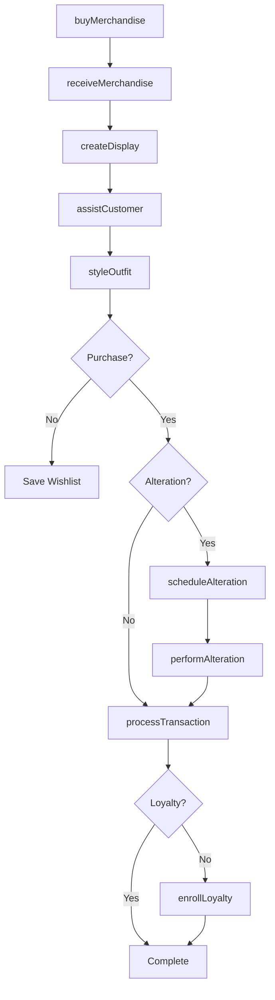
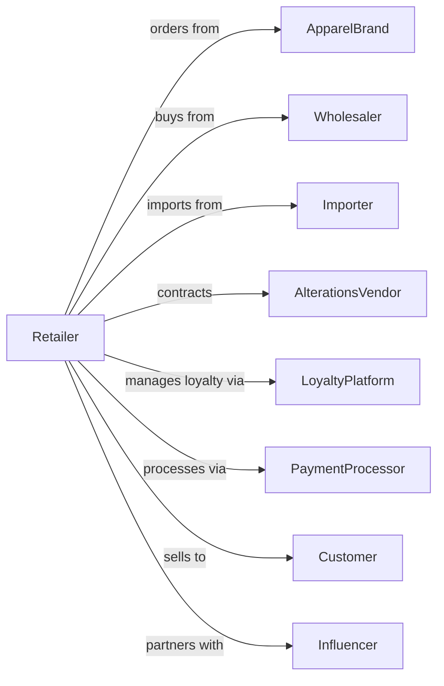

# Clothing and Clothing Accessories Retailers

> Business-as-Code definition for apparel retail operations. Models the clothing sales lifecycle from seasonal buying through visual merchandising, customer styling, alterations, and omnichannel fulfillment.

## Overview

Clothing and clothing accessories retailers sell new apparel, accessories like hats, bags, belts, and ties through specialty stores. This definition exposes actions for seasonal merchandise planning, visual presentation, customer styling consultations, basic alterations, and loyalty programs that drive fashion retail.

## Actors

| Actor | Description |
|-------|-------------|
| ApparelBrand | Designs and supplies clothing lines |
| Wholesaler | Distributes apparel from multiple brands |
| Importer | Sources garments from overseas manufacturers |
| AlterationsVendor | Provides advanced tailoring services |
| LoyaltyPlatform | Manages rewards and customer data |
| PaymentProcessor | Handles card and electronic payments |
| Customer | Individual purchasing clothing and accessories |
| Influencer | Promotes styles through social media |

## Roles

| Role | Description |
|------|-------------|
| StoreManager | Oversees store operations and team |
| BuyerMerchant | Selects seasonal assortments |
| SalesAssociate | Assists customers and processes sales |
| Stylist | Provides personalized outfit recommendations |
| VisualMerchandiser | Creates displays and store presentation |
| AlterationsTailor | Performs hemming and basic adjustments |
| InventorySpecialist | Manages stock levels and transfers |

## Entities

| Entity | Description |
|--------|-------------|
| Garment | Clothing item with size, color, and style |
| Accessory | Hat, belt, bag, scarf, or other fashion item |
| Collection | Seasonal merchandise grouping |
| Transaction | Customer purchase with items and payment |
| Alteration | Hemming, taking in, or other adjustment |
| LoyaltyAccount | Customer rewards membership |
| Return | Merchandise returned within policy |
| Promotion | Sale, discount, or special offer |
| FittingRoom | Try-on area for customers |
| Outfit | Curated combination of items |
| SizeInventory | Stock quantity by size and color |
| GiftCard | Stored value card for purchases |

## Actions

| Action | Description |
|--------|-------------|
| buyMerchandise | Select and order seasonal inventory |
| receiveMerchandise | Check in and process incoming shipments |
| createDisplay | Design and set up visual merchandising |
| assistCustomer | Help with selection and fit |
| styleOutfit | Curate complete look for customer |
| processTransaction | Complete sale with payment |
| scheduleAlteration | Book tailoring service |
| performAlteration | Execute hemming or adjustment |
| processReturn | Handle merchandise returns |
| enrollLoyalty | Sign up customer for rewards |
| transferInventory | Move stock between locations |
| applyPromotion | Activate sale pricing |

## Events

| Event | Description |
|-------|-------------|
| merchandiseBought | Seasonal order placed |
| merchandiseReceived | Shipment processed and stocked |
| displayCreated | Visual presentation completed |
| customerAssisted | Shopping help provided |
| outfitStyled | Complete look curated |
| transactionCompleted | Sale finalized |
| alterationScheduled | Tailoring booked |
| alterationCompleted | Adjustment finished |
| returnProcessed | Refund or exchange completed |
| loyaltyEnrolled | Customer joined rewards |
| inventoryTransferred | Stock moved between stores |
| promotionApplied | Sale pricing activated |

## Searches

| Search | Description |
|--------|-------------|
| findProducts | Search by style, size, or brand |
| checkInventory | Query stock by size and color |
| getCustomerProfile | Retrieve shopping history and preferences |
| findTransactions | Search sales by date or customer |
| getAlterations | View scheduled and completed tailoring |
| findPromotions | List active sales and offers |
| getLoyaltyBalance | Check customer rewards points |
| getCollections | Current seasonal assortments |

## Workflow



## Actor Relationships



## Usage

### Calling Actions

```typescript
import { retailApparel } from '@headlessly/retail-apparel'

const store = retailApparel()

// Style complete outfit for customer
const outfit = await store.styleOutfit({
  customerId: 'cust-456',
  occasion: 'business-casual',
  season: 'fall',
  items: [
    { sku: 'BLAZER-NAVY-M', price: 189.99 },
    { sku: 'SHIRT-WHITE-M', price: 79.99 },
    { sku: 'CHINOS-KHAKI-32', price: 89.99 },
    { sku: 'BELT-BROWN-34', price: 49.99 }
  ]
})

// Process sale with alteration
const transaction = await store.processTransaction({
  customerId: 'cust-456',
  items: outfit.items,
  alterations: [
    { sku: 'CHINOS-KHAKI-32', type: 'hem', inseam: 30 }
  ],
  loyaltyPointsEarned: 42
})

// Schedule alteration pickup
await store.scheduleAlteration({
  transactionId: transaction.id,
  alterationType: 'hem',
  pickupDate: '2024-03-18'
})
```

### Event-Driven Automation

```typescript
// Notify customer when alteration ready
store.alterationCompleted(async ({ transactionId, customerId }) => {
  await notifyCustomer({
    customerId,
    message: 'Your alterations are ready for pickup!'
  })
})

// Send personalized style recommendations
store.transactionCompleted(async ({ customerId, items }) => {
  const profile = await store.getCustomerProfile({ customerId })
  const recommendations = await generateStyleSuggestions({
    purchaseHistory: profile.purchases,
    recentItems: items
  })
  await sendStyleEmail({
    customerId,
    subject: 'Complete your new look',
    products: recommendations
  })
})
```
