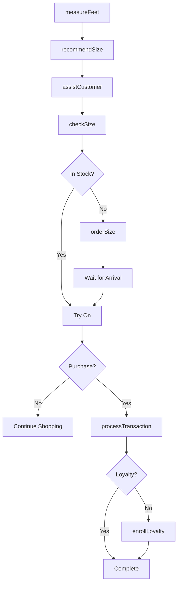
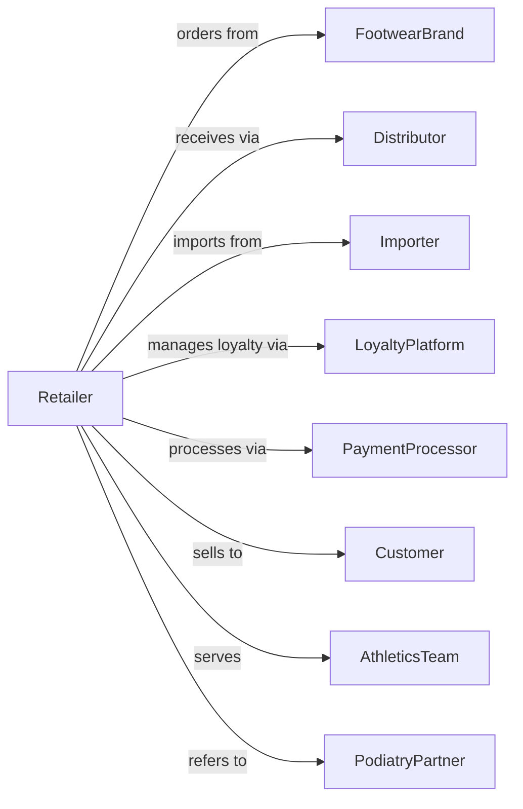

# Shoe Retailers

> Business-as-Code definition for footwear retail operations. Models the shoe sales lifecycle from seasonal buying through fitting consultation, inventory management, and customer loyalty programs.

## Overview

Shoe retailers sell athletic, casual, dress, and specialty footwear through dedicated stores with expert fitting services. This definition exposes actions for shoe fitting, inventory management by size, customer consultation, and loyalty programs that drive specialty footwear retail.

## Actors

| Actor | Description |
|-------|-------------|
| FootwearBrand | Designs and manufactures shoe lines |
| Distributor | Warehouses and delivers footwear products |
| Importer | Sources shoes from overseas factories |
| LoyaltyPlatform | Manages rewards and customer data |
| PaymentProcessor | Handles card and electronic payments |
| Customer | Individual purchasing footwear |
| AthleticsTeam | Group orders for team footwear |
| PodiatryPartner | Provides foot health referrals |

## Roles

| Role | Description |
|------|-------------|
| StoreManager | Oversees store operations and team |
| FittingSpecialist | Measures feet and recommends sizes |
| SalesAssociate | Assists customers with selection |
| InventoryManager | Manages stock by size and style |
| BuyingManager | Selects seasonal assortments |
| StockroomAssociate | Retrieves shoes and maintains backstock |

## Entities

| Entity | Description |
|--------|-------------|
| Shoe | Footwear product with style, size, and width |
| Brand | Footwear brand with product lines |
| SizeRun | Available sizes for a style |
| Transaction | Customer purchase with items and payment |
| Fitting | Foot measurement and size recommendation |
| LoyaltyAccount | Customer rewards membership |
| Return | Merchandise returned within policy |
| Promotion | Sale or discount offer |
| Inventory | Stock quantity by size and width |
| Order | Special order for unavailable size |
| GiftCard | Stored value card for purchases |
| Collection | Seasonal style grouping |

## Actions

| Action | Description |
|--------|-------------|
| measureFeet | Take foot measurements for fit |
| recommendSize | Suggest appropriate size and width |
| assistCustomer | Help with style selection |
| checkSize | Query specific size availability |
| processTransaction | Complete sale with payment |
| orderSize | Request unavailable size from warehouse |
| processReturn | Handle merchandise returns |
| enrollLoyalty | Sign up customer for rewards |
| createGroupOrder | Set up team or bulk purchase |
| receiveInventory | Check in and process shipments |
| transferInventory | Move stock between locations |
| applyPromotion | Activate sale pricing |

## Events

| Event | Description |
|-------|-------------|
| feetMeasured | Customer foot dimensions recorded |
| sizeRecommended | Fitting suggestion provided |
| customerAssisted | Selection help completed |
| sizeChecked | Inventory queried for size |
| transactionCompleted | Sale finalized |
| sizeOrdered | Special order submitted |
| returnProcessed | Refund or exchange completed |
| loyaltyEnrolled | Customer joined rewards |
| groupOrderCreated | Team order set up |
| inventoryReceived | Shipment processed |
| inventoryTransferred | Stock moved between stores |
| promotionApplied | Sale pricing activated |

## Searches

| Search | Description |
|--------|-------------|
| findShoes | Search by style, brand, or category |
| checkInventory | Query stock by size and width |
| getSizeRun | Available sizes for style |
| getCustomerProfile | Retrieve fit preferences and history |
| findTransactions | Search sales by date or customer |
| getSpecialOrders | Track pending size orders |
| findPromotions | List active sales |
| getLoyaltyBalance | Check customer rewards |

## Workflow



## Actor Relationships



## Usage

### Calling Actions

```typescript
import { retailFootwear } from '@headlessly/retail-footwear'

const store = retailFootwear()

// Measure and recommend fit
const fitting = await store.measureFeet({
  customerId: 'cust-789',
  measurements: {
    lengthLeft: 10.5,
    lengthRight: 10.5,
    widthLeft: 'D',
    widthRight: 'D',
    archType: 'normal'
  }
})

const recommendation = await store.recommendSize({
  fittingId: fitting.id,
  styleId: 'RUNNING-NIKE-PEGASUS',
  category: 'running'
})

// Process footwear sale
const transaction = await store.processTransaction({
  customerId: 'cust-789',
  items: [
    { sku: 'NIKE-PEGASUS-10.5D', quantity: 1, price: 129.99 },
    { sku: 'SOCKS-RUNNING-3PK', quantity: 1, price: 18.99 }
  ],
  loyaltyId: 'REWARDS-456'
})

// Order unavailable size
await store.orderSize({
  styleId: 'DRESS-OXFORD-BROWN',
  size: '11.5',
  width: 'EE',
  customerId: 'cust-789',
  notifyWhenAvailable: true
})
```

### Event-Driven Automation

```typescript
// Notify customer when special order arrives
store.inventoryReceived(async ({ items }) => {
  for (const item of items) {
    const pendingOrders = await store.getSpecialOrders({
      sku: item.sku,
      status: 'pending'
    })
    for (const order of pendingOrders) {
      await notifyCustomer({
        customerId: order.customerId,
        message: `Your ${item.styleName} in size ${item.size} has arrived!`
      })
    }
  }
})

// Suggest replacement based on purchase history
store.transactionCompleted(async ({ customerId, items }) => {
  const lastPurchase = await getLastPurchaseDate({ customerId })
  const monthsSincePurchase = monthsBetween(lastPurchase, new Date())
  if (monthsSincePurchase >= 12) {
    await sendReplacementReminder({
      customerId,
      message: 'Time for new running shoes? Your last pair is a year old!'
    })
  }
})
```
