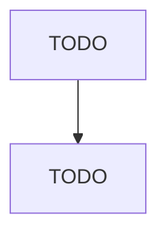

# Shoe Retailers

> TODO: Business-as-Code definition

## Overview

This industry comprises establishments primarily engaged in retailing all types of new footwear (except hosiery and specialty sports footwear, such as golf shoes, bowling shoes, and cleated shoes). Establishments primarily engaged in retailing new tennis shoes or sneakers are included in this industry. Cross-References. Establishments primarily engaged in--

## Actors

| Actor | Description |
|-------|-------------|
| TODO | TODO |

## Roles

| Role | Description |
|------|-------------|
| TODO | TODO |

## Entities

| Entity | Description |
|--------|-------------|
| TODO | TODO |

## Actions

| Action | Description |
|--------|-------------|
| TODO | TODO |

## Events

| Event | Description |
|-------|-------------|
| TODO | TODO |

## Searches

| Search | Description |
|--------|-------------|
| TODO | TODO |

## Workflow

## Actor Relationships

