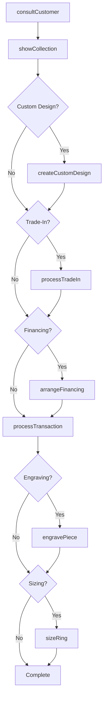
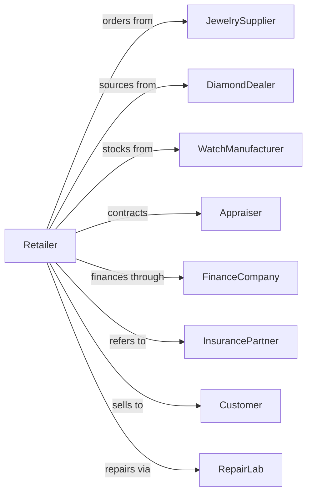

# Jewelry Retailers

> Business-as-Code definition for jewelry retail operations. Models the fine jewelry sales lifecycle from supplier sourcing through consultation, custom design, appraisal, and repair services.

## Overview

Jewelry retailers sell fine jewelry, watches, sterling silver, and precious gems through specialty stores with expert consultation and services. This definition exposes actions for customer consultation, custom design, appraisal, trade-in, repair services, and financing that drive high-value jewelry retail.

## Actors

| Actor | Description |
|-------|-------------|
| JewelrySupplier | Provides finished jewelry pieces and loose stones |
| DiamondDealer | Sources certified diamonds with grading reports |
| WatchManufacturer | Supplies branded timepieces |
| Appraiser | Provides independent valuations for insurance |
| FinanceCompany | Offers customer financing for purchases |
| InsurancePartner | Provides jewelry coverage options |
| Customer | Individual purchasing jewelry or watches |
| RepairLab | Performs complex jewelry repairs and restoration |

## Roles

| Role | Description |
|------|-------------|
| StoreManager | Oversees store operations and team |
| JewelryConsultant | Guides customers through selection process |
| GIA-CertifiedGemologist | Evaluates and grades gemstones |
| CustomDesigner | Creates bespoke jewelry pieces |
| Watchmaker | Services and repairs timepieces |
| BenchJeweler | Performs jewelry repairs and sizing |
| SalesAssociate | Assists customers with purchases |

## Entities

| Entity | Description |
|--------|-------------|
| JewelryPiece | Ring, necklace, bracelet, or earring item |
| Diamond | Certified stone with 4Cs grading |
| Watch | Timepiece with brand and specifications |
| Appraisal | Written valuation for insurance purposes |
| CustomOrder | Bespoke design specification |
| RepairTicket | Service request for jewelry or watch |
| TradeIn | Customer piece accepted toward purchase |
| Transaction | Customer purchase with payment |
| Certificate | GIA or other grading documentation |
| FinancingAgreement | Payment plan for purchase |
| Inventory | Stock with value and insurance tracking |
| EngagementConsult | Bridal jewelry planning session |

## Actions

| Action | Description |
|--------|-------------|
| consultCustomer | Guide through selection and education |
| showCollection | Present pieces matching customer criteria |
| createCustomDesign | Design bespoke piece to specifications |
| appraisePiece | Provide written valuation |
| processTradeIn | Evaluate and accept piece toward purchase |
| processTransaction | Complete sale with payment |
| arrangeFinancing | Set up payment plan for customer |
| createRepairTicket | Accept piece for repair or service |
| completeRepair | Finish jewelry or watch service |
| sizeRing | Adjust ring to fit customer |
| engravePiece | Add personalized inscription |
| orderInsurance | Facilitate jewelry insurance coverage |

## Events

| Event | Description |
|-------|-------------|
| customerConsulted | Selection guidance provided |
| collectionShown | Pieces presented to customer |
| customDesignCreated | Bespoke design finalized |
| pieceAppraised | Valuation completed |
| tradeInProcessed | Customer piece accepted |
| transactionCompleted | Sale finalized |
| financingArranged | Payment plan set up |
| repairTicketCreated | Service request opened |
| repairCompleted | Service finished |
| ringSized | Adjustment completed |
| pieceEngraved | Personalization added |
| insuranceOrdered | Coverage arranged |

## Searches

| Search | Description |
|--------|-------------|
| findJewelry | Search by type, metal, stone, or price |
| findWatches | Search timepieces by brand or style |
| getAppraisals | Retrieve customer valuations |
| getRepairTickets | View service requests by status |
| getCustomOrders | Track bespoke design progress |
| getInventory | Query stock with value tracking |
| getTransactions | Sales history by customer or date |
| getCertificates | Diamond and gem documentation |

## Workflow



## Actor Relationships



## Usage

### Calling Actions

```typescript
import { retailJewelry } from '@headlessly/retail-jewelry'

const store = retailJewelry()

// Create custom engagement ring design
const design = await store.createCustomDesign({
  customerId: 'cust-123',
  type: 'engagement-ring',
  specifications: {
    metal: '18k-white-gold',
    centerStone: { shape: 'round', carats: 1.5, quality: 'VS1-F' },
    setting: 'pave-halo',
    sideStones: { total: 0.5, quality: 'VS2-G' }
  },
  budget: 15000
})

// Process sale with trade-in and financing
const tradeIn = await store.processTradeIn({
  customerId: 'cust-123',
  piece: { type: 'ring', metal: '14k-gold', weight: 4.2 },
  offerAmount: 450
})

const transaction = await store.processTransaction({
  customerId: 'cust-123',
  items: [{ sku: design.sku, price: 14500 }],
  tradeInCredit: tradeIn.amount,
  financing: { term: 24, apr: 0 },
  services: [{ type: 'engraving', text: 'Forever - 03.15.24' }]
})
```

### Event-Driven Automation

```typescript
// Remind customer of appraisal update
store.transactionCompleted(async ({ customerId, items }) => {
  for (const item of items) {
    if (item.requiresAppraisal) {
      await scheduleAppraisalReminder({
        customerId,
        itemId: item.id,
        reminderDate: addYears(new Date(), 2),
        message: 'Time to update your jewelry appraisal for insurance'
      })
    }
  }
})

// Notify customer when custom order ready
store.customDesignCreated(async ({ orderId, customerId }) => {
  await notifyCustomer({
    customerId,
    message: 'Your custom piece is ready for final review!'
  })
  await schedulePickupAppointment({ customerId, orderId })
})
```
