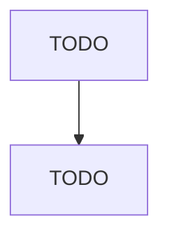

# Jewelry Retailers

> TODO: Business-as-Code definition

## Overview

This industry comprises establishments primarily engaged in retailing one or more of the following items: (1) new jewelry (except costume jewelry); (2) new sterling and plated silverware; and (3) new watches and clocks. Also included are establishments retailing these new products in combination with lapidary work and/or repair services. Cross-References. Establishments primarily engaged in--

## Actors

| Actor | Description |
|-------|-------------|
| TODO | TODO |

## Roles

| Role | Description |
|------|-------------|
| TODO | TODO |

## Entities

| Entity | Description |
|--------|-------------|
| TODO | TODO |

## Actions

| Action | Description |
|--------|-------------|
| TODO | TODO |

## Events

| Event | Description |
|-------|-------------|
| TODO | TODO |

## Searches

| Search | Description |
|--------|-------------|
| TODO | TODO |

## Workflow

## Actor Relationships

