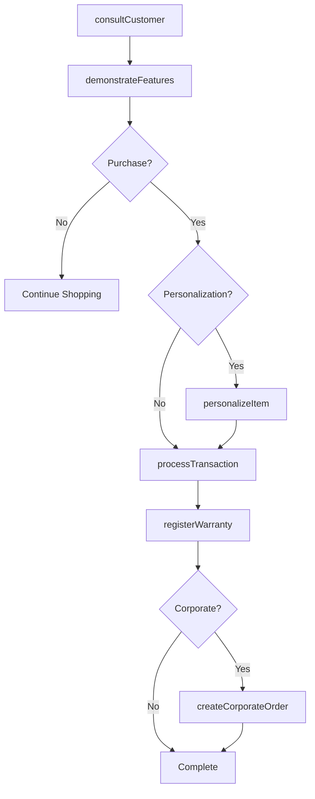
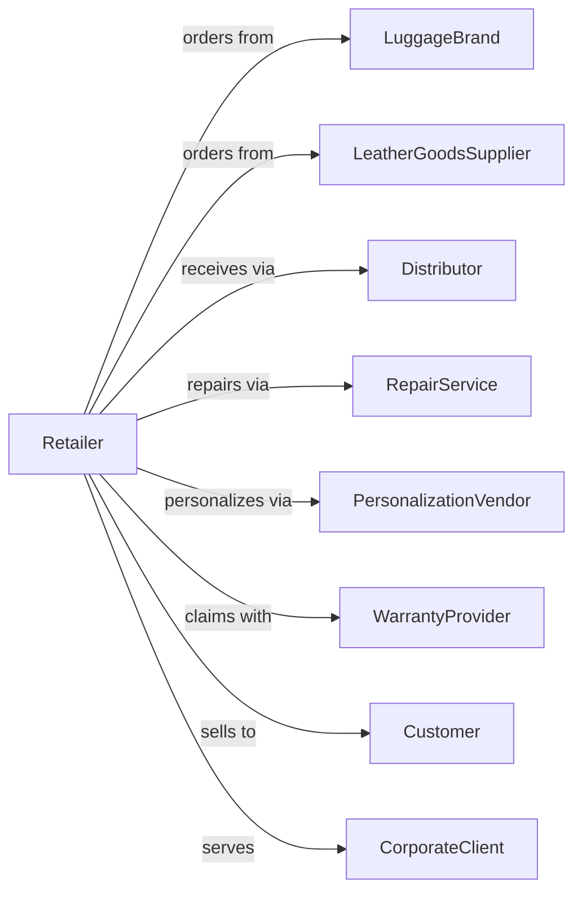

# Luggage and Leather Goods Retailers

> Business-as-Code definition for luggage and leather goods retail operations. Models the travel and accessories sales lifecycle from product sourcing through customer consultation, monogramming, and repair services.

## Overview

Luggage and leather goods retailers sell suitcases, briefcases, handbags, wallets, belts, and leather accessories through specialty stores. This definition exposes actions for product consultation, personalization services, warranty handling, and repair that drive specialty travel and leather goods retail.

## Actors

| Actor | Description |
|-------|-------------|
| LuggageBrand | Designs and manufactures luggage and travel goods |
| LeatherGoodsSupplier | Provides handbags, wallets, and accessories |
| Distributor | Warehouses and delivers merchandise |
| RepairService | Handles luggage and leather repairs |
| PersonalizationVendor | Provides monogramming and embossing |
| WarrantyProvider | Administers manufacturer warranties |
| Customer | Individual purchasing luggage or accessories |
| CorporateClient | Business ordering for employees or gifts |

## Roles

| Role | Description |
|------|-------------|
| StoreManager | Oversees store operations |
| LuggageSpecialist | Consults on travel needs and product selection |
| SalesAssociate | Assists customers and processes sales |
| RepairTechnician | Handles minor repairs and assessments |
| MonogrammingTech | Applies personalization to items |
| InventoryManager | Manages stock levels |

## Entities

| Entity | Description |
|--------|-------------|
| Luggage | Suitcase, carry-on, or travel bag |
| Briefcase | Professional carrying case |
| Handbag | Fashion bag or purse |
| Wallet | Leather wallet or card holder |
| Accessory | Belt, glove, or small leather good |
| Transaction | Customer purchase with payment |
| Personalization | Monogram or embossing service |
| RepairTicket | Service request for damage or wear |
| Warranty | Manufacturer coverage terms |
| CorporateOrder | Business bulk or gift order |
| Inventory | Stock by style, color, and size |
| Return | Merchandise returned within policy |

## Actions

| Action | Description |
|--------|-------------|
| consultCustomer | Understand travel needs and recommend products |
| demonstrateFeatures | Show product functionality and quality |
| processTransaction | Complete sale with payment |
| personalizeItem | Apply monogram or embossing |
| createCorporateOrder | Set up business or gift order |
| processWarrantyClaim | Handle manufacturer warranty issues |
| createRepairTicket | Accept item for repair assessment |
| completeRepair | Finish repair and notify customer |
| processReturn | Handle merchandise returns |
| checkInventory | Query stock availability |
| orderSpecialSize | Request unavailable size or color |
| registerWarranty | Activate product warranty coverage |

## Events

| Event | Description |
|-------|-------------|
| customerConsulted | Product recommendation provided |
| featuresDemo | Product demonstration completed |
| transactionCompleted | Sale finalized |
| itemPersonalized | Monogram or embossing applied |
| corporateOrderCreated | Business order set up |
| warrantyClaimProcessed | Warranty issue resolved |
| repairTicketCreated | Repair request opened |
| repairCompleted | Service finished |
| returnProcessed | Refund or exchange completed |
| inventoryChecked | Stock availability queried |
| specialOrderPlaced | Unavailable item ordered |
| warrantyRegistered | Coverage activated |

## Searches

| Search | Description |
|--------|-------------|
| findLuggage | Search by size, brand, or features |
| findHandbags | Search bags by style or brand |
| getTransactions | Sales history by customer or date |
| getRepairTickets | View service requests by status |
| getCorporateOrders | Track business orders |
| checkInventory | Query stock levels |
| getWarranties | Active warranty registrations |
| getPersonalizations | Pending monogramming orders |

## Workflow



## Actor Relationships



## Usage

### Calling Actions

```typescript
import { retailLuggage } from '@headlessly/retail-luggage'

const store = retailLuggage()

// Consult on travel luggage set
const consultation = await store.consultCustomer({
  customerId: 'cust-456',
  travelNeeds: {
    tripType: 'international',
    duration: '2-weeks',
    style: 'hardside',
    budget: 800
  }
})

// Process sale with personalization
const transaction = await store.processTransaction({
  customerId: 'cust-456',
  items: [
    { sku: 'LUGGAGE-SET-3PC', quantity: 1, price: 699.99 },
    { sku: 'PASSPORT-HOLDER', quantity: 1, price: 49.99 }
  ],
  personalization: [
    { itemSku: 'PASSPORT-HOLDER', type: 'monogram', initials: 'JDS' }
  ]
})

// Create corporate gift order
await store.createCorporateOrder({
  clientId: 'corp-123',
  items: [
    { sku: 'BRIEFCASE-LEATHER', quantity: 25, price: 299.99 }
  ],
  personalization: { type: 'emboss', logo: 'company-logo.svg' },
  deliveryDate: '2024-12-15',
  giftWrapping: true
})
```

### Event-Driven Automation

```typescript
// Notify when personalization complete
store.itemPersonalized(async ({ transactionId, customerId }) => {
  await notifyCustomer({
    customerId,
    message: 'Your personalized item is ready for pickup!'
  })
})

// Follow up on corporate orders
store.corporateOrderCreated(async ({ orderId, clientId, deliveryDate }) => {
  await scheduleFollowUp({
    clientId,
    triggerDate: subtractDays(deliveryDate, 14),
    purpose: 'confirm-delivery-details'
  })
  await sendOrderConfirmation({ clientId, orderId })
})
```
