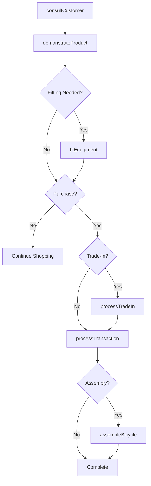
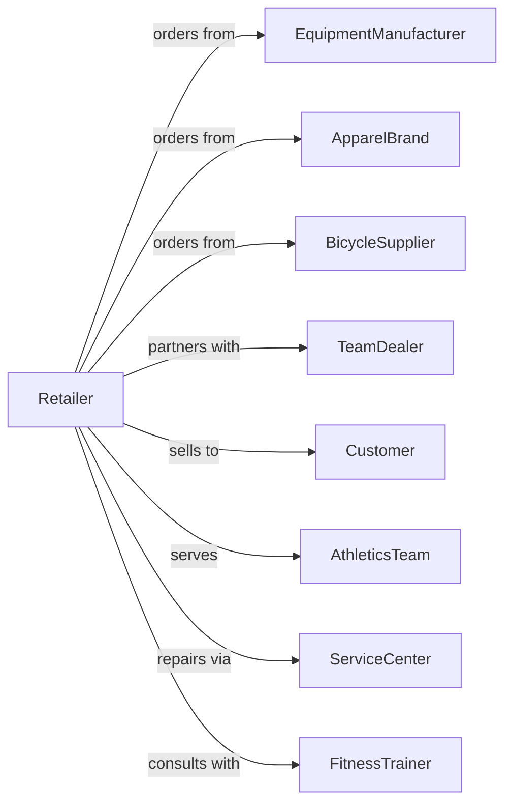

# Sporting Goods Retailers

> Business-as-Code definition for sporting goods retail operations. Models the sports equipment sales lifecycle from vendor sourcing through expert consultation, equipment fitting, team sales, and service.

## Overview

Sporting goods retailers sell bicycles, fitness equipment, camping gear, athletic uniforms, specialty footwear, and sports equipment through specialty stores. This definition exposes actions for product consultation, equipment fitting, team sales, bike service, and seasonal merchandise management that drive sporting goods retail.

## Actors

| Actor | Description |
|-------|-------------|
| EquipmentManufacturer | Produces sporting goods and equipment |
| ApparelBrand | Supplies athletic uniforms and clothing |
| BicycleSupplier | Provides bikes and cycling accessories |
| TeamDealer | Handles team uniform and equipment orders |
| Customer | Individual purchasing sporting goods |
| AthleticsTeam | School or recreational team ordering gear |
| ServiceCenter | Provides equipment repair and maintenance |
| FitnessTrainer | Recommends equipment for training programs |

## Roles

| Role | Description |
|------|-------------|
| StoreManager | Oversees store operations |
| SportSpecialist | Expert in specific sport categories |
| BikeMechanic | Services and repairs bicycles |
| FittingSpecialist | Sizes equipment for proper fit |
| TeamSalesRep | Manages team and uniform orders |
| SalesAssociate | Assists customers and processes sales |
| InventoryManager | Handles seasonal stock planning |

## Entities

| Entity | Description |
|--------|-------------|
| Equipment | Sporting goods item with specifications |
| Bicycle | Bike with frame size and components |
| Uniform | Athletic apparel for teams |
| FitnessEquipment | Exercise machines and weights |
| CampingGear | Tents, sleeping bags, and outdoor equipment |
| Transaction | Customer purchase with payment |
| TeamOrder | Bulk order for athletic team |
| ServiceTicket | Repair or maintenance request |
| Fitting | Equipment sizing session |
| Inventory | Stock by season and category |
| Rental | Equipment rental agreement |
| TradeIn | Used equipment accepted toward purchase |

## Actions

| Action | Description |
|--------|-------------|
| consultCustomer | Recommend equipment for sport and skill level |
| fitEquipment | Size and adjust gear for proper fit |
| demonstrateProduct | Show features and functionality |
| processTransaction | Complete sale with payment |
| createTeamOrder | Set up bulk team purchase |
| createServiceTicket | Accept equipment for repair |
| completeService | Finish repair and notify customer |
| processRental | Set up equipment rental |
| processTradeIn | Accept used gear toward purchase |
| assembleBicycle | Build and tune new bike |
| orderSpecialItem | Request unavailable product |
| planSeasonal | Manage inventory for seasons |

## Events

| Event | Description |
|-------|-------------|
| customerConsulted | Product recommendation provided |
| equipmentFitted | Sizing completed |
| productDemonstrated | Features showcased |
| transactionCompleted | Sale finalized |
| teamOrderCreated | Bulk order set up |
| serviceTicketCreated | Repair request opened |
| serviceCompleted | Repair finished |
| rentalProcessed | Equipment rented |
| tradeInProcessed | Used gear accepted |
| bicycleAssembled | New bike built and ready |
| specialItemOrdered | Unavailable product requested |
| seasonalPlanned | Inventory adjusted for season |

## Searches

| Search | Description |
|--------|-------------|
| findEquipment | Search by sport, brand, or category |
| findBicycles | Search bikes by type and size |
| getTeamOrders | Track team order status |
| getServiceTickets | View repair requests |
| checkInventory | Query stock by item |
| getRentals | Active rental agreements |
| getTradeInValue | Estimate used equipment value |
| getSeasonalItems | Current season merchandise |

## Workflow



## Actor Relationships



## Usage

### Calling Actions

```typescript
import { retailSportingGoods } from '@headlessly/retail-sporting-goods'

const store = retailSportingGoods()

// Fit customer for bicycle
const fitting = await store.fitEquipment({
  customerId: 'cust-789',
  equipmentType: 'road-bike',
  measurements: {
    inseam: 32,
    torso: 24,
    armLength: 25,
    ridingStyle: 'endurance'
  }
})

// Process bike sale with assembly
const transaction = await store.processTransaction({
  customerId: 'cust-789',
  items: [
    { sku: 'BIKE-ROAD-CARBON-56', quantity: 1, price: 2499.99 },
    { sku: 'HELMET-AERO-M', quantity: 1, price: 149.99 },
    { sku: 'PEDALS-CLIPLESS', quantity: 1, price: 89.99 }
  ],
  services: [
    { type: 'assembly', price: 75.00 },
    { type: 'fitting', price: 0 }
  ]
})

// Create team uniform order
await store.createTeamOrder({
  teamId: 'team-456',
  sport: 'basketball',
  items: [
    { sku: 'JERSEY-CUSTOM', quantity: 15, price: 45.00 },
    { sku: 'SHORTS-CUSTOM', quantity: 15, price: 35.00 }
  ],
  customization: {
    teamName: 'Eagles',
    numbers: ['1', '2', '3', '5', '10', '11', '12', '15', '20', '21', '23', '24', '30', '32', '33']
  },
  deliveryDate: '2024-09-01'
})
```

### Event-Driven Automation

```typescript
// Notify when bike assembly complete
store.bicycleAssembled(async ({ transactionId, customerId }) => {
  await notifyCustomer({
    customerId,
    message: 'Your bike is assembled and ready for pickup!'
  })
})

// Schedule service reminder
store.transactionCompleted(async ({ customerId, items }) => {
  const bikes = items.filter(i => i.category === 'bicycle')
  for (const bike of bikes) {
    await scheduleServiceReminder({
      customerId,
      itemId: bike.id,
      triggerDate: addMonths(new Date(), 6),
      message: 'Time for your 6-month bike tune-up!'
    })
  }
})
```
