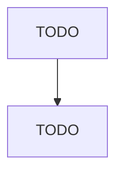

# Sewing, Needlework, and Piece Goods Retailers

> TODO: Business-as-Code definition

## Overview

This industry comprises establishments primarily engaged in retailing new sewing supplies, fabrics, patterns, yarns, and other needlework accessories or retailing these products in combination with new sewing machines. Illustrative Examples: Fabric retailers Sewing supply retailers Needlecraft sewing supply retailers Upholstery materials retailers Quilting supply retailers Cross-References. Establishments primarily engaged in--

## Actors

| Actor | Description |
|-------|-------------|
| TODO | TODO |

## Roles

| Role | Description |
|------|-------------|
| TODO | TODO |

## Entities

| Entity | Description |
|--------|-------------|
| TODO | TODO |

## Actions

| Action | Description |
|--------|-------------|
| TODO | TODO |

## Events

| Event | Description |
|-------|-------------|
| TODO | TODO |

## Searches

| Search | Description |
|--------|-------------|
| TODO | TODO |

## Workflow

## Actor Relationships

