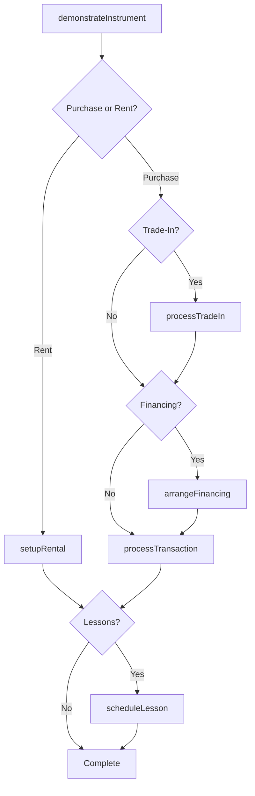
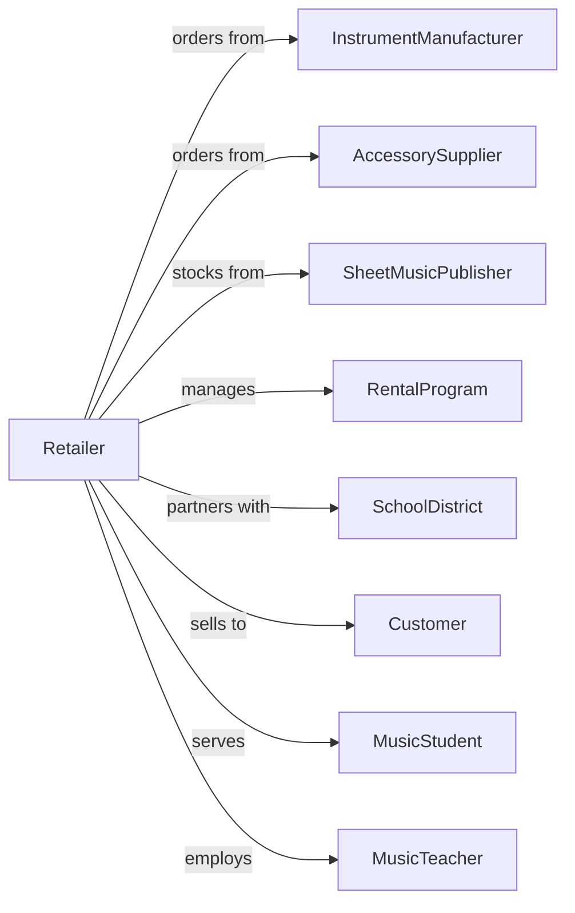

# Musical Instrument and Supplies Retailers

> Business-as-Code definition for musical instrument retail operations. Models the music retail lifecycle from vendor sourcing through instrument demonstration, rental programs, lessons, and repair services.

## Overview

Musical instrument and supplies retailers sell guitars, pianos, drums, brass, woodwind instruments, sheet music, and accessories with repair and instruction services. This definition exposes actions for instrument demonstration, rental programs, lesson scheduling, repair services, and school band programs that drive music retail.

## Actors

| Actor | Description |
|-------|-------------|
| InstrumentManufacturer | Produces musical instruments |
| AccessorySupplier | Provides strings, reeds, cases, and accessories |
| SheetMusicPublisher | Distributes sheet music and method books |
| RentalProgram | Manages school instrument rental fleet |
| SchoolDistrict | Coordinates band and orchestra programs |
| Customer | Individual purchasing instruments or supplies |
| MusicStudent | Learner renting or buying for lessons |
| MusicTeacher | Instructor providing lessons at store |

## Roles

| Role | Description |
|------|-------------|
| StoreManager | Oversees store operations |
| InstrumentSpecialist | Demonstrates and advises on instruments |
| RepairTechnician | Services and repairs instruments |
| LessonCoordinator | Schedules music instruction |
| RentalManager | Manages school rental program |
| SalesAssociate | Assists customers and processes sales |
| PianoTech | Tunes and services pianos |

## Entities

| Entity | Description |
|--------|-------------|
| Instrument | Guitar, piano, drum, or orchestral instrument |
| Accessory | Strings, reeds, picks, cases, and stands |
| SheetMusic | Printed music and method books |
| Rental | School or customer instrument rental |
| Lesson | Scheduled music instruction session |
| RepairTicket | Instrument service request |
| Transaction | Customer purchase with payment |
| TradeIn | Used instrument accepted toward purchase |
| FinancingPlan | Payment plan for instrument purchase |
| Inventory | Stock by instrument type and brand |
| SchoolAccount | Band or orchestra program account |
| Demo | In-store instrument demonstration |

## Actions

| Action | Description |
|--------|-------------|
| demonstrateInstrument | Play and showcase instrument features |
| processTransaction | Complete sale with payment |
| setupRental | Create instrument rental agreement |
| processRentalReturn | Accept returned rental instrument |
| scheduleLesson | Book music instruction session |
| conductLesson | Provide music instruction |
| createRepairTicket | Accept instrument for service |
| completeRepair | Finish instrument repair |
| processTradeIn | Accept used instrument toward purchase |
| arrangeFinancing | Set up payment plan |
| tunePiano | Provide piano tuning service |
| orderSchoolInstruments | Process school band program order |

## Events

| Event | Description |
|-------|-------------|
| instrumentDemonstrated | Instrument showcased to customer |
| transactionCompleted | Sale finalized |
| rentalSetup | Rental agreement created |
| rentalReturned | Instrument returned from rental |
| lessonScheduled | Instruction session booked |
| lessonConducted | Instruction completed |
| repairTicketCreated | Service request opened |
| repairCompleted | Instrument service finished |
| tradeInProcessed | Used instrument accepted |
| financingArranged | Payment plan set up |
| pianoTuned | Tuning service completed |
| schoolOrderProcessed | Band program order placed |

## Searches

| Search | Description |
|--------|-------------|
| findInstruments | Search by type, brand, or price |
| findSheetMusic | Search by title, composer, or instrument |
| getRentals | Active rental agreements |
| getLessons | Scheduled instruction sessions |
| getRepairTickets | Open service requests |
| checkInventory | Stock by instrument |
| getTradeInValue | Used instrument valuation |
| getSchoolAccounts | Band program accounts |

## Workflow



## Actor Relationships



## Usage

### Calling Actions

```typescript
import { retailMusicalInstruments } from '@headlessly/retail-musical-instruments'

const store = retailMusicalInstruments()

// Set up school rental
const rental = await store.setupRental({
  studentId: 'student-789',
  instrument: 'trumpet',
  rentalPeriod: 'school-year',
  schoolId: 'middle-school-456',
  monthlyRate: 29.99,
  maintenanceIncluded: true
})

// Process instrument purchase with trade-in
const tradeIn = await store.processTradeIn({
  customerId: 'cust-123',
  instrument: { type: 'guitar', brand: 'Fender', model: 'Stratocaster', condition: 'good' },
  offerAmount: 450
})

const transaction = await store.processTransaction({
  customerId: 'cust-123',
  items: [
    { sku: 'GIBSON-LES-PAUL-STD', quantity: 1, price: 2499.99 },
    { sku: 'CASE-HARD-GIBSON', quantity: 1, price: 199.99 }
  ],
  tradeInCredit: tradeIn.amount,
  financing: { term: 12, apr: 0 }
})

// Schedule guitar lessons
await store.scheduleLesson({
  studentId: 'cust-123',
  instrument: 'guitar',
  instructor: 'teacher-456',
  schedule: { day: 'saturday', time: '14:00', duration: 30 }
})
```

### Event-Driven Automation

```typescript
// Remind about rental maintenance
store.rentalSetup(async ({ rentalId, instrumentType, studentId }) => {
  await scheduleReminder({
    studentId,
    triggerDate: addMonths(new Date(), 3),
    message: `Time for your ${instrumentType} maintenance checkup!`
  })
})

// Follow up after repair
store.repairCompleted(async ({ ticketId, customerId, instrumentType }) => {
  await notifyCustomer({
    customerId,
    message: `Your ${instrumentType} is ready for pickup!`
  })
  await scheduleFollowUp({
    customerId,
    delay: '7-days',
    purpose: 'repair-satisfaction'
  })
})
```
