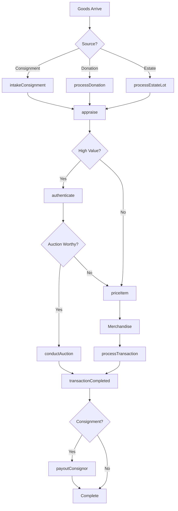
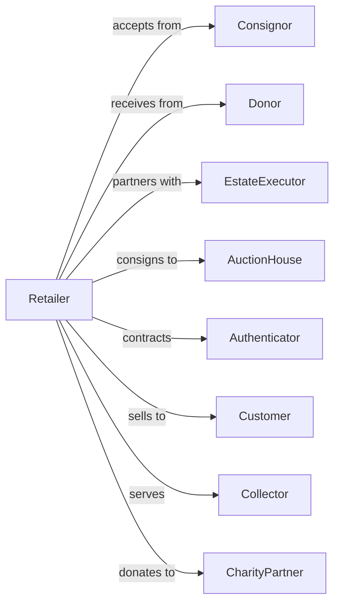

# Used Merchandise Retailers

> Business-as-Code definition for used merchandise retail operations. Models the secondhand goods lifecycle from consignment intake through authentication, pricing, merchandising, and resale across thrift stores, antique shops, and consignment boutiques.

## Overview

Used merchandise retailers sell used merchandise, antiques, and secondhand goods through thrift stores, consignment shops, antique stores, and vintage boutiques. This definition exposes actions for consignment intake, item authentication, pricing assessment, auction processing, and donation management that drive resale retail.

## Actors

| Actor | Description |
|-------|-------------|
| Consignor | Individual selling items on consignment |
| Donor | Individual or organization donating goods |
| EstateExecutor | Manages estate sales and liquidations |
| AuctionHouse | Partners for high-value item sales |
| Authenticator | Verifies authenticity of collectibles |
| Customer | Individual purchasing secondhand goods |
| Collector | Buyer seeking specific antiques or vintage items |
| CharityPartner | Nonprofit receiving donation proceeds |

## Roles

| Role | Description |
|------|-------------|
| StoreManager | Oversees store operations |
| ConsignmentSpecialist | Manages intake and consignor relationships |
| Appraiser | Assesses value of incoming items |
| SalesAssociate | Assists customers and processes sales |
| SortingWorker | Processes donations and incoming goods |
| PricingSpecialist | Sets prices based on market value |
| AntiqueExpert | Authenticates and values antiques |

## Entities

| Entity | Description |
|--------|-------------|
| Item | Used merchandise with condition and pricing |
| ConsignmentContract | Agreement with consignor for sale terms |
| Donation | Donated goods with receipt |
| Antique | Vintage item with authentication |
| Collectible | Sought-after item with collector value |
| Transaction | Customer purchase with payment |
| Appraisal | Value assessment for item |
| AuctionLot | Items grouped for auction sale |
| Inventory | Stock by category and condition |
| Payout | Payment to consignor after sale |
| DonationReceipt | Tax documentation for donor |
| Return | Merchandise returned within policy |

## Actions

| Action | Description |
|--------|-------------|
| intakeConsignment | Accept item for consignment sale |
| processDonation | Accept and sort donated goods |
| appraise | Assess value of incoming item |
| authenticate | Verify authenticity of collectible |
| priceItem | Set retail price based on value |
| processTransaction | Complete sale with payment |
| payoutConsignor | Distribute proceeds to consignor |
| conductAuction | Run auction for high-value items |
| processReturn | Handle item return or exchange |
| issueDonationReceipt | Provide tax documentation |
| markdownItem | Reduce price for aged inventory |
| processEstateLot | Intake bulk estate items |

## Events

| Event | Description |
|-------|-------------|
| consignmentIntaken | Item accepted for consignment |
| donationProcessed | Donated goods sorted and priced |
| appraised | Value assessment completed |
| authenticated | Authenticity verified |
| itemPriced | Retail price set |
| transactionCompleted | Sale finalized |
| consignorPaidOut | Proceeds distributed |
| auctionConducted | Auction completed |
| returnProcessed | Return or exchange completed |
| donationReceiptIssued | Tax receipt provided |
| itemMarkedDown | Price reduced |
| estateLotProcessed | Bulk items intake completed |

## Searches

| Search | Description |
|--------|-------------|
| findItems | Search by category, brand, or condition |
| getConsignments | Consignment items by consignor or status |
| getDonations | Processed donations by date |
| getAppraisals | Pending and completed valuations |
| checkInventory | Stock by category |
| getAuctions | Upcoming and past auctions |
| getPayouts | Consignor payments by status |
| getAntiques | Authenticated vintage items |

## Workflow



## Actor Relationships



## Usage

### Calling Actions

```typescript
import { retailUsedMerchandise } from '@headlessly/retail-used-merchandise'

const store = retailUsedMerchandise()

// Intake consignment item
const consignment = await store.intakeConsignment({
  consignorId: 'consignor-789',
  item: {
    description: 'Vintage Eames Lounge Chair',
    category: 'furniture',
    condition: 'excellent',
    photos: ['eames-1.jpg', 'eames-2.jpg']
  },
  splitPercentage: 60,
  minimumPrice: 2000,
  consignmentPeriod: '90-days'
})

// Appraise high-value item
const appraisal = await store.appraise({
  itemId: consignment.itemId,
  category: 'designer-furniture',
  comparables: true,
  rush: false
})

// Authenticate collectible
await store.authenticate({
  itemId: 'ITEM-456',
  category: 'vintage-watch',
  authenticationService: 'certified-watch-authority',
  documentationIncluded: true
})

// Process donation with receipt
const donation = await store.processDonation({
  donorName: 'Jane Smith',
  donorAddress: '123 Main St',
  items: [
    { description: 'Winter coats', quantity: 5, estimatedValue: 150 },
    { description: 'Kitchen appliances', quantity: 3, estimatedValue: 75 }
  ],
  taxReceiptRequired: true
})
```

### Event-Driven Automation

```typescript
// Notify consignor when item sells
store.transactionCompleted(async ({ items }) => {
  for (const item of items) {
    if (item.consignorId) {
      const payout = await store.payoutConsignor({
        itemId: item.id,
        salePrice: item.price
      })
      await notifyConsignor({
        consignorId: item.consignorId,
        message: `Your item sold for $${item.price}! Your payout: $${payout.amount}`
      })
    }
  }
})

// Auto-markdown aged inventory
store.itemPriced(async ({ itemId, pricedDate }) => {
  await scheduleAction({
    action: 'markdownItem',
    itemId,
    triggerDate: addDays(pricedDate, 30),
    params: { discountPercent: 25 }
  })
})
```
