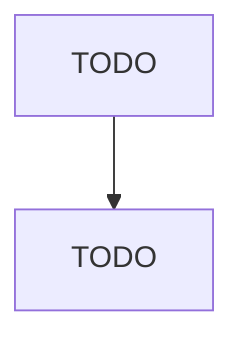

# Used Merchandise Retailers

> TODO: Business-as-Code definition

## Overview

This industry comprises establishments primarily engaged in retailing used merchandise, antiques, and secondhand goods (except motor vehicles, such as automobiles, RVs, motorcycles, and boats; motor vehicle parts; tires; and mobile homes). This industry includes establishments retailing used merchandise on an auction basis. Illustrative Examples: Antique retailers Used household appliance retailers Used book retailers Used merchandise thrift shops Used clothing retailers Used sporting goods reta

## Actors

| Actor | Description |
|-------|-------------|
| TODO | TODO |

## Roles

| Role | Description |
|------|-------------|
| TODO | TODO |

## Entities

| Entity | Description |
|--------|-------------|
| TODO | TODO |

## Actions

| Action | Description |
|--------|-------------|
| TODO | TODO |

## Events

| Event | Description |
|-------|-------------|
| TODO | TODO |

## Searches

| Search | Description |
|--------|-------------|
| TODO | TODO |

## Workflow

## Actor Relationships

