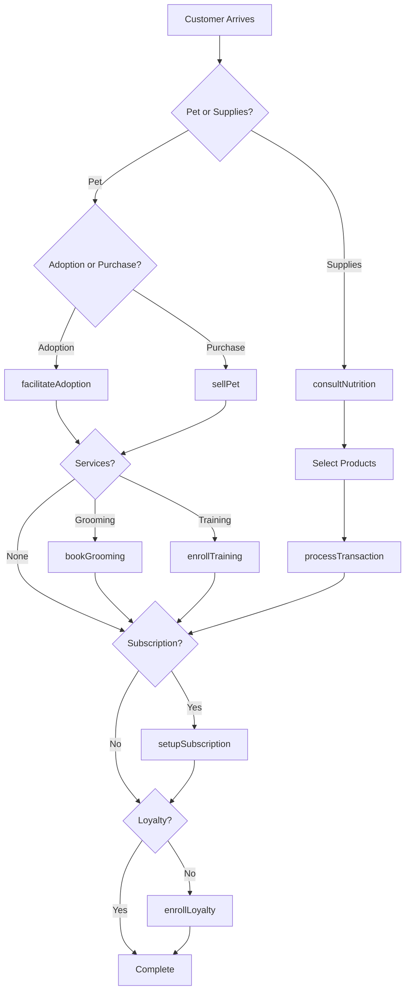
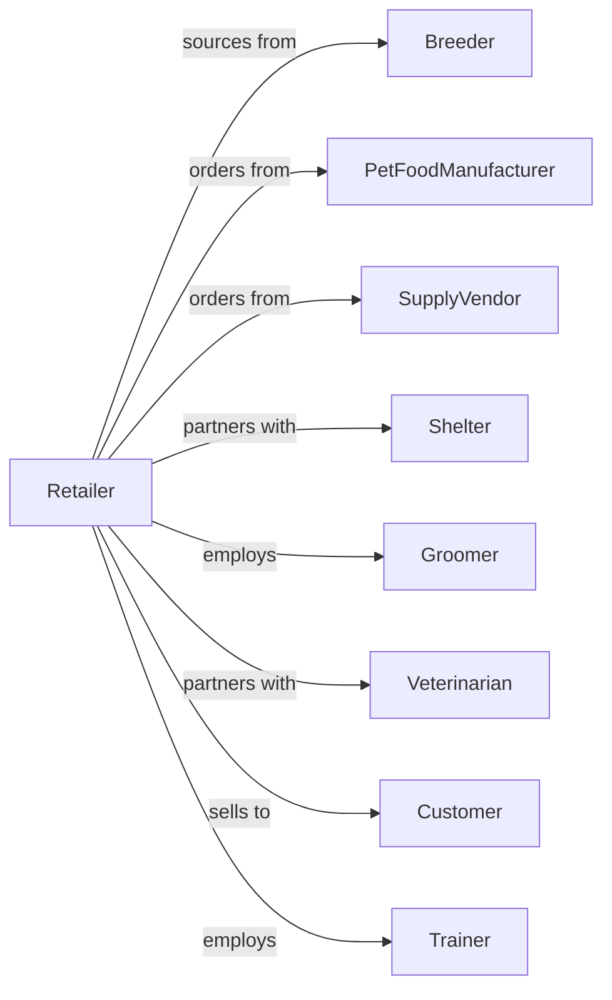

# Pet and Pet Supplies Retailers

> Business-as-Code definition for pet retail operations. Models the pet sales and supplies lifecycle from breeder sourcing through pet adoption, grooming services, training classes, and subscription food delivery.

## Overview

Pet and pet supplies retailers sell pets, pet foods, and pet supplies through specialty stores offering live animals, premium foods, accessories, and in-store services. This definition exposes actions for pet adoption, grooming appointments, training classes, veterinary partnerships, and subscription services that drive pet retail.

## Actors

| Actor | Description |
|-------|-------------|
| Breeder | Supplies purebred dogs and cats |
| PetFoodManufacturer | Produces pet foods and treats |
| SupplyVendor | Provides pet accessories and supplies |
| Shelter | Partners for adoption events |
| Groomer | Provides grooming services |
| Veterinarian | Partners for in-store clinics |
| Customer | Individual purchasing pets or supplies |
| Trainer | Conducts obedience and training classes |

## Roles

| Role | Description |
|------|-------------|
| StoreManager | Oversees store operations |
| PetCareAssociate | Maintains animal health and enclosures |
| SalesAssociate | Assists customers and processes sales |
| GroomingStylist | Performs pet grooming services |
| TrainingInstructor | Conducts pet training classes |
| AquaticsSpecialist | Maintains aquariums and advises on fish |
| NutritionConsultant | Recommends pet foods and diets |

## Entities

| Entity | Description |
|--------|-------------|
| Pet | Live animal available for adoption or sale |
| PetFood | Food and treats by brand and type |
| Supply | Accessory, toy, or care product |
| Transaction | Customer purchase with payment |
| GroomingAppointment | Scheduled grooming service |
| TrainingClass | Pet obedience or skill class |
| AdoptionEvent | Shelter partnership adoption day |
| Subscription | Recurring food or supply delivery |
| VetClinic | In-store veterinary service session |
| LoyaltyAccount | Customer rewards membership |
| Inventory | Stock by product category |
| AdoptionApplication | Pet adoption screening form |

## Actions

| Action | Description |
|--------|-------------|
| sellPet | Complete pet purchase with documentation |
| facilitateAdoption | Process shelter pet adoption |
| processTransaction | Complete supply sale with payment |
| bookGrooming | Schedule grooming appointment |
| performGrooming | Execute grooming service |
| enrollTraining | Register pet for training class |
| conductTraining | Lead training session |
| consultNutrition | Recommend diet for pet needs |
| setupSubscription | Create recurring delivery |
| hostAdoptionEvent | Run shelter partnership event |
| enrollLoyalty | Sign up customer for rewards |
| scheduleVetClinic | Book in-store veterinary visit |

## Events

| Event | Description |
|-------|-------------|
| petSold | Pet purchase completed |
| adoptionFacilitated | Shelter pet placed |
| transactionCompleted | Supply sale finalized |
| groomingBooked | Appointment scheduled |
| groomingPerformed | Service completed |
| trainingEnrolled | Pet registered for class |
| trainingConducted | Session completed |
| nutritionConsulted | Diet recommendation provided |
| subscriptionSetup | Recurring delivery created |
| adoptionEventHosted | Partnership event completed |
| loyaltyEnrolled | Customer joined rewards |
| vetClinicScheduled | Veterinary visit booked |

## Searches

| Search | Description |
|--------|-------------|
| findPets | Search available pets by species and breed |
| findProducts | Search supplies by category or brand |
| getGroomingAppointments | Scheduled grooming by date |
| getTrainingClasses | Upcoming classes by type |
| getSubscriptions | Active recurring deliveries |
| getAdoptionEvents | Upcoming adoption events |
| checkInventory | Stock by product |
| getLoyaltyBalance | Customer rewards points |

## Workflow



## Actor Relationships



## Usage

### Calling Actions

```typescript
import { retailPets } from '@headlessly/retail-pets'

const store = retailPets()

// Facilitate shelter adoption
const adoption = await store.facilitateAdoption({
  petId: 'shelter-dog-456',
  adopterId: 'cust-123',
  applicationId: 'app-789',
  adoptionFee: 150,
  includeStarterKit: true
})

// Book grooming appointment
const grooming = await store.bookGrooming({
  customerId: 'cust-123',
  petName: 'Buddy',
  petType: 'dog',
  breed: 'golden-retriever',
  services: ['bath', 'haircut', 'nail-trim'],
  date: '2024-03-25',
  time: '10:00'
})

// Set up food subscription
await store.setupSubscription({
  customerId: 'cust-123',
  items: [
    { sku: 'DOG-FOOD-PREMIUM-30LB', quantity: 1 },
    { sku: 'DOG-TREATS-DENTAL', quantity: 2 }
  ],
  frequency: 'monthly',
  autoShip: true
})

// Enroll in training class
await store.enrollTraining({
  customerId: 'cust-123',
  petName: 'Buddy',
  classType: 'puppy-obedience',
  startDate: '2024-04-01',
  sessions: 6
})
```

### Event-Driven Automation

```typescript
// Send grooming reminder
store.groomingBooked(async ({ customerId, petName, appointmentDate }) => {
  await scheduleReminder({
    customerId,
    triggerDate: subtractDays(appointmentDate, 1),
    message: `Reminder: ${petName}'s grooming appointment is tomorrow!`
  })
})

// Follow up after adoption
store.adoptionFacilitated(async ({ adopterId, petName }) => {
  await scheduleFollowUp({
    customerId: adopterId,
    delay: '7-days',
    message: `How is ${petName} settling in? Stop by for any supplies you need!`
  })
})
```
