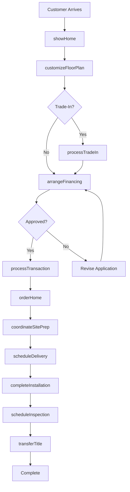
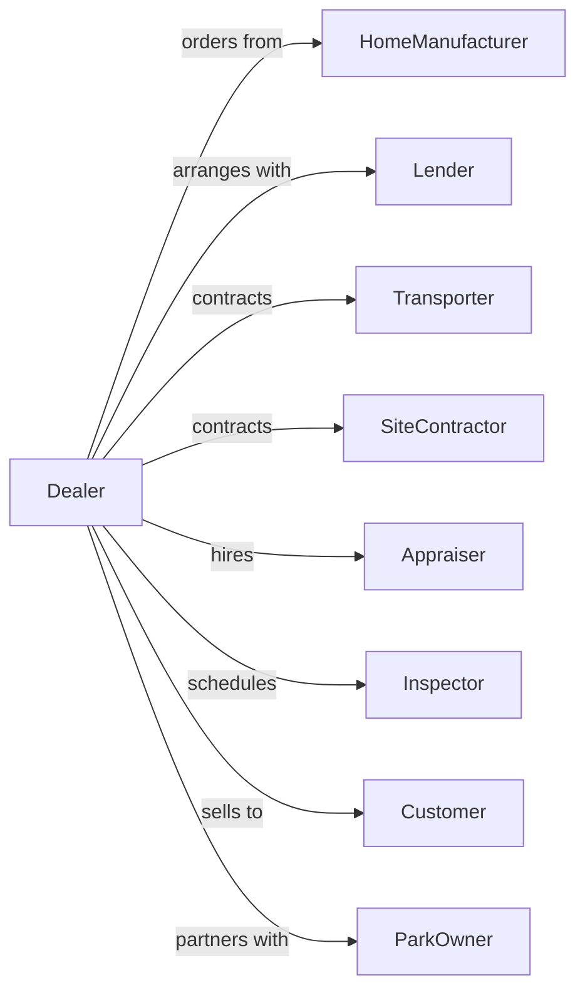

# Manufactured (Mobile) Home Dealers

> Business-as-Code definition for manufactured home retail operations. Models the mobile home sales lifecycle from manufacturer sourcing through customer financing, site preparation, delivery, and installation services.

## Overview

Manufactured home dealers sell new and used mobile homes, modular homes, and related parts and equipment. This definition exposes actions for home selection, financing arrangement, site preparation coordination, delivery scheduling, installation, and warranty services that drive manufactured home retail.

## Actors

| Actor | Description |
|-------|-------------|
| HomeManufacturer | Produces manufactured and modular homes |
| Lender | Provides manufactured home financing |
| Transporter | Handles home delivery and setup |
| SiteContractor | Prepares land and foundations |
| Appraiser | Values homes for financing |
| Inspector | Certifies installation compliance |
| Customer | Individual purchasing home |
| ParkOwner | Manages manufactured home communities |

## Roles

| Role | Description |
|------|-------------|
| DealerOwner | Operates dealership business |
| SalesConsultant | Guides customers through selection |
| FinanceManager | Arranges loans and payment plans |
| SetupCoordinator | Manages delivery and installation |
| ServiceTechnician | Handles repairs and warranty work |
| InventoryManager | Manages home lot and displays |
| TitleClerk | Processes ownership documentation |

## Entities

| Entity | Description |
|--------|-------------|
| ManufacturedHome | New or used mobile or modular home |
| FloorPlan | Home layout configuration |
| Transaction | Home purchase with financing |
| Financing | Loan or payment arrangement |
| Delivery | Home transport to customer site |
| Installation | Setup and anchoring at location |
| Warranty | Manufacturer coverage terms |
| ServiceTicket | Repair or warranty claim |
| Inventory | Homes on lot by model |
| TradeIn | Used home accepted toward purchase |
| Permit | Required installation permits |
| Title | Ownership documentation |

## Actions

| Action | Description |
|--------|-------------|
| showHome | Tour customer through model |
| customizeFloorPlan | Select options and features |
| arrangeFinancing | Set up loan or payment plan |
| processTransaction | Complete sale with contracts |
| coordinateSitePrep | Arrange land preparation |
| scheduleDelivery | Book home transport |
| completeInstallation | Set up and anchor home |
| processTradeIn | Accept used home toward purchase |
| scheduleInspection | Book compliance certification |
| processWarrantyClaim | Handle manufacturer warranty |
| orderHome | Request home from manufacturer |
| transferTitle | Process ownership documentation |

## Events

| Event | Description |
|-------|-------------|
| homeShown | Customer toured model |
| floorPlanCustomized | Options and features selected |
| financingArranged | Loan approved |
| transactionCompleted | Sale contracts signed |
| sitePrepCoordinated | Land preparation scheduled |
| deliveryScheduled | Transport date set |
| installationCompleted | Home set up and anchored |
| tradeInProcessed | Used home accepted |
| inspectionScheduled | Certification booked |
| warrantyClaimProcessed | Claim submitted to manufacturer |
| homeOrdered | Manufacturer order placed |
| titleTransferred | Ownership documented |

## Searches

| Search | Description |
|--------|-------------|
| findHomes | Search by size, features, or price |
| getFloorPlans | Available configurations |
| getTransactions | Sales by status or date |
| getDeliveries | Scheduled transports |
| getInstallations | Pending setups |
| getServiceTickets | Warranty and repair claims |
| checkInventory | Homes on lot |
| getTradeInValue | Used home valuation |

## Workflow



## Actor Relationships



## Usage

### Calling Actions

```typescript
import { retailManufacturedHomes } from '@headlessly/retail-manufactured-homes'

const dealer = retailManufacturedHomes()

// Customize floor plan
const home = await dealer.customizeFloorPlan({
  baseModel: 'CLAYTON-RANCH-1680',
  bedrooms: 3,
  bathrooms: 2,
  options: [
    'upgraded-kitchen',
    'fireplace',
    'covered-porch'
  ],
  exteriorColor: 'desert-tan',
  interiorPackage: 'premium'
})

// Process trade-in
const tradeIn = await dealer.processTradeIn({
  customerId: 'cust-456',
  home: {
    year: 2015,
    manufacturer: 'Fleetwood',
    model: 'Westfield',
    size: '16x80',
    condition: 'good',
    location: 'current-site'
  },
  appraisalRequired: true
})

// Arrange financing
const financing = await dealer.arrangeFinancing({
  customerId: 'cust-456',
  homePrice: 89900,
  tradeInCredit: tradeIn.value,
  downPayment: 5000,
  loanTerm: 240,
  includesLand: false
})

// Complete transaction and schedule delivery
await dealer.processTransaction({
  customerId: 'cust-456',
  homeId: home.id,
  financingId: financing.id,
  deliveryAddress: '123 Country Lane, Lot 45',
  targetDeliveryDate: '2024-05-15'
})
```

### Event-Driven Automation

```typescript
// Coordinate site prep when order placed
dealer.homeOrdered(async ({ customerId, deliveryAddress, targetDate }) => {
  await dealer.coordinateSitePrep({
    address: deliveryAddress,
    requiredDate: subtractDays(targetDate, 14),
    requirements: ['foundation', 'utilities', 'permits']
  })
})

// Schedule inspection after installation
dealer.installationCompleted(async ({ homeId, customerId }) => {
  await dealer.scheduleInspection({
    homeId,
    inspectionType: 'final-setup',
    preferredDate: addDays(new Date(), 3)
  })
  await notifyCustomer({
    customerId,
    message: 'Your home installation is complete! Inspection scheduled.'
  })
})
```
