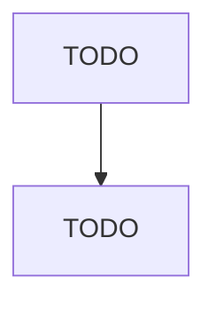

# All Other Miscellaneous Retailers

> TODO: Business-as-Code definition

## Overview

This U.S. industry comprises establishments primarily engaged in retailing miscellaneous specialized lines of merchandise (except motor vehicle and parts dealers; building material and garden equipment and supplies dealers; food and beverage retailers; furniture, home furnishings, electronics, and appliance retailers; general merchandise retailers; health and personal care retailers; gasoline stations and fuel dealers; clothing, clothing accessories, shoe, and jewelry retailers; sporting goods, 

## Actors

| Actor | Description |
|-------|-------------|
| TODO | TODO |

## Roles

| Role | Description |
|------|-------------|
| TODO | TODO |

## Entities

| Entity | Description |
|--------|-------------|
| TODO | TODO |

## Actions

| Action | Description |
|--------|-------------|
| TODO | TODO |

## Events

| Event | Description |
|-------|-------------|
| TODO | TODO |

## Searches

| Search | Description |
|--------|-------------|
| TODO | TODO |

## Workflow

## Actor Relationships

