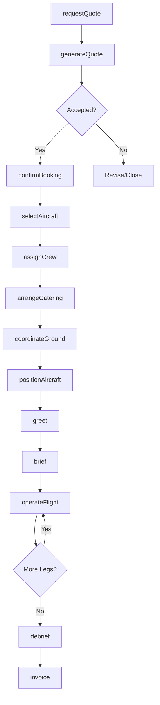
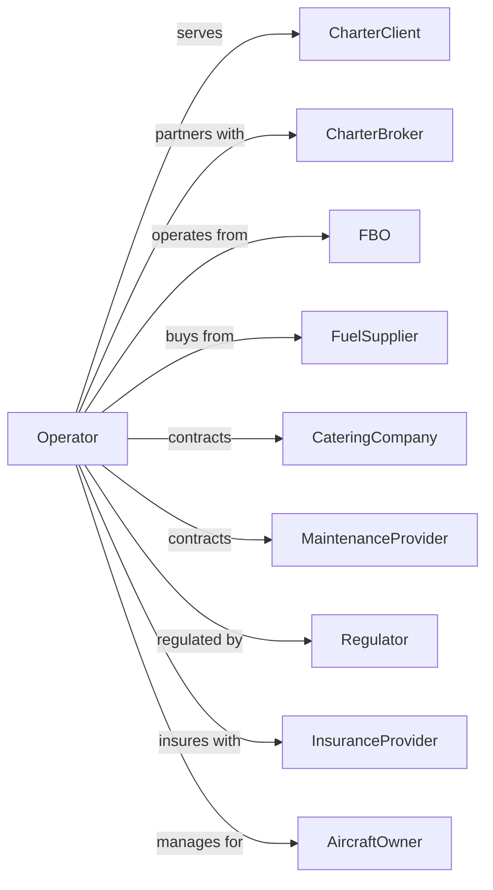

# Nonscheduled Chartered Passenger Air Transportation

> Business-as-Code definition for on-demand private and charter passenger flight operations. Models the complete charter lifecycle from quote request through aircraft positioning, passenger service, and trip completion.

## Overview

Nonscheduled chartered passenger air transportation involves operating private and charter flights on demand without fixed routes or schedules. This definition exposes actions for managing charter requests, aircraft selection, crew assignment, catering, and personalized passenger services for corporate, leisure, and group travel.

## Actors

| Actor | Description |
|-------|-------------|
| CharterClient | Individual or company booking private flights |
| CharterBroker | Arranges flights and negotiates rates |
| FBO | Fixed-base operator providing ground services |
| FuelSupplier | Provides aviation fuel |
| CateringCompany | Supplies in-flight meals and amenities |
| MaintenanceProvider | Performs aircraft maintenance |
| Regulator | FAA oversight of Part 135 operations |
| InsuranceProvider | Provides aviation liability coverage |
| AircraftOwner | Provides aircraft for charter operations |

## Roles

| Role | Description |
|------|-------------|
| Pilot | Commands charter aircraft |
| FirstOfficer | Assists pilot on multi-crew operations |
| FlightAttendant | Provides cabin service on larger aircraft |
| CharterCoordinator | Manages booking requests and trip planning |
| Dispatcher | Plans routes, weather, and fuel requirements |
| GroundCrew | Handles aircraft servicing and positioning |
| ConciergeSpecialist | Arranges ground transportation and amenities |
| AccountManager | Manages client relationships and contracts |

## Entities

| Entity | Description |
|--------|-------------|
| CharterRequest | Client inquiry for private flight |
| Quote | Price proposal for requested trip |
| Trip | Confirmed charter itinerary |
| Aircraft | Available jet, turboprop, or helicopter |
| FlightLeg | Single segment of multi-leg trip |
| Crew | Assigned pilots and attendants |
| Passenger | Individual traveling on charter |
| Catering | Food and beverage order for flight |
| GroundTransport | Limousine or car service arrangement |
| Invoice | Billing for completed charter |

## Actions

| Action | Description |
|--------|-------------|
| requestQuote | Submit charter inquiry with trip details |
| generateQuote | Create price proposal for requested trip |
| selectAircraft | Choose appropriate aircraft for mission |
| confirmBooking | Accept quote and secure charter |
| assignCrew | Schedule pilots and flight attendants |
| arrangeCatering | Order in-flight food and beverages |
| coordinateGround | Set up limousine and handling services |
| positionAircraft | Fly empty to pickup location |
| brief | Conduct pre-flight safety briefing |
| operateFlight | Fly charter leg to destination |
| greet | Welcome passengers and assist boarding |
| debrief | Complete post-flight documentation |
| invoice | Bill client for completed charter |
| followUp | Gather feedback and maintain relationship |

## Events

| Event | Description |
|-------|-------------|
| quoteRequested | Charter inquiry received |
| quoteGenerated | Price proposal sent to client |
| bookingConfirmed | Charter reservation secured |
| aircraftSelected | Specific aircraft assigned to trip |
| crewAssigned | Pilots and attendants scheduled |
| cateringOrdered | In-flight service arranged |
| groundArranged | Transportation and handling confirmed |
| aircraftPositioned | Aircraft ready at departure location |
| passengersBoarded | Clients aboard and ready |
| departed | Charter leg began |
| arrived | Charter leg completed |
| tripCompleted | All legs finished |
| invoiced | Bill sent to client |
| paymentReceived | Client payment processed |

## Searches

| Search | Description |
|--------|-------------|
| findAircraft | List available aircraft by type and location |
| getQuote | Retrieve quote details and status |
| getTrip | Get trip itinerary and manifest |
| checkAvailability | Verify aircraft and crew availability |
| getClientHistory | Retrieve past trips and preferences |
| findFBOs | List fixed-base operators at airport |
| getWeather | Check conditions for route planning |
| getCateringOptions | List available catering vendors |

## Workflow



## Actor Relationships



## Usage

### Calling Actions

```typescript
import { flyNonscheduledChartered } from '@headlessly/fly-nonscheduled-chartered'

const charter = flyNonscheduledChartered()

// Request a quote for charter trip
const quote = await charter.requestQuote({
  origin: 'TEB',
  destination: 'MIA',
  departureDate: '2024-07-15',
  departureTime: '10:00',
  passengers: 6,
  aircraftCategory: 'midsize-jet',
  returnTrip: true,
  returnDate: '2024-07-18'
})

// Confirm the booking
const trip = await charter.confirmBooking({
  quoteId: quote.id,
  clientId: 'corp-123',
  passengers: [
    { name: 'John Executive', weight: 180 },
    { name: 'Jane Executive', weight: 140 }
  ],
  specialRequests: ['WiFi required', 'Vegetarian meals']
})

// Arrange catering
await charter.arrangeCatering({
  tripId: trip.id,
  menu: 'premium-breakfast',
  beverages: ['coffee', 'champagne', 'sparkling-water'],
  dietaryRestrictions: ['vegetarian']
})
```

### Event-Driven Automation

```typescript
// Auto-position aircraft before trip
charter.bookingConfirmed(async ({ tripId, origin, aircraftId }) => {
  const aircraft = await charter.findAircraft({ aircraftId })

  if (aircraft.currentLocation !== origin) {
    await charter.positionAircraft({
      aircraftId,
      destination: origin,
      arrivalBuffer: 60 // minutes before departure
    })
  }
})

// Auto-send trip confirmation
charter.tripCompleted(async ({ tripId, clientId }) => {
  const trip = await charter.getTrip({ tripId })
  const client = await charter.getClientHistory({ clientId })

  await sendEmail({
    to: client.email,
    subject: 'Thank you for flying with us',
    body: `We hope you enjoyed your trip. Total flight time: ${trip.totalFlightTime}`
  })

  await charter.followUp({
    tripId,
    scheduledDate: addDays(new Date(), 1)
  })
})
```
