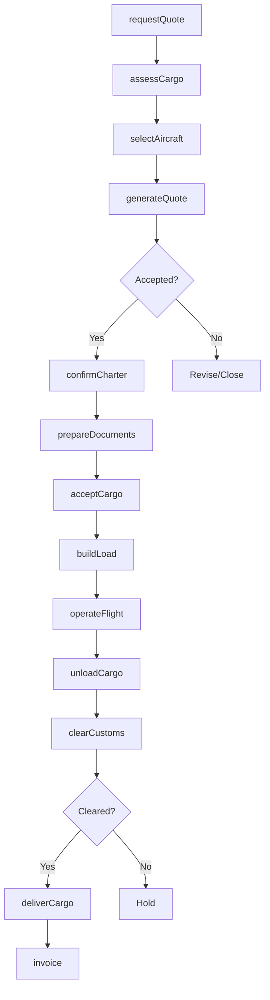
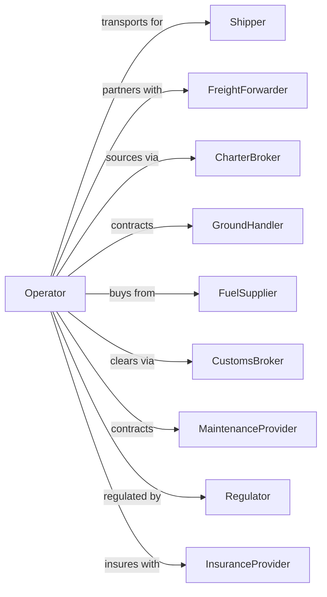

# Nonscheduled Chartered Freight Air Transportation

> Business-as-Code definition for on-demand air cargo charter operations. Models the complete charter freight lifecycle from quote request through cargo loading, flight operations, and delivery.

## Overview

Nonscheduled chartered freight air transportation involves operating cargo-only charter flights on demand for time-sensitive, oversized, or specialized shipments. This definition exposes actions for managing charter quotes, cargo acceptance, aircraft loading, and expedited delivery for industries requiring urgent or unique air freight solutions.

## Actors

| Actor | Description |
|-------|-------------|
| Shipper | Company requiring urgent cargo transport |
| FreightForwarder | Arranges charter logistics and documentation |
| CharterBroker | Sources aircraft and negotiates rates |
| GroundHandler | Provides loading and cargo handling |
| FuelSupplier | Provides aviation fuel |
| CustomsBroker | Handles import/export clearance |
| MaintenanceProvider | Ensures aircraft airworthiness |
| Regulator | FAA and customs authorities |
| InsuranceProvider | Covers cargo and liability |

## Roles

| Role | Description |
|------|-------------|
| CharterCoordinator | Manages requests and trip logistics |
| LoadMaster | Plans cargo placement and weight distribution |
| Pilot | Commands freighter aircraft |
| FirstOfficer | Assists in flight operations |
| CargoAgent | Processes documentation and acceptance |
| RampSupervisor | Oversees loading operations |
| OperationsController | Monitors flight progress and exceptions |
| AccountManager | Handles client relationships |

## Entities

| Entity | Description |
|--------|-------------|
| CharterRequest | Inquiry for cargo charter service |
| Quote | Price proposal including aircraft and handling |
| Flight | Charter cargo flight with itinerary |
| Aircraft | Freighter with cargo capacity specs |
| Shipment | Cargo consignment with specifications |
| LoadPlan | Cargo placement and balance calculation |
| AirWaybill | Documentation for shipped cargo |
| CustomsDeclaration | Import/export paperwork |
| Invoice | Billing for charter services |
| TrackingUpdate | Real-time shipment status |

## Actions

| Action | Description |
|--------|-------------|
| requestQuote | Submit charter inquiry with cargo details |
| assessCargo | Evaluate dimensions, weight, and handling needs |
| selectAircraft | Choose appropriate freighter for cargo |
| generateQuote | Create price proposal for charter |
| confirmCharter | Accept quote and book aircraft |
| prepareDocuments | Create airway bills and customs forms |
| acceptCargo | Receive shipment at origin |
| buildLoad | Plan and execute cargo loading |
| operateFlight | Fly charter to destination |
| unloadCargo | Remove shipment at destination |
| clearCustoms | Process import/export formalities |
| deliverCargo | Release shipment to consignee |
| invoice | Bill client for charter services |
| trackShipment | Monitor cargo location and status |

## Events

| Event | Description |
|-------|-------------|
| quoteRequested | Charter inquiry received |
| cargoAssessed | Shipment specifications evaluated |
| aircraftSelected | Freighter assigned to charter |
| quoteGenerated | Price proposal sent |
| charterConfirmed | Booking secured and aircraft held |
| documentsReady | Paperwork completed |
| cargoAccepted | Shipment received at origin |
| loadCompleted | Cargo aboard and secured |
| departed | Charter flight began |
| arrived | Aircraft landed at destination |
| cargoUnloaded | Shipment removed from aircraft |
| customsCleared | Import/export approved |
| cargoDelivered | Shipment released to recipient |
| invoiced | Bill sent to client |

## Searches

| Search | Description |
|--------|-------------|
| findAircraft | List available freighters by capacity |
| getQuote | Retrieve charter quote details |
| checkCapacity | Verify aircraft can handle cargo specs |
| trackShipment | Get real-time cargo location |
| getLoadPlan | Retrieve cargo placement details |
| findHandlers | List ground handlers at airport |
| getCustomsStatus | Check clearance progress |
| getFlightStatus | Monitor charter flight progress |

## Workflow



## Actor Relationships



## Usage

### Calling Actions

```typescript
import { flyNonscheduledChartered } from '@headlessly/fly-nonscheduled-chartered'

const charter = flyNonscheduledChartered()

// Request quote for urgent cargo charter
const quote = await charter.requestQuote({
  origin: 'ORD',
  destination: 'FRA',
  departureDate: '2024-06-10',
  cargo: {
    description: 'Automotive parts - urgent production line',
    pieces: 45,
    totalWeight: 18000,
    dimensions: { length: 400, width: 300, height: 200 },
    hazmat: false,
    temperatureControlled: false
  },
  priority: 'critical'
})

// Confirm charter booking
const charter = await charter.confirmCharter({
  quoteId: quote.id,
  shipperId: 'auto-mfg-123',
  consignee: {
    name: 'German Auto Plant',
    address: 'Industrial Park 45, Frankfurt'
  },
  specialHandling: ['fragile', 'no-stack']
})

// Track shipment in transit
const status = await charter.trackShipment({
  awbNumber: charter.awbNumber
})
```

### Event-Driven Automation

```typescript
// Auto-notify on departure
charter.departed(async ({ flightId, awbNumber, eta }) => {
  const shipment = await charter.getQuote({ awbNumber })

  await sendNotification({
    to: shipment.consignee.email,
    subject: 'Charter Cargo Departed',
    body: `Your shipment ${awbNumber} is airborne. ETA: ${eta}`
  })
})

// Auto-escalate customs issues
charter.customsHold(async ({ awbNumber, reason, airport }) => {
  await createUrgentTicket({
    subject: `Charter Cargo Customs Hold: ${awbNumber}`,
    description: `Location: ${airport}, Reason: ${reason}`,
    priority: 'critical',
    assignTo: 'customs-resolution-team'
  })

  // Notify shipper immediately
  const shipment = await charter.trackShipment({ awbNumber })
  await callClient({
    phone: shipment.shipper.phone,
    message: 'Urgent: Your charter cargo is held at customs'
  })
})
```
