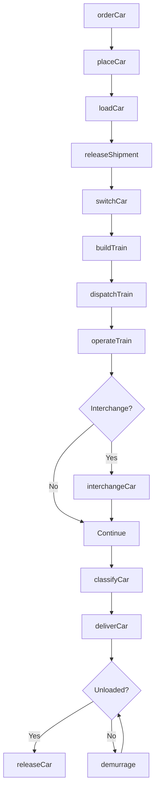
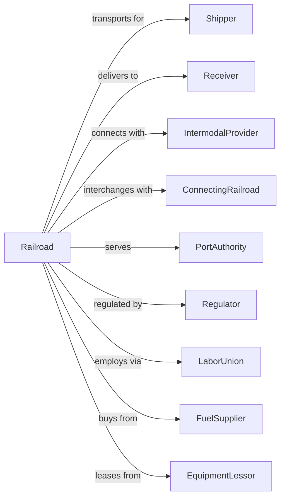

# Line-Haul Railroads

> Business-as-Code definition for Class I and regional railroad operations. Models the complete rail freight lifecycle from car ordering and interchange through line-haul movement and delivery.

## Overview

Line-haul railroads operate long-distance freight and passenger trains across extensive rail networks, moving bulk commodities, intermodal containers, and carload freight between major terminals. This definition exposes actions for managing train operations, car supply, interchange, and network optimization across transcontinental rail systems.

## Actors

| Actor | Description |
|-------|-------------|
| Shipper | Company shipping goods via rail |
| Receiver | Company receiving rail freight |
| IntermodalProvider | Supplies containers and trailers for rail |
| ConnectingRailroad | Partner railroad for interchange |
| PortAuthority | Seaport handling import/export containers |
| Regulator | STB and FRA oversight of rail operations |
| LaborUnion | Represents railroad workers |
| FuelSupplier | Provides diesel fuel for locomotives |
| EquipmentLessor | Leases railcars and locomotives |

## Roles

| Role | Description |
|------|-------------|
| TrainEngineer | Operates locomotive and controls train |
| Conductor | Manages train crew and switching operations |
| Dispatcher | Controls train movements on territory |
| YardMaster | Coordinates switching and car classification |
| CarDistributor | Manages empty car supply and allocation |
| TrackMaintainer | Inspects and repairs rail infrastructure |
| SignalMaintainer | Services signaling and communications |
| AccountManager | Handles shipper relationships and contracts |

## Entities

| Entity | Description |
|--------|-------------|
| Train | Consist of locomotives and cars on mainline |
| Locomotive | Power unit for train movement |
| Railcar | Freight car by type (boxcar, tank, hopper, etc.) |
| Shipment | Freight consignment with routing |
| Waybill | Shipping document with origin, destination, commodity |
| Interchange | Transfer point between railroads |
| Terminal | Major yard for train assembly and breakdown |
| Track | Rail infrastructure with capacity limits |
| Signal | Train control and safety system |
| Rate | Price for commodity movement |

## Actions

| Action | Description |
|--------|-------------|
| orderCar | Request empty car for loading |
| placeCar | Spot railcar at shipper facility |
| loadCar | Fill car with freight and seal |
| releaseShipment | Notify railroad car is ready for pickup |
| switchCar | Move car between tracks in yard |
| buildTrain | Assemble cars into train consist |
| dispatchTrain | Authorize train departure on route |
| operateTrain | Move train over territory |
| interchangeCar | Transfer car to connecting railroad |
| classifyCar | Sort car to correct track in yard |
| deliverCar | Place car at receiver for unloading |
| releaseCar | Return empty to railroad control |
| trackShipment | Monitor car location and ETA |
| demurrage | Bill for excess car detention time |

## Events

| Event | Description |
|-------|-------------|
| carOrdered | Empty car request received |
| carPlaced | Car spotted at shipper facility |
| carLoaded | Freight loaded and car sealed |
| shipmentReleased | Car ready for pickup |
| trainBuilt | Cars assembled into consist |
| trainDispatched | Departure authorized |
| trainDeparted | Movement began on mainline |
| interchanged | Car transferred to connecting road |
| trainArrived | Train reached destination terminal |
| carClassified | Car sorted to correct track |
| carDelivered | Car spotted at receiver |
| carReleased | Empty returned to railroad |
| shipmentTracked | Location update recorded |
| demurrageBilled | Detention charges assessed |

## Searches

| Search | Description |
|--------|-------------|
| findCars | List available cars by type and location |
| trackShipment | Get car location and ETA |
| getWaybill | Retrieve shipment documentation |
| getTrainStatus | Monitor train location and progress |
| findRoutes | List routing options between points |
| getYardInventory | List cars at specific terminal |
| getRates | Get pricing for commodity and lane |
| getInterchangeStatus | Check car status at junction |

## Workflow



## Actor Relationships



## Usage

### Calling Actions

```typescript
import { railLineHaulRailroads } from '@headlessly/rail-line-haul-railroads'

const railroad = railLineHaulRailroads()

// Order empty cars for grain shipment
const carOrder = await railroad.orderCar({
  carType: 'covered-hopper',
  quantity: 50,
  location: 'KANSASCITY',
  loadDate: '2024-06-15',
  commodity: 'corn',
  shipperId: 'midwest-grain'
})

// Release loaded shipment
await railroad.releaseShipment({
  waybillNumber: 'UP-2024-156789',
  carInitial: 'BNSF',
  carNumber: '123456',
  destination: 'LOSANGELES',
  weight: 220000
})

// Track shipment in transit
const status = await railroad.trackShipment({
  waybillNumber: 'UP-2024-156789'
})
```

### Event-Driven Automation

```typescript
// Auto-notify on car placement
railroad.carPlaced(async ({ carId, location, shipperId }) => {
  await sendNotification({
    to: shipperId,
    subject: 'Car Placed for Loading',
    body: `Car ${carId} has been spotted at ${location}. Please load within free time.`
  })
})

// Auto-assess demurrage
railroad.carDelivered(async ({ carId, deliveryTime }) => {
  const freeTimeHours = 48

  setInterval(async () => {
    const car = await railroad.findCars({ carId })

    if (car.status === 'placed' && hoursElapsed(deliveryTime) > freeTimeHours) {
      await railroad.demurrage({
        carId,
        hours: hoursElapsed(deliveryTime) - freeTimeHours,
        rate: 85
      })
    }
  }, 3600000) // Check hourly
})
```
