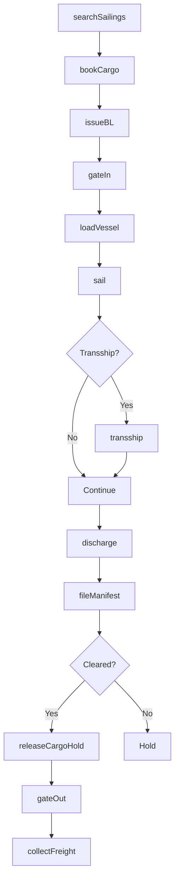
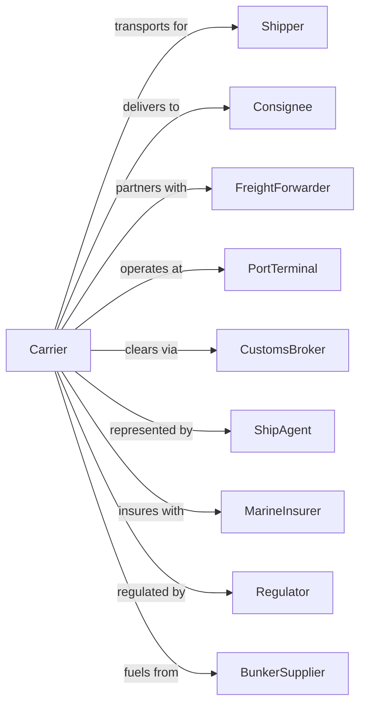

# Deep Sea Freight Transportation

> Business-as-Code definition for international ocean freight operations. Models the complete container and bulk shipping lifecycle from booking through transoceanic voyage and port discharge.

## Overview

Deep sea freight transportation involves operating container ships, bulk carriers, and tankers on international trade routes between foreign ports. This definition exposes actions for managing vessel scheduling, container booking, bill of lading, port operations, and cargo tracking across global shipping lanes.

## Actors

| Actor | Description |
|-------|-------------|
| Shipper | Exporter sending goods overseas |
| Consignee | Importer receiving goods |
| FreightForwarder | Arranges shipping and documentation |
| PortTerminal | Loads and discharges cargo |
| CustomsBroker | Handles import/export clearance |
| ShipAgent | Represents carrier at foreign ports |
| MarineInsurer | Covers cargo and hull |
| Regulator | IMO, Coast Guard, and flag state |
| BunkerSupplier | Provides marine fuel |

## Roles

| Role | Description |
|------|-------------|
| Captain | Commands vessel at sea |
| ChiefOfficer | Manages cargo operations |
| ChiefEngineer | Oversees propulsion and systems |
| VesselPlanner | Schedules port rotations |
| BookingAgent | Accepts cargo reservations |
| DocumentsClerk | Prepares bills of lading |
| OperationsManager | Coordinates port calls |
| PricingAnalyst | Sets freight rates |

## Entities

| Entity | Description |
|--------|-------------|
| Vessel | Container ship, bulk carrier, or tanker |
| Container | Standard shipping unit (TEU/FEU) |
| Voyage | Scheduled sailing with port rotation |
| BillOfLading | Contract of carriage document |
| Booking | Cargo reservation on voyage |
| Port | Loading or discharge terminal |
| Berth | Dock position at port |
| Manifest | List of cargo aboard vessel |
| FreightRate | Price per container or metric ton |
| TrackingEvent | Cargo status update |

## Actions

| Action | Description |
|--------|-------------|
| searchSailings | Find available voyages for route |
| bookCargo | Reserve space on vessel |
| issueBL | Create bill of lading document |
| gateIn | Receive container at port terminal |
| loadVessel | Place cargo aboard ship |
| sail | Depart port and transit ocean |
| transship | Transfer cargo at hub port |
| discharge | Remove cargo at destination port |
| gateOut | Release container from terminal |
| trackCargo | Monitor shipment location |
| collectFreight | Bill and receive payment |
| releaseCargoHold | Authorize cargo release |
| fileManifest | Submit cargo data to customs |
| demurrage | Charge for container detention |

## Events

| Event | Description |
|-------|-------------|
| sailingFound | Available voyage identified |
| cargoBooked | Space reserved on vessel |
| blIssued | Bill of lading created |
| containerGatedIn | Cargo received at origin port |
| vesselLoaded | Cargo aboard ship |
| vesselSailed | Departure from port |
| transshipped | Cargo transferred at hub |
| vesselArrived | Ship reached destination |
| cargoDischarged | Unloaded from vessel |
| containerGatedOut | Released from terminal |
| cargoTracked | Location update recorded |
| freightCollected | Payment received |
| cargoReleased | Hold removed for pickup |
| manifestFiled | Customs data submitted |

## Searches

| Search | Description |
|--------|-------------|
| findSailings | List voyages by route and date |
| trackContainer | Get container location and status |
| getBillOfLading | Retrieve shipping documents |
| getVesselSchedule | View port rotation and ETAs |
| getRates | Get freight pricing for lane |
| getPortStatus | Check terminal congestion |
| findBookings | List cargo reservations |
| getManifest | View cargo aboard vessel |

## Workflow



## Actor Relationships



## Usage

### Calling Actions

```typescript
import { shipDeepSea } from '@headlessly/ship-deep-sea'

const carrier = shipDeepSea()

// Search for available sailings
const sailings = await carrier.searchSailings({
  origin: 'CNSHA', // Shanghai
  destination: 'USLAX', // Los Angeles
  departureWeek: '2024-W25',
  containerType: '40HC'
})

// Book cargo space
const booking = await carrier.bookCargo({
  voyageId: sailings[0].voyageId,
  shipper: { name: 'China Exports Ltd', address: 'Shanghai' },
  consignee: { name: 'US Imports Inc', address: 'Los Angeles' },
  containers: 5,
  containerType: '40HC',
  commodity: 'electronics',
  weight: 85000
})

// Track container in transit
const tracking = await carrier.trackContainer({
  containerNumber: 'MSCU-1234567'
})
```

### Event-Driven Automation

```typescript
// Auto-notify on vessel arrival
carrier.vesselArrived(async ({ voyageId, port }) => {
  const bookings = await carrier.findBookings({ voyageId, destinationPort: port })

  for (const booking of bookings) {
    await sendNotification({
      to: booking.consignee.email,
      subject: 'Vessel Arrival Notice',
      body: `Your cargo has arrived at ${port}. Please arrange customs clearance.`
    })
  }
})

// Auto-apply demurrage
carrier.containerGatedOut(async ({ containerId, gateOutTime, freeTimeExpiry }) => {
  if (gateOutTime > freeTimeExpiry) {
    const daysOver = daysBetween(freeTimeExpiry, gateOutTime)

    await carrier.demurrage({
      containerId,
      days: daysOver,
      ratePerDay: 150
    })
  }
})
```
