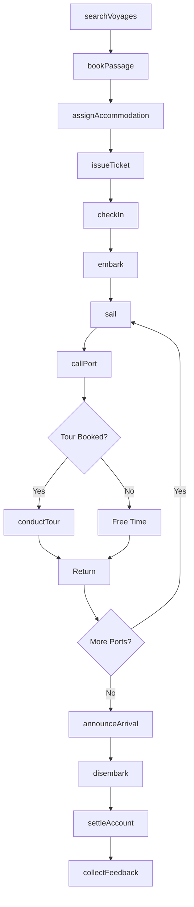
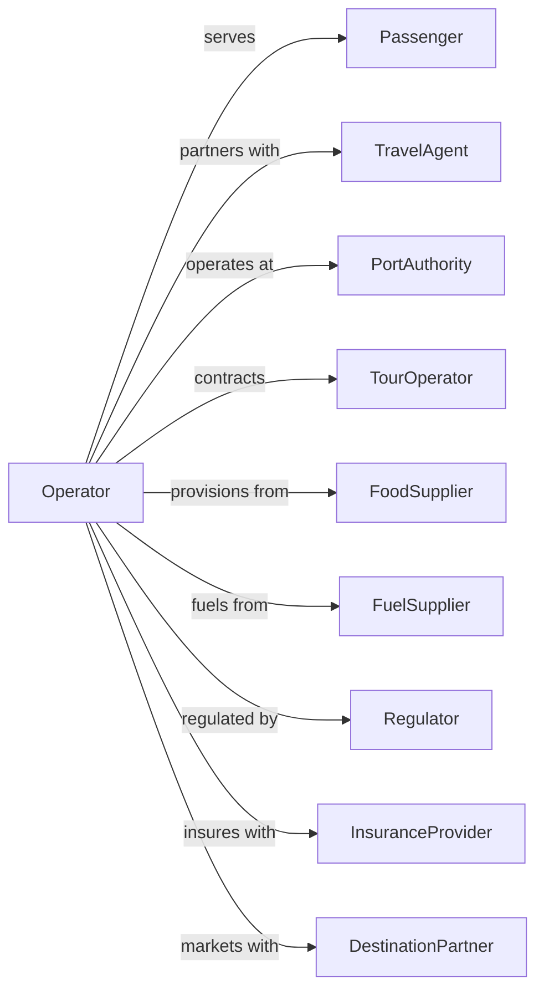

# Coastal and Great Lakes Passenger Transportation

> Business-as-Code definition for domestic passenger vessel operations. Models the complete domestic cruise and ferry lifecycle from booking through coastal and Great Lakes passenger service.

## Overview

Coastal and Great Lakes passenger transportation involves operating passenger vessels on domestic routes including coastal cruises, overnight ferries, and Great Lakes excursions. This definition exposes actions for managing passenger bookings, vessel operations, onboard services, and port calls within U.S. waters.

## Actors

| Actor | Description |
|-------|-------------|
| Passenger | Traveler booking domestic water passage |
| TravelAgent | Books voyages on behalf of passengers |
| PortAuthority | Manages passenger terminals |
| TourOperator | Provides shore activities |
| FoodSupplier | Provisions vessel |
| FuelSupplier | Provides marine fuel |
| Regulator | Coast Guard oversight |
| InsuranceProvider | Covers passenger liability |
| DestinationPartner | Port city tourism board |

## Roles

| Role | Description |
|------|-------------|
| Captain | Commands passenger vessel |
| HotelManager | Oversees guest services |
| PurserOfficer | Handles passenger accounts |
| CabinAttendant | Provides stateroom service |
| DeckOfficer | Manages navigation and safety |
| FoodManager | Coordinates dining services |
| EntertainmentDirector | Plans onboard activities |
| PortAgent | Coordinates port operations |

## Entities

| Entity | Description |
|--------|-------------|
| Voyage | Scheduled sailing with itinerary |
| Vessel | Passenger ship or ferry |
| Cabin | Stateroom accommodation |
| Booking | Passenger reservation |
| Port | Embarkation or call destination |
| Ticket | Travel document for passage |
| Amenity | Onboard service or facility |
| Shore Excursion | Activity at port of call |
| Manifest | Passenger list for voyage |
| Fare | Price for passage type |

## Actions

| Action | Description |
|--------|-------------|
| searchVoyages | Find available sailings |
| bookPassage | Reserve cabin or seat |
| assignAccommodation | Allocate specific cabin |
| checkIn | Process passenger before sailing |
| embark | Board passengers at terminal |
| sail | Operate vessel between ports |
| callPort | Stop at destination port |
| conductTour | Execute shore excursion |
| provideService | Deliver onboard amenities |
| disembark | Process passenger departure |
| settleAccount | Finalize onboard charges |
| issueTicket | Create travel document |
| announceArrival | Notify of port approach |
| collectFeedback | Gather passenger survey |

## Events

| Event | Description |
|-------|-------------|
| voyagesSearched | Available sailings returned |
| passageBooked | Reservation confirmed |
| accommodationAssigned | Cabin allocated |
| passengerCheckedIn | Pre-boarding completed |
| passengerEmbarked | Guest boarded vessel |
| vesselSailed | Departed from port |
| portCalled | Arrived at destination |
| tourConducted | Shore activity completed |
| serviceProvided | Amenity delivered |
| passengerDisembarked | Guest departed vessel |
| accountSettled | Charges finalized |
| ticketIssued | Travel document created |
| arrivalAnnounced | Port approach broadcast |
| feedbackCollected | Survey received |

## Searches

| Search | Description |
|--------|-------------|
| findVoyages | List sailings by route and date |
| checkAvailability | View cabin inventory |
| getBooking | Retrieve reservation details |
| getItinerary | View voyage schedule |
| findTours | List shore excursions |
| getManifest | View passenger list |
| getVesselPosition | Track ship location |
| getWeather | Check marine conditions |

## Workflow



## Actor Relationships



## Usage

### Calling Actions

```typescript
import { shipCoastalGreat } from '@headlessly/ship-coastal-great'

const operator = shipCoastalGreat()

// Search for Great Lakes cruises
const voyages = await operator.searchVoyages({
  region: 'great-lakes',
  departurePort: 'USCHI', // Chicago
  departureMonth: '2024-07',
  nights: 5
})

// Book passage
const booking = await operator.bookPassage({
  voyageId: voyages[0].id,
  passengers: [
    { firstName: 'Robert', lastName: 'Johnson', age: 55 },
    { firstName: 'Mary', lastName: 'Johnson', age: 52 }
  ],
  cabinCategory: 'outside',
  specialRequests: ['lower-deck', 'dietary-vegetarian']
})

// Book shore excursion
await operator.conductTour({
  bookingId: booking.id,
  port: 'mackinac-island',
  tourId: 'horse-carriage-tour',
  participants: 2
})
```

### Event-Driven Automation

```typescript
// Auto-send boarding information
operator.passengerCheckedIn(async ({ bookingId, voyageId }) => {
  const booking = await operator.getBooking({ bookingId })
  const voyage = await operator.findVoyages({ voyageId })

  await sendEmail({
    to: booking.primaryPassenger.email,
    subject: 'Your Boarding Pass is Ready',
    template: 'boarding-info',
    data: {
      embarkationPort: voyage.departurePort,
      embarkationTime: voyage.embarkationTime,
      cabin: booking.cabin
    }
  })
})

// Auto-announce port arrivals
operator.portCalled(async ({ voyageId, port, arrivalTime }) => {
  await operator.announceArrival({
    voyageId,
    message: `Good morning! We will be arriving at ${port} at ${arrivalTime}. Shore excursions depart 30 minutes after docking.`
  })
})
```
