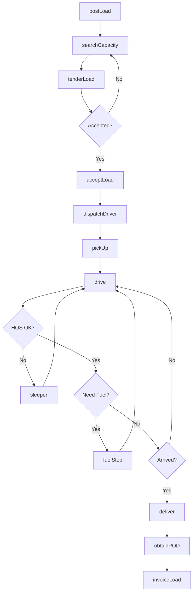
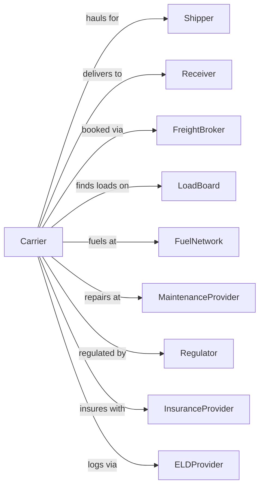

# General Freight Trucking, Long-Distance, Truckload

> Business-as-Code definition for over-the-road truckload freight operations. Models the complete TL shipment lifecycle from load posting through driver assignment, transit, and delivery across interstate routes.

## Overview

Long-distance truckload trucking involves providing full trailer movements from origin to destination without intermediate handling, typically crossing state lines with multi-day transit times. This definition exposes actions for managing load matching, driver dispatch, hours of service compliance, and fleet tracking across the national highway network.

## Actors

| Actor | Description |
|-------|-------------|
| Shipper | Company tendering full truckload freight |
| Receiver | Destination for TL delivery |
| FreightBroker | Matches loads with carriers |
| LoadBoard | Electronic marketplace for freight |
| FuelNetwork | Truck stop chain for fuel and services |
| MaintenanceProvider | Repairs trucks on the road |
| Regulator | FMCSA and state DOT |
| InsuranceProvider | Covers cargo and liability |
| ELDProvider | Electronic logging device vendor |

## Roles

| Role | Description |
|------|-------------|
| Driver | Operates tractor-trailer over the road |
| Dispatcher | Assigns loads and manages driver schedules |
| FleetManager | Oversees equipment and driver performance |
| SafetyDirector | Ensures FMCSA compliance |
| LoadPlanner | Matches freight with available capacity |
| BillingSpecialist | Processes freight invoices |
| DriverRecruiter | Hires and onboards drivers |
| MaintenanceCoordinator | Schedules truck repairs |

## Entities

| Entity | Description |
|--------|-------------|
| Tractor | Power unit pulling trailer |
| Trailer | 53-foot dry van or reefer |
| Load | Full truckload shipment |
| Lane | Origin-destination pair with rate |
| Driver | OTR operator with CDL |
| HOS | Hours of service status |
| ELD | Electronic logging device |
| BOL | Bill of lading |
| POD | Proof of delivery |
| Rate | Per-mile or flat rate for lane |

## Actions

| Action | Description |
|--------|-------------|
| postLoad | Advertise available freight |
| searchCapacity | Find available trucks for load |
| tenderLoad | Offer shipment to carrier |
| acceptLoad | Carrier agrees to haul freight |
| dispatchDriver | Assign driver and equipment |
| pickUp | Load trailer at shipper |
| drive | Operate truck on route |
| fuelStop | Refuel and take break |
| sleeper | Rest period in sleeper berth |
| deliver | Unload at destination |
| dropTrailer | Leave trailer for live unload |
| obtainPOD | Capture delivery signature |
| invoiceLoad | Bill for completed haul |
| trackLoad | Monitor shipment location |

## Events

| Event | Description |
|-------|-------------|
| loadPosted | Freight available on board |
| capacityFound | Truck matched to load |
| loadTendered | Offer sent to carrier |
| loadAccepted | Carrier confirmed acceptance |
| driverDispatched | Assignment completed |
| loadPickedUp | Trailer loaded and sealed |
| inTransit | En route to destination |
| fuelCompleted | Fuel stop finished |
| breakTaken | Rest period recorded |
| loadDelivered | Freight unloaded |
| trailerDropped | Equipment left at facility |
| podObtained | Signature captured |
| loadInvoiced | Bill submitted |
| loadTracked | Position updated |

## Searches

| Search | Description |
|--------|-------------|
| findLoads | Search available freight by lane |
| findTrucks | List available capacity |
| trackLoad | Get shipment location and ETA |
| getDriverHOS | Check available driving hours |
| getLaneRates | Get market rates for route |
| getDriverLocation | Find driver position |
| getFuelPrices | Compare fuel costs by location |
| getWeatherRoute | Check conditions along route |

## Workflow



## Actor Relationships



## Usage

### Calling Actions

```typescript
import { truckGeneralFreight } from '@headlessly/truck-general-freight'

const carrier = truckGeneralFreight()

// Search for available loads
const loads = await carrier.findLoads({
  originState: 'CA',
  destinationState: 'TX',
  equipmentType: 'dry-van',
  pickupDate: '2024-06-15',
  minRate: 2.50 // per mile
})

// Accept and dispatch load
const load = await carrier.acceptLoad({
  loadId: loads[0].id,
  driverId: 'driver-456',
  tractorId: 'truck-789',
  trailerId: 'trailer-012'
})

// Track load in transit
const status = await carrier.trackLoad({
  loadId: load.id
})
```

### Event-Driven Automation

```typescript
// Auto-alert for HOS compliance
carrier.inTransit(async ({ loadId, driverId }) => {
  const hos = await carrier.getDriverHOS({ driverId })

  if (hos.availableDriveMinutes < 120) {
    await sendAlert({
      to: driverId,
      message: 'Less than 2 hours drive time remaining. Plan rest stop.'
    })
  }
})

// Auto-update shipper on delivery
carrier.loadDelivered(async ({ loadId, deliveryTime }) => {
  const load = await carrier.trackLoad({ loadId })

  await sendNotification({
    to: load.shipper.email,
    subject: 'Load Delivered',
    body: `Your shipment has been delivered at ${deliveryTime}`
  })

  await carrier.invoiceLoad({
    loadId,
    deliveryTime,
    accessorials: []
  })
})

// Auto-find backhaul
carrier.loadDelivered(async ({ loadId, deliveryLocation }) => {
  const backhauls = await carrier.findLoads({
    originCity: deliveryLocation,
    pickupDate: addDays(new Date(), 1),
    maxDeadhead: 100
  })

  if (backhauls.length > 0) {
    await sendToDispatcher({
      subject: 'Backhaul Opportunity',
      loads: backhauls
    })
  }
})
```
