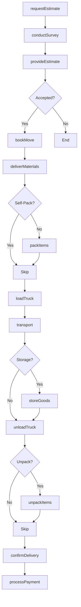
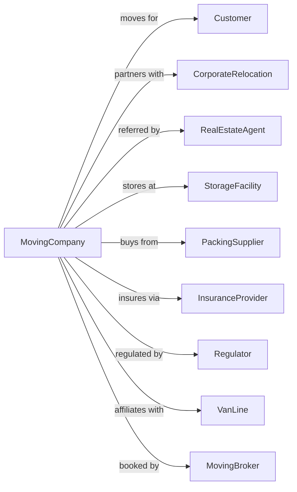

# Used Household and Office Goods Moving

> Business-as-Code definition for residential and commercial moving operations. Models the complete relocation lifecycle from estimate through packing, loading, transport, and delivery of household and office goods.

## Overview

Moving services involve relocating household furniture, personal belongings, and office equipment between residences and commercial locations. This definition exposes actions for managing estimates, packing services, loading, long-distance transport, and unpacking with valuation protection.

## Actors

| Actor | Description |
|-------|-------------|
| Customer | Individual or business relocating |
| CorporateRelocation | Company managing employee moves |
| RealEstateAgent | Refers moving services |
| StorageFacility | Provides temporary storage |
| PackingSupplier | Provides boxes and materials |
| InsuranceProvider | Covers valuation and liability |
| Regulator | FMCSA for interstate moves |
| VanLine | National moving network |
| MovingBroker | Books moves for customers |

## Roles

| Role | Description |
|------|-------------|
| MoveCoordinator | Manages relocation process |
| Estimator | Surveys and prices moves |
| Driver | Operates moving truck |
| Packer | Packs and protects belongings |
| Loader | Loads items onto truck |
| Unloader | Unloads at destination |
| WarehouseWorker | Handles storage operations |
| ClaimsAdjuster | Processes damage claims |

## Entities

| Entity | Description |
|--------|-------------|
| Move | Complete relocation project |
| Estimate | Price quote for moving services |
| Inventory | List of items being moved |
| Truck | Moving van with capacity |
| Container | Portable storage unit |
| PackingMaterials | Boxes, wrap, and padding |
| Valuation | Protection level for belongings |
| BillOfLading | Contract for move |
| Claim | Damage or loss report |
| Storage | Temporary holding of goods |

## Actions

| Action | Description |
|--------|-------------|
| requestEstimate | Schedule in-home survey |
| conductSurvey | Assess belongings and access |
| provideEstimate | Issue binding or non-binding quote |
| bookMove | Confirm move date and services |
| deliverMaterials | Drop off packing supplies |
| packItems | Wrap and box belongings |
| loadTruck | Place items in moving van |
| transport | Drive to destination |
| storeGoods | Place items in warehouse |
| unloadTruck | Remove items at destination |
| unpackItems | Unwrap and place belongings |
| confirmDelivery | Get customer signature |
| processPayment | Collect move charges |
| fileClaim | Report damage or missing items |

## Events

| Event | Description |
|-------|-------------|
| estimateRequested | Survey scheduled |
| surveyConducted | Home assessed |
| estimateProvided | Quote issued to customer |
| moveBooked | Relocation confirmed |
| materialsDelivered | Supplies dropped off |
| packingCompleted | Items wrapped and boxed |
| truckLoaded | Belongings on van |
| inTransit | Moving to destination |
| goodsStored | Items in warehouse |
| truckUnloaded | Items removed at destination |
| unpackingCompleted | Belongings placed |
| deliveryConfirmed | Customer signed off |
| paymentProcessed | Charges collected |
| claimFiled | Damage reported |

## Searches

| Search | Description |
|--------|-------------|
| getEstimate | Retrieve move quote |
| trackMove | Get shipment status |
| getInventory | List items on move |
| findAvailableDates | Check move date availability |
| getStorageStatus | Check warehouse inventory |
| getValuationOptions | List protection levels |
| getClaimStatus | Check claim progress |
| findDrivers | List available crews |

## Workflow



## Actor Relationships



## Usage

### Calling Actions

```typescript
import { truckUsedHousehold } from '@headlessly/truck-used-household'

const mover = truckUsedHousehold()

// Request estimate
const estimate = await mover.requestEstimate({
  customer: { name: 'John Smith', phone: '555-1234' },
  origin: '123 Current St, Chicago, IL',
  destination: '456 New Ave, Denver, CO',
  moveDate: '2024-07-15',
  bedrooms: 3,
  specialItems: ['piano', 'pool-table']
})

// Book the move
const move = await mover.bookMove({
  estimateId: estimate.id,
  services: ['full-pack', 'unpack-kitchen', 'appliance-service'],
  valuation: 'full-replacement',
  paymentMethod: 'corporate-bill'
})

// Track move in transit
const status = await mover.trackMove({
  moveId: move.id
})
```

### Event-Driven Automation

```typescript
// Auto-send packing tips before move
mover.moveBooked(async ({ moveId, moveDate }) => {
  const daysUntilMove = daysBetween(new Date(), moveDate)

  if (daysUntilMove === 14) {
    const move = await mover.getEstimate({ moveId })

    await sendEmail({
      to: move.customer.email,
      subject: 'Your Move is 2 Weeks Away',
      template: 'pre-move-checklist',
      data: { moveDate, services: move.services }
    })
  }
})

// Auto-process post-delivery follow-up
mover.deliveryConfirmed(async ({ moveId, customerId }) => {
  // Schedule follow-up call for claims window
  await scheduleTask({
    type: 'follow-up-call',
    moveId,
    customerId,
    scheduledDate: addDays(new Date(), 3)
  })

  await sendSurvey({
    to: customerId,
    type: 'move-satisfaction',
    moveId
  })
})

// Auto-alert for high-value moves
mover.truckLoaded(async ({ moveId, inventoryValue }) => {
  if (inventoryValue > 50000) {
    await sendAlert({
      to: 'operations@mover.com',
      subject: 'High Value Move In Transit',
      body: `Move ${moveId} with $${inventoryValue} in declared value is now in transit.`
    })
  }
})
```
