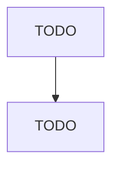

# Specialized Freight (except Used Goods) Trucking, Long-Distance

> TODO: Business-as-Code definition

## Overview

This industry comprises establishments primarily engaged in providing long-distance specialized trucking. These establishments provide trucking between metropolitan areas that may cross North American country borders. Illustrative Examples: Long-distance automobile carrier trucking Long-distance refrigerated product trucking Long-distance bulk liquid trucking Long-distance trucking of waste Long-distance hazardous material trucking Cross-References. Establishments primarily engaged in--

## Actors

| Actor | Description |
|-------|-------------|
| TODO | TODO |

## Roles

| Role | Description |
|------|-------------|
| TODO | TODO |

## Entities

| Entity | Description |
|--------|-------------|
| TODO | TODO |

## Actions

| Action | Description |
|--------|-------------|
| TODO | TODO |

## Events

| Event | Description |
|-------|-------------|
| TODO | TODO |

## Searches

| Search | Description |
|--------|-------------|
| TODO | TODO |

## Workflow

## Actor Relationships

